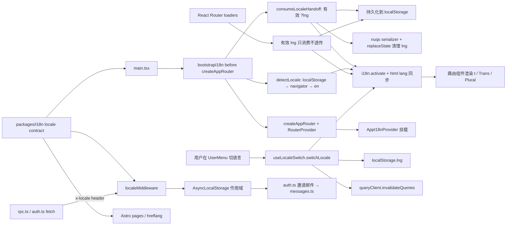

# 0009 · 前端采用 Lingui + 服务端轻量字典的 i18n 方案

## 背景（Context）

`docs/dev-file/05-Frontend-Architecture.md §11` 最初预先选定了
`i18next + react-i18next`。由于尚未落地任何代码，我们结合以下约束重新评估：

- **Bundle 预算**（`05 §12`）：单 chunk ≤ 150 KB gz，总计 ≤ 500 KB gz。
  `i18next` 仅运行时就有 ~40 KB gz（约占总预算 8%）。
- **Contract-first Zod**（ADR 0017）：`packages/contracts` 中的 schema 保持
  与 locale 无关；错误以结构化 code（`{ code, path }`）传递，由 UI 层渲染
  文案。i18n **不**用于翻译 Zod 报错。
- **AI 协作的两人团队**（ADR 0000）：string-key 形式的 i18n API
  （`t('feature.section.key')`）容易让 AI 生成与 catalog 漂移的键名，评审时
  难以察觉。
- **需要 ICU 格式化**：Deadline Radar / Overdue 表格 / 邮件摘要等场景需要复数
  与数字格式化（`{count, plural, one {# day} other {# days}}`）。
- **React Email 模板** 在 Worker 中渲染；服务端也要按调用方 locale 选文案。
- **Phase 0 demo sprint** 要求 en + zh-CN 端到端可用，而不是留到 Phase 2
  做技术验证。

## 决策（Decision）

SaaS SPA 采用 **Lingui v6**；Worker 采用**类型化字典 shim**（不引入任何 Lingui
运行时）；Marketing 采用 Astro i18n routing + 静态 copy dictionary。三者共享
locale contract，但不共享同一个文案 catalog：

- `apps/app`：`@lingui/core` + `@lingui/react`（运行时约 4 KB gz），
  `@lingui/cli` + `@lingui/babel-plugin-lingui-macro` + `@lingui/vite-plugin` +
  `@lingui/format-po` + `@rolldown/plugin-babel`（仅 dev 依赖）。版本全部在根
  `pnpm-workspace.yaml` 的 catalog 中 pin 住。
- `apps/server`：约 40 行的类型化字典（`src/i18n/messages.ts`）+ 一个
  `resolveLocale(headers) → 'en' | 'zh-CN'` 辅助函数。Worker 产物里没有任何
  Lingui 依赖。
- `apps/marketing`：Astro static pages；页面文案放在 marketing 自己的静态
  dictionary / content files，不进入 app 的 `.po` catalog，也不引入 Worker 字典。
- `packages/i18n`：`Locale`、`SUPPORTED_LOCALES`、`DEFAULT_LOCALE`、
  `INTL_LOCALE`、`LOCALE_HEADER` 的单一来源。它只包含纯 TS 常量和 helper，不依赖
  Lingui / Astro / React / Worker runtime。

硬性规则：

1. **Zod 保持 locale-free。** schema 只用稳定 error code；所有面向用户的文案
   归 UI 层，走 Lingui macros。
2. **所有 UI 文案必须走 `<Trans>` / `` t`…` `` macros。** 属性字符串
   （`aria-label`、`placeholder` 等）使用函数形式。数量相关文案用 `<Plural>`。
3. **SaaS app catalog 位置**：`apps/app/src/i18n/locales/{locale}/messages.po`。
   `@lingui/vite-plugin` 负责把 `.po` 编译进依赖图；两个 locale 都用静态
   import 加载（体积可忽略）。如果将来新增第三种语言，再切换到
   `dynamicActivate`。
4. **构建期 macro 转换**：`@rolldown/plugin-babel` 对 `src/**/*.ts(x)` 跑
   Lingui v6 的 `linguiTransformerBabelPreset()`。`@vitejs/plugin-react` v6
   已切到 SWC 并不再暴露 Babel hook，因此 Lingui macro 用独立的 Rolldown
   Babel pass 来跑。`include` 必须使用 Babel match-pattern 可匹配的形式；
   本仓库用 `/\/src\/.*\.[jt]sx?$/`，不要写成 picomatch 风格的
   `['src/**/*.{ts,tsx}']`，否则 macro import 会漏编译并进入 runtime。
5. **Lingui v6 迁移约束。** Lingui 6.0 是 ESM-only，要求 Node `>=22.19`
   且 `@lingui/vite-plugin` 只支持 Vite `^6.3.0 || ^7 || ^8`。本仓库已经是
   ESM monorepo，并通过 Vite+ 工具链使用兼容的 Vite 管线，因此升级只需要把
   根 `engines.node` 抬到 `>=22.19.0`，并移除 v6 已删除的字符串
   `format: 'po'` 配置。
6. **服务端本地化刻意做薄。** Worker 只提供一份面向事务邮件的类型化字典
   （subject / body / CTA）。locale 从 `x-locale` header 解析（由 SPA 注入），
   失败时回退 `Accept-Language`，并通过 `AsyncLocalStorage` 透传给解耦的
   回调（如 better-auth 的邀请邮件 hook），避免把 header 串进每一层签名。
7. **错误码合约。** 中间件返回稳定的英文 code（`UNAUTHORIZED`、
   `FORBIDDEN`、`RATE_LIMITED`、`TENANT_MISSING`、`TENANT_MISMATCH`、
   `NOT_FOUND`、`INVALID_REQUEST`、`CONFLICT`、`INTERNAL_SERVER_ERROR`）。
   SPA 通过 `translateServerErrorCode()` 查 `MessageDescriptor` 表做翻译，
   使得 `lingui extract` 能正确抓取英文源文案。
8. **富文本占位符命名。** `apps/app/lingui.config.ts` 启用 Lingui v6 的
   `macro.jsxPlaceholderAttribute = 'data-t'` 与常见 JSX tag 默认名。这样 `<Trans>`
   中的链接、强调、代码等标签会抽取成 `<link>` / `<strong>` / `<code>` 等
   稳定占位符，而不是 `<0>` / `<1>`，降低翻译上下文丢失和无意义 catalog diff。
9. **PO origin 去行号。** `@lingui/format-po` 配置为 `origins: true` +
   `lineNumbers: false`。Catalog 仍保留文件级来源，便于定位上下文；但纯代码移动不会因为
   `#: file.tsx:line` 改变而制造 `.po` diff churn。
10. **公开站 catalog 分离。** Marketing 文案生命周期属于获客与 SEO，不和 app 的
    交互文案、server 的事务邮件混用。共享的只有 locale 列表、`Intl` 映射、header 名称和
    “所有用户可见文案必须可本地化”的工程纪律。

本决策取代 `docs/dev-file/05-Frontend-Architecture.md §11` 中的
`i18next + react-i18next` 条目。

## 架构（Architecture）

### SPA（`apps/app`）

```
src/i18n/
  bootstrap.ts           # 同步消费一次性 locale handoff，并激活 Lingui
  i18n.ts               # @lingui/core 全局单例、locale 辅助函数、
                        #   attachLocaleHeader() 供 rpc.ts + auth.ts 复用
  locales.ts            # app 浏览器偏好层：detectLocale()
                        #   （?lng → localStorage → navigator → en）与 persistLocale()
  query.ts              # nuqs parser + serializer：parseAsStringLiteral(SUPPORTED_LOCALES)
                        #   共享常量来自 packages/i18n
  provider.tsx          # AppI18nProvider 包裹 @lingui/react 的 I18nProvider，
                        #   useLocaleSwitch() 基于 useSyncExternalStore
                        #   以避免并发渲染下的 tearing，切换 locale 时同步
                        #   失效 TanStack Query 缓存
  locales/{en,zh-CN}/messages.po
  locales/{en,zh-CN}/messages.ts   # 由 @lingui/vite-plugin 编译产出
```

横切辅助：

- `src/lib/utils.ts` —— `formatCents` / `formatDate` 通过 `@duedatehq/i18n`
  的 `INTL_LOCALE['en'] = 'en-US'` / `INTL_LOCALE['zh-CN'] = 'zh-CN'`
  读取当前 locale，让 `Intl.NumberFormat` / `Intl.DateTimeFormat` 自动选择合适的千分位与日期样式。
- `src/lib/i18n-error.ts` —— 使用 `i18n._(MessageDescriptor)` 做惰性查表，
  locale 切换无需预译，直接触发重渲染。
- `src/lib/rpc.ts` + `src/lib/auth.ts` —— 两处都通过 `attachLocaleHeader(headers)`
  注入来自 `@duedatehq/i18n` 的 `LOCALE_HEADER`，避免字面量散落在多处。

已替换所有硬编码文案的路由：`_layout`、`login`、`dashboard`、`obligations`、
`settings`、`error`。语言切换器位于 `UserMenu` 下的 `DropdownMenuSub`，在
侧边栏 panel 与顶栏 compact 两种形态下都可见。`activateLocale()` 内部会把
`<html lang>` 同步到当前 locale，满足无障碍需求。

### Worker（`apps/server`）

```
src/i18n/
  resolve.ts            # resolveLocale(headers) —— x-locale > Accept-Language > en
                        # runWithLocale() / getRequestLocale() 基于 AsyncLocalStorage
  messages.ts           # MessageKey 类型化字典：invitation.{subject,body,cta}
                        # interpolate() 替换 {name} 占位符
src/middleware/locale.ts     # localeMiddleware：runWithLocale(resolveLocale(headers), next)
src/auth.ts                  # sendInvitationEmail 内部读取 getRequestLocale()
src/types/node-async-hooks.d.ts  # Workers 运行时的最小类型声明
```

`node:async_hooks` 依赖 `wrangler.toml` 中 `compatibility_flags =
["nodejs_compat"]`；Worker 运行时原生暴露 `AsyncLocalStorage`，但
`@cloudflare/workers-types` 没有声明，所以单独加一个类型 shim。

### Marketing（`apps/marketing`）

```
src/i18n/
  locales.ts            # 从 packages/i18n re-export locale contract
  en.ts                 # landing / SEO copy
  zh-CN.ts              # localized landing / SEO copy
src/pages/
  index.astro
  zh-CN/index.astro     # 若启用 zh-CN route
```

Astro 负责 `html lang`、canonical、`hreflang`、metadata、Open Graph 和 sitemap。React
islands 只在需要交互时加载；marketing 不读取 app session，不调用内部 `/rpc`。

### Shared locale contract（`packages/i18n`）

```
src/
  locales.ts            # Locale / SUPPORTED_LOCALES / DEFAULT_LOCALE / INTL_LOCALE
  headers.ts            # LOCALE_HEADER = 'x-locale'
  index.ts
```

`packages/i18n` 是常量包，不是翻译包。它让 `apps/app`、`apps/server`、`apps/marketing`
对“支持哪些语言、HTML/Intl 用什么 locale、请求头叫什么”保持一致。

### 数据流（Data flow）



## 脚本（Scripts）

`apps/app/package.json` 新增：

- `pnpm --filter @duedatehq/app i18n:extract` —— 扫描源码、更新 `.po`，并通过官方
  `lingui extract --clean` 清理源码已移除的 obsolete entries。
- `pnpm --filter @duedatehq/app i18n:compile` —— 通过官方 `lingui compile --strict`
  输出编译后的 catalog；任意活跃 catalog 有 missing translation 时命令必须失败。
  Vite 插件在 `dev` / `build` 阶段会自动执行；保留脚本是为了在 CI 中单独
  校验一次。
- CI catalog drift check：每次 `main` push 与 PR 都执行 `i18n:extract` +
  `i18n:compile`，再对 `apps/app/src/i18n/locales` 跑 `git diff --exit-code`。如果源码文案、
  PO catalog 或编译产物未同步提交，或任何 catalog 有 missing translation，CI 应失败。
  Lingui CLI 没有只检查不写入的官方 `--check` / dry-run 模式；`compile --strict` 负责
  missing translation，`git diff` 负责 generated-artifact drift。React testing guide 只覆盖
  `I18nProvider` 包裹与渲染断言，不能替代 catalog gate。该 workflow 不使用 `paths` 过滤，
  因为 drift 是当前仓库状态问题，不应被后续 docs-only 提交掩盖。
- Lingui v6 CLI 默认会并行处理抽取与编译任务；需要排查非确定性问题时可临时
  追加 `--workers 1` 关闭并行。

两条命令也记录在 `AGENTS.md → Build, Test, and Development Commands`。
`pnpm ready`（check + test + build）覆盖类型、单测与构建；本地交付 i18n 改动时仍需单独
跑 `i18n:extract` + `i18n:compile`，独立 GitHub Actions workflow 会在 PR / `main` push 上
执行同一组 catalog gate。

## 测试（Tests）

- `apps/app/src/i18n/provider.test.tsx` —— bootstrap、切换、持久化、以及
  同 locale 切换应为 no-op；基于 `react-dom/client` + `happy-dom`，在
  真实的 provider + TanStack Query 树内运行。
- `apps/app/src/lib/utils.test.ts` —— `formatCents` / `formatDate` 的
  en / zh-CN 分支。
- `apps/app/src/lib/i18n-error.test.ts` —— 每个 locale 下的已知 code 翻译、
  未知 code 的 `null` 回退。
- `apps/server/src/i18n/resolve.test.ts` —— header 优先级
  （`x-locale` > `Accept-Language` > 默认）以及 `runWithLocale` 的作用域行为。
- `apps/server/src/middleware/locale.test.ts` —— 在并发 Hono 请求下验证
  locale 按请求隔离（保证 AsyncLocalStorage 的接线正确）。

## 影响（Consequences）

**好处**

- SPA 运行时占用约 4 KB gz（对比 i18next 的 ~40 KB gz），单 chunk 预算释放
  约 8%。
- 源码自然语言化（`<Trans>Client {name} has {count} overdue tasks</Trans>`），
  AI 生成代码无需发明 string key。`lingui extract --clean` 会删除源码中已不存在的
  obsolete 条目，避免历史消息继续参与严格编译。
- ICU 语法与占位符一致性在 `pnpm build` 阶段校验，出错在 CI 就暴露而非
  运行时在浏览器中才发现。
- `useSyncExternalStore` 支撑的 `useLocaleSwitch` 避免了 Lingui 自身变更
  通知与 React 19 并发渲染之间的 tearing。
- 服务端 locale 通过 `AsyncLocalStorage` 透传，新的邮件模板只需调用
  `getRequestLocale()`，不会在各层函数签名里蔓延。
- Worker bundle 保持 Lingui-free。服务端字典是约 40 行的纯 TypeScript，
  通过编译期 `MessageKey` 穷尽性检查保证每种语言都不漏译（缺译直接是
  类型错误）。

**代价**

- 生态比 i18next 小，新成员上手成本略高。靠 `AGENTS.md` 与本 ADR 来缓解。
- `@vitejs/plugin-react` v6 已改用 SWC，无法承载 Lingui macro，因此需要
  再挂一个 `@rolldown/plugin-babel` 做 macro 转换。它只覆盖 `apps/app/src`
  下的 TypeScript 源码，避免对依赖包跑 Babel；但这确实是 Vite+ 体系里多出来的
  一个插件，需要和主工具链一起 pin 版本。
- Lingui v6 的 Node 下限高于项目原先的 `>=22.12.0`，本 ADR 要求本地和 CI
  使用 Node `>=22.19.0` 或 v24+。
- SPA、Worker、Marketing 各维护自己的 catalog/dictionary（Lingui `.po` vs.
  类型化字典 vs. Astro 静态 copy）。当前重叠面极小，分离换来的是 Worker 产物
  体积可控、marketing 文案可独立迭代；但新增 locale 时必须同步 `packages/i18n`
  和三端文案来源。

**不确定项**

- 未来翻译厂商是否坚持要求扁平 JSON 交付。Lingui 可以输出 JSON，但 PO
  是其 happy path。选型时再重新评估。
- 如果 Worker 开始直接渲染 React Email 模板，类型化字典可能会撑不住，到时
  可以考虑在服务端引入 Lingui，或按模板分拆 catalog。

## 状态（Status）

implemented（Phase 0）—— 端到端双语（en、zh-CN）覆盖 SPA 所有路由与邀请
邮件，已随 `pnpm ready` 全绿通过。新增 locale 与翻译厂商接入作为后续事项
跟踪。
