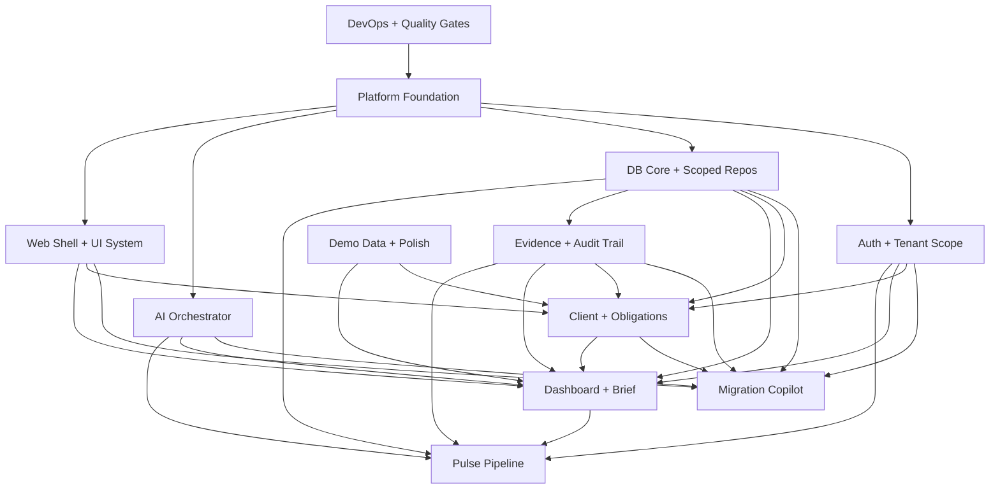

# 09 · Demo Sprint Module Playbook · 2 人 AI 辅助模块拆分手册

> 适用场景：2 位开发者 · AI 辅助开发 · 目标 Demo-Ready 闭环。
> 本文只按模块拆分，不按排期、页面、实现位置或技术层拆分。具体项目结构以 Dev File 08 为准。
> 核心判断：PRD v2.0 是 build-complete 目标形态；本文只覆盖 Phase 0 内嵌 Demo Sprint 的最小可信闭环，不等价于完整 Phase 0 MVP。

---

## 1. Dev Docs 硬约束

本文是 00 ~ 08 的执行拆分，不重新定义架构。若本文与 00 ~ 08 冲突，以 00 ~ 08 为准。

| 来源                     | 必须遵守                                                                                                              | 对模块拆分的影响                                                                                                   |
| ------------------------ | --------------------------------------------------------------------------------------------------------------------- | ------------------------------------------------------------------------------------------------------------------ |
| 00 Overview              | Cloudflare SaaS Worker + Astro marketing；Migration 原子导入；Pulse 闭环；Demo 可简化 Overlay                         | 登录后产品模块服务于同一个 Worker 闭环；公开站由 marketing 承载；Demo 可直接更新 due date，但必须写 evidence/audit |
| 01 Tech Stack            | Vite SPA、Hono Worker、oRPC、D1/R2/KV/Queues/Vectorize、TS 6 + `tsgo`                                                 | 不引入 Next.js、Postgres、外部队列、typed ESLint 默认门禁                                                          |
| 02 System Architecture   | `/rpc` 给内部 oRPC；`/api` 给 auth/webhook/future REST；D1 batch 受 SQLite/D1 限制                                    | 模块之间只通过 contract/facade 交互；批量写要分批、幂等、可回滚                                                    |
| 03 Data Model            | D1 无 RLS；`scoped(db, firmId)` 是租户业务数据唯一入口；audit 永不删                                                  | 所有租户写入必须经过 scoped repo 和 audit/evidence writer                                                          |
| 04 AI Architecture       | AI Orchestrator 是唯一 AI SDK 出入口；AI 不直接写 DB；必须 guard/citation/trace                                       | Migration、Pulse、Brief 都只消费 AI facade，不各自接模型 SDK                                                       |
| 05 Frontend Architecture | SPA workbench；React Router；TanStack Query/Table；Zustand 不超过 3 个 store；Vite+ 作为工具链（PWA 在 Phase 0 不做） | 前端模块以业务能力隔离，server state 不进 Zustand                                                                  |
| 06 Security Compliance   | Owner-only 不等于无安全；session、active firm、tenant scope、audit 必须在                                             | Demo 也要防跨租户、写审计、保护 secret、避免 AI 法律结论                                                           |
| 07 DevOps Testing        | CI 跑 format/lint/secrets/`tsgo`/test/build；migration 不靠破坏性 rollback                                            | 每个模块都必须有可自动执行的质量门禁                                                                               |
| 08 Project Structure     | monorepo、导入方向、package exports、strict tsconfig、Lefthook staged-first                                           | 本文只定义模块边界；落地位置按 08 执行                                                                             |

---

## 2. Demo 范围

### 2.1 必须覆盖

| 叙事                     | 最小闭环                                                          | PRD 映射           |
| ------------------------ | ----------------------------------------------------------------- | ------------------ |
| 真实用户口证             | 录屏 + 公开 Worker URL 可访问                                     | §15.3.1            |
| Migration + Live Genesis | Paste CSV → AI Mapper → Default Matrix → 原子导入 → exposure 变化 | §6A + §7.5.6       |
| Triage Workbench         | Dashboard tabs + Deadline Radar + Smart Priority + Evidence Mode  | §5.1 + §6.4 + §7.5 |
| Pulse Apply              | 预置 Pulse → 匹配客户 → Batch Apply → audit/evidence/email outbox | §6.3               |
| Glass-Box Brief          | AI Weekly Brief 带 citation，点击打开 Evidence                    | §6.2               |

### 2.2 明确不做

| 能力                            | Demo 不做                        | 保留口径                                                                                        |
| ------------------------------- | -------------------------------- | ----------------------------------------------------------------------------------------------- |
| 完整 Team/RBAC                  | 不做四角色权限 UI 和权限矩阵落地 | Owner-only；Organization 数据层就位；MFA 作为用户可选账户安全项                                 |
| Client Readiness Portal         | 不做外部客户入口                 | Phase 1                                                                                         |
| Audit-Ready Package             | 不做 ZIP 签名导出                | Demo 展示 audit trail / evidence chain                                                          |
| 完整 Rules Overlay              | 不做 runtime overlay engine      | Demo 直接更新 due date；后续从 Pulse application 迁移                                           |
| Onboarding Agent                | 不做自主 onboarding agent        | Demo 使用传统向导 + AI mapper                                                                   |
| Ask DueDateHQ                   | 不做问答                         | Cmd-K 仅保留占位                                                                                |
| 完整 Email Reminder             | 不做阶梯提醒                     | Demo 只做 Pulse digest                                                                          |
| ICS / Stripe / Menu Bar         | 不做完整系统集成                 | Phase 1 / Phase 2                                                                               |
| PWA / Service Worker / Web Push | 不做 installable / 浏览器推送    | 回头率靠 SPA chunk cache + Email Outbox + in-app toast；install 体验推迟到 Phase 2 Tauri widget |
| 50 州 verified pack             | 不做全辖区规则                   | Demo seed 只含 Federal + CA + NY                                                                |

---

## 3. 模块边界规则

### 3.1 模块字段定义

每个模块必须明确四件事：

| 字段         | 含义                                                 |
| ------------ | ---------------------------------------------------- |
| Owns         | 该模块对哪些业务能力和正确性负责                     |
| Exposes      | 该模块给其他模块使用的稳定接口、事件、slot 或 facade |
| Consumes     | 该模块依赖哪些其他模块的稳定接口                     |
| Does not own | 明确不由该模块修改或兜底的边界                       |

### 3.2 两人协作规则

- 不按前端/后端分人；每个 owner 对自己的业务模块端到端负责。
- 不用实现位置归属来定义工作，代码位置按 08，模块边界按本文。
- 跨模块只通过 contract、facade、domain event、query invalidation、UI slot 交互。
- owner 可以消费别人模块暴露的接口，但不能改别人模块内部规则。
- 改共享 contract 必须打 `[contract]`，并由消费方 review。
- 如果一个改动需要同时改两个 owner 的模块，优先拆成 provider PR 和 consumer PR。

### 3.3 调试隔离规则

- 本地独立数据优先，不共享远端 staging 做探索性调试。
- 每人使用独立 demo firm、seed profile、对象 key 前缀和测试账号。
- 跨模块依赖未完成时，consumer 使用 fixture/fake contract，不阻塞自己的模块。
- Dashboard 这类宿主模块只暴露 slot；业务模块只挂 slot，不改宿主内部布局。
- Evidence drawer、AI Orchestrator、Tenant Scope、Audit Writer 这类共享能力只能通过 facade 消费。

---

## 4. 模块总览

| 模块                   | Owner | Owns                                                                                                        | Exposes                                                                  | Consumes                                                                          | Does not own                                                            |
| ---------------------- | ----- | ----------------------------------------------------------------------------------------------------------- | ------------------------------------------------------------------------ | --------------------------------------------------------------------------------- | ----------------------------------------------------------------------- |
| Platform Foundation    | Alice | Cloudflare 单 Worker 运行底座、routing、bindings、local runtime                                             | Worker app shell、binding registry、runtime config                       | Tech stack、DevOps gates                                                          | 任何业务规则                                                            |
| Web Shell + UI System  | Bob   | App shell、navigation、layout slots、UI primitives、global interaction shell                                | Workbench shell、drawer stack、command shell、dashboard slots            | Platform、oRPC client contract                                                    | 业务数据写入                                                            |
| Auth + Tenant Scope    | Alice | session、active firm、Owner-only demo auth、tenant context                                                  | authenticated context、tenant scoped context、auth errors                | DB Core、Security rules                                                           | 完整 Phase 1 RBAC UI                                                    |
| DB Core + Scoped Repos | Bob   | D1 schema semantics、tenant-scoped repo factory、audit/evidence writers                                     | scoped domain repos、transaction-aware writers                           | Auth tenant context、D1 constraints                                               | procedure orchestration、UI state                                       |
| AI Orchestrator        | Alice | AI SDK execution via Cloudflare AI Gateway、prompt execution、guard、trace、PII redaction、retrieval facade | structured AI result、streaming result、retrieval result、trace payload  | Vectorize/KV/writer/tracer ports                                                  | DB writes、business permission decisions                                |
| Migration Copilot      | Alice | CSV intake、mapping、normalization、batch apply/revert、Live Genesis story                                  | imported clients/obligations event、migration audit/evidence             | AI Orchestrator、DB Core、Client/Obligation facade                                | Obligations layout、Dashboard layout                                    |
| Client + Obligations   | Bob   | client CRUD、obligation generation、obligation operations、status workflow                                  | client facade、obligation generation facade、obligation queue read model | DB Core、Audit/Evidence, UI System                                                | Migration import UX、Pulse apply logic                                  |
| Dashboard + Brief      | Bob   | risk summary、triage tabs、penalty/priority explanation、weekly brief render + citation routing             | dashboard slots、risk query result、brief stream render                  | Obligations data、AI Orchestrator (brief stream + citation refs)、Evidence facade | Pulse matching/apply、Migration import、AI 语义解释、brief summary 自拼 |
| Evidence + Audit Trail | Bob   | evidence chain display、audit event integrity、before/after diff                                            | write evidence/audit facade、open evidence action、audit query           | DB Core、Auth actor context                                                       | AI extraction, business action decisions                                |
| Pulse Pipeline         | Alice | source ingest demo data、extraction, match, review, batch apply/revert, digest email                        | pulse event、affected clients result、apply result、dashboard extension  | AI Orchestrator、DB Core、Evidence/Audit、Dashboard slot                          | Dashboard layout、Obligations table internals                           |
| Demo Data + Polish     | Bob   | deterministic demo profile、seed idempotency、demo polish                                                   | demo profile, command palette entries                                    | DB Core、Audit, Analytics                                                         | Real billing, SEO site                                                  |
| DevOps + Quality Gates | Alice | CI, hooks, quality scripts, deploy discipline, migration safety                                             | required checks, deploy pipeline, quality commands                       | All modules                                                                       | Business acceptance decisions                                           |

---

## 5. 模块细则

### 5.1 Platform Foundation

**Owns**

- 单 Worker app runtime。
- `/rpc` 与 `/api` 的 routing 分层。
- Cloudflare bindings 的配置形态。
- local runtime 与 preview runtime 的一致性。

**Exposes**

- 可被所有业务模块挂载的 Worker shell。
- Runtime env/bindings registry。
- oRPC handler mount。

**Consumes**

- 01 的 Cloudflare stack。
- 02 的 routing 和 deployment architecture。
- 07 的 deploy/testing 纪律。

**Does not own**

- 业务 procedure 的权限判断。
- 业务数据写入。
- AI prompt 或前端页面行为。

**DoD**

- SPA assets、`/rpc`、auth endpoint 在同一 Worker 内可用。
- local runtime 与 Cloudflare bindings 命名一致。
- 不引入第二个后端部署单元。

### 5.2 Web Shell + UI System

**Owns**

- App shell、navigation、responsive workbench layout。
- UI primitive 和 DueDateHQ domain primitive。
- Drawer stack、command shell、toast、keyboard shell（TanStack Hotkeys provider + shortcut registry + `?` help）。
- Dashboard slot contract。

**Exposes**

- Dashboard top/alert/action slots。
- Evidence drawer open action。
- Command palette registration。
- Reusable visual primitives。

**Consumes**

- oRPC typed client。
- Auth state。
- Feature modules exported components。

**Does not own**

- Business mutation logic。
- Server state caching policy beyond TanStack Query usage。
- Feature-specific data interpretation。

**DoD**

- UI shell can host all demo modules without module internals leaking into layout。
- UI primitives fit CPA operational workbench style, not marketing style。
- Keyboard-first flows are supported where 05 requires them。

### 5.3 Auth + Tenant Scope

**Owns**

- Google OAuth auth。
- Active firm resolution。
- Owner-only demo permission baseline。
- Tenant scoped context creation。
- Auth failure audit semantics。

**Exposes**

- Authenticated user context。
- Active firm context。
- Scoped repo context。
- Standard auth error mapping。

**Consumes**

- better-auth Organization model。
- DB Core scoped factory。
- Security policy from 06。

**Does not own**

- Full Phase 1 RBAC matrix UI。
- Business-specific authorization details beyond dangerous write guard。

**DoD**

- Any procedure without valid session/firm fails closed。
- `firmId` never comes from client input。
- Auth failures are auditable。

### 5.4 DB Core + Scoped Repos

**Owns**

- Domain data semantics in D1。
- Global vs tenant-scoped data boundary。
- Scoped repo factory。
- Transaction-aware audit/evidence writers。
- D1 migration discipline。

**Exposes**

- Client domain repo。
- Obligation domain repo。
- Dashboard read repo。
- Pulse domain repo。
- Audit/evidence writer facade。

**Consumes**

- Tenant context。
- D1 binding。
- 03 data model and D1 constraints。

**Does not own**

- Procedure orchestration。
- AI guard decisions。
- UI query behavior。

**DoD**

- Every tenant-scoped query is firm-scoped inside repo。
- Audit events are append-only。
- D1-specific limitations are respected: no Postgres-only SQL, no unbounded batch, no direct vector logic。

### 5.5 AI Orchestrator

**Owns**

- AI SDK Core execution facade。
- Cloudflare AI Gateway provider configuration。
- Prompt execution facade。
- JSON validation。
- Streaming guard。
- Citation guard。
- PII redaction。
- Retrieval abstraction。
- AI SDK usage / latency / guard trace metadata。

**Exposes**

- Structured result facade。
- Streaming result facade。
- Retrieval facade。
- Guarded refusal/pending-review result。

**Consumes**

- Cloudflare AI Gateway through AI SDK provider。
- Vectorize。
- KV budget/cache ports。
- Writer/tracer ports for internal `ai_output` / audit metadata。

**Does not own**

- DB writes。
- Tenant permission decisions。
- Final business approval。

**DoD**

- Business modules never call model SDKs directly。
- AI output cannot become source of truth without schema validation and guard result。
- Trace metadata is available for observability。

### 5.6 Migration Copilot

**Owns**

- CSV intake。
- Field mapping。
- Value normalization。
- Default Matrix application trigger。
- Batch apply/revert semantics。
- Migration-specific evidence and audit。
- Live Genesis demo story。

**Exposes**

- Migration batch state。
- Imported client/obligation event。
- Revert capability。
- Migration result summary。

**Consumes**

- AI Orchestrator。
- Client/Obligation facade。
- Audit/Evidence facade。
- Tenant scoped context。

**Does not own**

- Obligations table behavior。
- Dashboard risk computation。
- Core obligation generation internals。

**DoD**

- Bad rows do not block valid rows。
- Valid rows are committed through atomic D1 batch boundaries。
- AI mapping/normalization is double-checked by deterministic validators。
- Revert is tied to the migration batch boundary。

### 5.7 Client + Obligations

**Owns**

- Client lifecycle。
- Obligation generation from rules/default matrix/date logic。
- Obligations query, filters, sorting, pagination。
- Obligations status workflow。
- Obligations keyboard operations。

**Exposes**

- Client create/update facade。
- Obligation generation facade。
- Obligations query result。
- Status mutation result。

**Consumes**

- DB Core。
- Audit/Evidence facade。
- UI System primitives。

**Does not own**

- Migration ingestion UX。
- Pulse relief matching/apply。
- Dashboard layout or brief generation。

**DoD**

- Manual client creation and migrated clients converge to the same domain model。
- Obligations does not care where a client came from。
- Status changes are auditable and undoable。

### 5.8 Dashboard + Brief

**Owns**

- Risk summary。
- Triage grouping。
- Penalty and priority explanation。
- Weekly Brief presentation。
- Dashboard slot host。
- Dashboard cache/invalidation semantics。

**Exposes**

- Dashboard data result。
- Risk/exposure summary。
- Brief stream result。
- Slot host for Pulse。

**Consumes**

- Obligations/obligation read model。
- AI Orchestrator for Brief。
- Evidence open action。
- Pulse extension through slot。

**Does not own**

- Pulse matching/apply。
- Migration import。
- Evidence persistence。

**DoD**

- First screen uses server-side aggregation, not client-side scanning。
- Penalty/priority logic is deterministic and unit-tested。
- Brief citations open valid evidence。
- Pulse can appear without changing Dashboard internals。

### 5.9 Evidence + Audit Trail

**Owns**

- Evidence chain semantics。
- Audit event append-only semantics。
- Source display。
- Before/after diff。
- Evidence drawer behavior。

**Exposes**

- Write audit action。
- Write evidence action。
- Open evidence action。
- Audit query result。

**Consumes**

- DB Core。
- Auth actor context。
- Source metadata from business modules。

**Does not own**

- Which business event should happen。
- AI extraction result。
- Pulse/Migration domain decisions。

**DoD**

- Every dangerous write can be explained after the fact。
- Evidence includes source URL, source excerpt, verifier and verification timestamp when applicable。
- No module deletes audit history。

### 5.10 Pulse Pipeline

**Owns**

- Pulse source demo data。
- Pulse extraction。
- Human-review-ready structured result。
- Affected client matching。
- Batch apply/revert。
- Digest email outbox。
- Pulse UI extension。

**Exposes**

- Approved Pulse list。
- Affected client groups。
- Apply/revert result。
- Dashboard extension。
- Pulse event for in-app banner / email outbox。

**Consumes**

- AI Orchestrator。
- DB Core。
- Audit/Evidence facade。
- Dashboard slot。
- Email queue。

**Does not own**

- Dashboard layout。
- Obligations row rendering。
- Core evidence drawer internals。

**DoD**

- Match logic is D1-compatible and parameterized。
- County-unknown cases go to review instead of default apply。
- Apply writes due date update, evidence, audit, outbox and application record in one transactional boundary。
- Revert is auditable。

### 5.11 (removed · PWA + Push)

**Phase 0 不再作为独立模块交付。** 原来由这个模块覆盖的能力已分流：

- **用户通知** → Notification center 的 in-app rows + Pulse Pipeline 的 Email Outbox（Resend）+ Web Shell 的 in-app toast / Dashboard banner slot。Pulse alert 到达会深链到 `/rules?tab=pulse&alert=<id>`，真正的 apply / dismiss / snooze / revert 在 Rules > Pulse Changes 完成。
- **Installable / Dock 驻留** → 推迟到 Phase 2 Tauri menu bar widget 统一覆盖。
- **Badge / Web Push** → 不做；与对齐 `00-Overview.md §7` 和 `01-Tech-Stack.md §2.1` 的否决矩阵。

后续若恢复 PWA，需要先在 `05-Frontend-Architecture.md §8` 补回 manifest / SW / push 章节，然后在本文档恢复本节并加回 `Install Surface Contract` / `Push Event Contract`。

### 5.12 Demo Data + Polish

**Owns**

- Deterministic demo profile。
- Seed idempotency。
- Command palette entries。
- Demo polish and responsive pass。

**Exposes**

- Demo profile。
- Search/navigation entries。

**Consumes**

- DB Core。
- Audit facade。
- Analytics provider。
- UI System。

**Does not own**

- Real billing。
- SEO marketing site。
- Business logic correctness of Migration/Pulse/Obligations。

**DoD**

- Demo profile can be rebuilt safely。
- Seed does not wipe another developer's profile。
- Core demo path has no layout overlap at target breakpoints。

### 5.13 DevOps + Quality Gates

**Owns**

- CI checks。
- Git hooks。
- Quality commands。
- Secret scanning。
- Deploy pipeline。
- Migration safety checks。

**Exposes**

- Required PR checks。
- Local hook behavior。
- Deploy workflow。

**Consumes**

- All modules' tests and build outputs。
- 07 DevOps constraints。
- 08 project structure。

**Does not own**

- Feature acceptance criteria。
- Business demo scope decisions。

**DoD**

- PR cannot pass with format/lint/type/test/build/secret failures。
- Default typecheck uses `tsgo`。
- `tsc --noEmit` only remains as manual fallback。
- No destructive migration is treated as normal rollback strategy。

---

## 6. Shared Contract Surface

这些是模块之间允许共享的稳定面，不是按代码位置分工。

| Contract                   | Provider                                                                               | Consumers                              | Rule                                                                                                                                                                                          |
| -------------------------- | -------------------------------------------------------------------------------------- | -------------------------------------- | --------------------------------------------------------------------------------------------------------------------------------------------------------------------------------------------- |
| Client Domain Contract     | Client + Obligations                                                                   | Migration、Dashboard、Pulse、Demo Seed | 新字段优先 optional；client identity 不由 consumer 自造。Frozen: ✓ 2026-04-24 via local pre-work                                                                                              |
| Obligation Domain Contract | Client + Obligations                                                                   | Migration、Dashboard、Pulse、Evidence  | due date 变更必须可审计。Frozen: ✓ 2026-04-24 via local pre-work                                                                                                                              |
| Tenant Context Contract    | Auth + Tenant Scope                                                                    | All server modules                     | `firmId` 来自 session，不来自 input                                                                                                                                                           |
| AI Execution Contract      | AI Orchestrator                                                                        | Migration、Pulse、Brief                | output 必须 schema-validated + guarded。Frozen: ✓ 2026-04-24 via local pre-work                                                                                                               |
| Brief Composition Contract | AI Orchestrator (stream + citation refs) · Dashboard + Brief (render + citation click) | —                                      | Provider 保证 stream chunk schema 稳定、每个 citation ref 指向真实 evidence；Consumer 只渲染和 route，不改写 AI 语义、不自拼 summary；citation click 调 Evidence drawer facade，不自绘 source |
| Audit/Evidence Contract    | Evidence + Audit Trail                                                                 | Migration、Pulse、Obligations、AI      | dangerous write 必须同事务写 audit/evidence。Frozen: ✓ 2026-04-24 via local pre-work                                                                                                          |
| Dashboard Slot Contract    | Dashboard + Brief                                                                      | Pulse                                  | consumer 只挂 slot，不改宿主布局                                                                                                                                                              |
| Demo Profile Contract      | Demo Data                                                                              | All demo modules                       | seed 幂等且按 profile 隔离                                                                                                                                                                    |

---

## 7. 模块依赖图



并行方式：

- Foundation modules 先冻结 exposes，再让 feature modules 并行消费。
- Migration 和 Client + Obligations 可并行，通过 Client/Obligation contract 汇合。
- Pulse 和 Dashboard 可并行，通过 Dashboard Slot contract + Brief Composition Contract 汇合。

### 7.1 Foundation Freeze Signatures（2 人 AI 辅助并行的必要前置）

2 人 AI 辅助开发下最大的协作风险不是"人写慢"，而是**两侧 AI agent 基于各自看到的不同版本 contract 快速生成了互不兼容的代码**。下列 5 组 signature 必须在 feature 模块开始消费前**冻结在 `packages/contracts` / 类型导出面**内；内部实现可以先用 stub / fake 满足编译和测试。

冻结后到"内部实现完成"之间这段时间，consumer 端 AI 只要对着类型签名生成调用代码就不会漂移；provider 端 AI 可以独立迭代内部实现而不破坏 consumer。

| #   | 模块                   | Owner | 必须冻结的 signature                                                                                                                             |
| --- | ---------------------- | ----- | ------------------------------------------------------------------------------------------------------------------------------------------------ |
| 1   | Platform Foundation    | Alice | oRPC handler mount 在 `/rpc/*` 的入口；Worker `Env` / bindings registry 的 TypeScript 类型                                                       |
| 2   | Auth + Tenant Scope    | Alice | `requireSession(ctx)` / `requireActiveFirm(ctx)` / `scoped(db, firmId)` 的输入输出签名；标准 auth error union                                    |
| 3   | DB Core + Scoped Repos | Bob   | Client / Obligation / Pulse / Dashboard-read repo 的方法签名；Audit writer / Evidence writer facade 的调用签名（实现可 stub，返回 fixture）      |
| 4   | Web Shell + UI System  | Bob   | Drawer stack API、Dashboard slot contract、Command palette registration API、Evidence drawer `openEvidence(ref)` 签名                            |
| 5   | AI Orchestrator        | Alice | `executeStructured<TSchema>` / `executeStream` / `retrieve` 的输入输出类型；Brief stream chunk schema；guard / refusal / pending-review 结果形态 |

冻结规则：

- 所有上述 signature 的真源都在 `packages/contracts`（或相应 typed export 面）。
- 冻结后的任何修改是 `[contract]` PR，provider 和所有 consumer owner 都要 review（对齐 §3.2 / §13）。
- Consumer 在 provider 内部实现未完成时，按 §3.3 用 fixture / fake contract 解除阻塞。
- AI agent 在生成跨模块代码时，**只允许从 `packages/contracts` 导入**跨模块类型；禁止跨模块深路径 import（对齐 08 的 import 方向规则）。

---

## 8. Debug Isolation

| 隔离点          | 规则                                                           |
| --------------- | -------------------------------------------------------------- |
| Demo firm       | 每人独立 firm/profile；seed 默认只写当前 profile               |
| Storage prefix  | 每人独立 object prefix；不得覆盖对方 raw/evidence/demo assets  |
| Shared preview  | 只用于验证已合并能力，不用于探索性调试                         |
| Fixture         | 跨模块 provider 未 ready 时，consumer 用 fixture/fake contract |
| Slot            | consumer 只挂 slot，不改 host module 内部                      |
| Contract change | 必须 `[contract]` PR，由 provider 和 consumer 都 review        |
| Staging         | 只接受已通过本地 sanity 的分支                                 |
| Production      | 只走 deploy pipeline，不手工修业务数据                         |

---

## 9. Issue / PR 模板

### 9.1 Issue 标签

```
type/feat · type/fix · type/chore · type/docs · contract
module/platform · module/web-shell · module/auth · module/db · module/ai
module/migration · module/obligations · module/dashboard · module/evidence
module/pulse · module/demo · module/devops
owner/alice · owner/bob
priority/p0-demo · priority/p1-stretch
```

每个 issue 必须同时打 `module/*` 和 `owner/*`。

### 9.2 Issue 模板

```markdown
## Goal

What demo or engineering capability becomes true?

## Module

module/pulse · owner/alice

## Boundary

Owns:
Exposes:
Consumes:
Does not own:

## Dev Docs Alignment

- 00:
- 01:
- 02:
- 03:
- 04:
- 05:
- 06:
- 07:
- 08:

## Acceptance Criteria

- [ ] ...

## Contract Impact

No / Yes, describe provider and consumers.

## Tests

- [ ] unit
- [ ] integration
- [ ] smoke
```

### 9.3 PR 模板

```markdown
## Summary

-

## Module Boundary

Module:
Owns:
Exposes changed:
Consumes changed:
Does not own:

## Contract Impact

- [ ] No
- [ ] Yes, title includes [contract] and affected consumers reviewed

## Other Owner Impact

- [ ] No
- [ ] Yes, owner reviewed:

## Verification

1.

## Screenshot / GIF

Required for UI changes.
```

---

## 10. Quality Gates

每个模块 PR 前至少通过（Vite+ 统一入口）：

```bash
vp check                 # oxfmt + oxlint + tsgolint
vp run -r test           # Vitest（pool-workers for apps/server）
vp run -r build          # vite 8 / rolldown / wrangler --dry-run
```

涉及数据模型或 D1 migration 的 PR 追加：

```bash
pnpm db:migrate:local
pnpm db:seed:demo -- --profile local
```

涉及 Worker binding、Queue 的 PR 追加 Workers integration smoke。

默认质量链路：

- `vp check` 一条命令跑 Oxfmt / Oxlint / tsgolint 三件套（`lint.options.typeCheck: true`）。
- Vitest for unit/integration tests（走 `vp run -r test`）。
- gitleaks for secret scanning（CI step；不入 pre-commit 以保 hook < 3s）。
- 需要 `tsc --noEmit` 稳定诊断时手动 `pnpm -F <pkg> exec tsc --noEmit`，不进 CI。

---

## 11. Demo Sanity

合并到 main 前，至少确认：

1. 登录成功，active firm 正确。
2. Dashboard 可加载。
3. Evidence drawer 可打开。
4. Obligations 能修改一条 status。
5. Migration 或 Pulse 的受影响流程可端到端走通。
6. Audit trail 能看到对应事件。
7. Demo profile 可重建且不清空其他 profile。

---

## 12. 风险降级规则

| 风险                         | 降级方式                                          | 不允许的做法                    |
| ---------------------------- | ------------------------------------------------- | ------------------------------- |
| Migration AI mapper 不稳定   | 使用 preset profile + 手动 mapping                | 让未校验 AI 字段直接入库        |
| Migration batch 超 D1 限制   | 分批提交，记录 batch boundary                     | 拼接超长 SQL 或跳过事务         |
| Dashboard brief 慢           | 使用 cached brief / streaming fallback            | 阻塞首屏 triage                 |
| Pulse batch apply 有事务问题 | 禁用 apply，演预置 applied state + audit/evidence | 写非原子路径冒充生产            |
| Pulse digest email 失败      | in-app Dashboard banner + 下次登录再发            | 阻塞 Pulse 主闭环或重试风暴     |
| Vectorize 不可用             | D1 FTS5 / fixture chunks fallback                 | 让 citation 指向不存在 evidence |
| Shared preview 数据脏        | 重跑当前 demo profile                             | 手工删除 audit history          |
| Deploy 异常                  | 使用最近稳定 Worker + Plan B 录屏                 | 直接改 production 数据修 demo   |

---

## 13. 合并纪律

- `main` 必须保持可 demo。
- Branch：`feat/<module>/<short>`。
- Commit 使用 Conventional Commits。
- Merge 使用 squash。
- `[contract]` PR 必须 provider 和 consumer 都 review。
- 触碰 platform、tenant scope、DB core、AI orchestrator、audit/evidence、quality gates 的 PR 必须列出影响面。
- Direct main push 只允许 production blocker，之后补 PR 说明。

---

## 14. Phase 1 接续

Demo Sprint 结束后，优先把 demo 简化点迁回完整 MVP 路线：

1. Overlay Engine：从 Pulse application 反推 exception rule + obligation exception application。
2. Team RBAC：启用 better-auth Access Control plugin 和四角色权限矩阵。
3. Client Readiness Portal：独立客户入口与 token 安全模型。
4. Audit-Ready Evidence Package：Queue 生成 ZIP、R2 signed URL、SHA-256 manifest。
5. Stripe / ICS / Phase 1 规则内容页扩展。

---

## 15. 最后原则

1. 模块边界优先于个人速度。
2. Contract 先于实现。
3. 本地隔离优先于共享环境调试。
4. Audit/evidence 先于炫酷 UI。
5. AI 只做辅助判断，不能绕过 schema、guard、review 和 audit。
6. 默认质量链路必须快，但不能弱：`vp check`（Oxfmt + Oxlint + tsgolint）+ Vitest + gitleaks。
7. AI 辅助开发下，**两侧 AI agent 只允许从 `packages/contracts` 导入跨模块类型**；签名未冻结前不跨模块消费；冻结后的修改一律走 `[contract]` PR（见 §7.1）。
