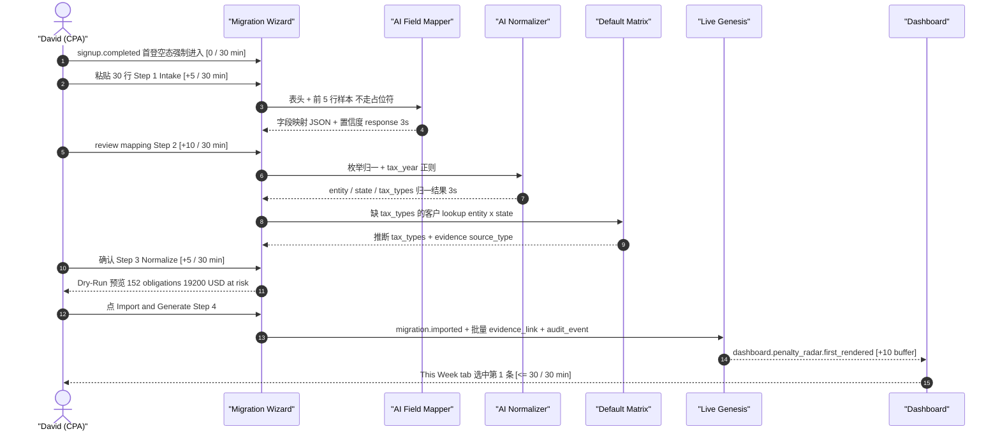

# Migration Copilot · MVP 范围与用户旅程

> 版本：v1.0（Demo Sprint · 2026-04-24）
> 上游：PRD Part1A §3.2 / §4.1 · Part1B §6A.1–§6A.10 · Part2B §12.2 / §12.3 · `dev-file/09` §2 / `dev-file/10` §3
> 入册位置：[`./README.md`](./README.md) §2 第 01 份

本文件把 Migration Copilot 的"Demo Sprint 必做 / 不做"、每条 AC 的三维映射、KPI 起止点、Story S2 端到端旅程、产品入口、权限与可达性基线写死，作为 UX（`./02-ux-4step-wizard.md`）与 Prompt（`./04-ai-prompts.md`）/ Default Matrix（`./05-default-matrix.md`）的上层锚点。

---

## 1. Demo Sprint MVP 范围一览

对照 `../../dev-file/09-Demo-Sprint-Module-Playbook.md` §2.1 / §2.2 与 PRD Part1A §4.1 P0-2 ~ P0-6。

| 在 Demo Sprint 范围内（必做）                                                                                                                                                                                                                                         | 不在 Demo Sprint 范围内（本轮留 hook）                                                                        |
| --------------------------------------------------------------------------------------------------------------------------------------------------------------------------------------------------------------------------------------------------------------------- | ------------------------------------------------------------------------------------------------------------- |
| Paste / CSV / XLSX 入口（Part1A P0-2 · Part1B §6A.6 Step 1）                                                                                                                                                                                                          | Onboarding AI Agent 真实实现（PRD §6A.11；设计就位见 [`./03-onboarding-agent.md`](./03-onboarding-agent.md)） |
| 5 个 Preset Profile 含 File In Time（Part1B §6A.4）                                                                                                                                                                                                                   | 全辖区显式 matrix 扩展（本 Sprint 仅 Federal + CA + NY；当前 Rules 已覆盖 `FED + 50 states + DC`）            |
| AI Field Mapper 识别 9 字段 `name / ein / state / county / entity_type / tax_types / email / assignee / notes`（Part1A P0-3 · Part1B §6A.2）                                                                                                                          | Team RBAC 四角色（PRD §3.6.3 · P1-19）                                                                        |
| AI Normalizer + 智能建议非阻塞（Part1A P0-4 · Part1B §6A.3）                                                                                                                                                                                                          | Pulse apply 联动 Migration 产生的 obligations（Demo Sprint 用静态 seed；`dev-file/09` §2.2）                  |
| Default Tax Types Inference Matrix Demo 子集 = Federal + CA + NY × 8 实体（Part1A P0-5 · Part1B §6A.5 · [`./05-default-matrix.md`](./05-default-matrix.md)）                                                                                                          | Migration 触发 PWA install prompt（PWA 整体 Phase 2；`dev-file/09` §5.11）                                    |
| Dry-Run 预览 + 原子 Import + Live Genesis 动画（Part1A P0-6 · Part1B §6A.6 Step 4）                                                                                                                                                                                   | Tauri macOS menu bar 联动（PRD P1-37 · Phase 2）                                                              |
| 24h 全量 Revert（Owner + Manager，见 [`./10-conflict-resolutions.md#1-revert-24h-全量撤销权限`](./10-conflict-resolutions.md#1-revert-24h-全量撤销权限)）                                                                                                             | 真实 WISP v1.0（Demo Sprint 交 1-page draft；PRD Part1A P0-24 · Part2B §13.2）                                |
| Migration 专属 evidence_link + audit_event `migration.imported / .reverted / .single_undo`（Part2B §13.2.1）                                                                                                                                                          | Rules Overlay runtime engine（Demo 直接 UPDATE；`dev-file/09` §2.2 + `dev-file/00` §3）                       |
| 5 套 Preset sample fixture + 坏行 fixture（Part2B §17 · [`./06-fixtures/README.md`](./06-fixtures/README.md)）                                                                                                                                                        | Audit-Ready Evidence Package（ZIP + SHA-256；PRD P1-28 · `dev-file/09` §14）                                  |
| Agent-shaped setup shell 的产品与埋点契约（非完整 Agent；见 [`./11-agentic-enhancements.md`](./11-agentic-enhancements.md)）                                                                                                                                          | Agent 自动 commit / ReAct 工具调用 / Setup History 完整页                                                     |
| Coverage transparency：Step 3 / Step 4 显示 `verified / demo_seed / skeleton / unsupported` 状态（见 [`./11-agentic-enhancements.md#3-增强点-b--6-辖区信任路线coverage-transparency`](./11-agentic-enhancements.md#3-增强点-b--6-辖区信任路线coverage-transparency)） | Default Matrix 扩展到全辖区显式 cells，并与当前 Rules coverage 对齐                                           |
| Dashboard landing 的 first-week operating loop strip（可用 fixture / sample Pulse，必须显式标 demo）                                                                                                                                                                  | 真实 Pulse Overlay Engine 联动 Migration 产生的 obligations                                                   |

> Phase 0 扩展位：本 §1 的右列在 Phase 0 MVP（4 周全量）阶段逐项上线时，需要回头在本 README §2 / `./10-conflict-resolutions.md` 补对应决策。本轮不展开。

---

## 2. AC × Test × P0 三维映射表

数据来源：PRD Part1A §3.2 S2-AC1..AC5 · §4.1 P0-2 ~ P0-6 · Part2B §12.3 T-S2-01..05 · Part1B §6A.10 验收清单。

| Story AC | 验收原文                                             | 测试用例（Part2B §12.3） | P0 模块（Part1A §4.1）                        | 本册兑现位置                                                                                                                                                                              |
| -------- | ---------------------------------------------------- | ------------------------ | --------------------------------------------- | ----------------------------------------------------------------------------------------------------------------------------------------------------------------------------------------- |
| S2-AC1   | 支持 TaxDome / Drake / Karbon / QuickBooks 导出 CSV  | T-S2-01                  | P0-2 Migration Copilot（入口 + Preset）       | [`./02-ux-4step-wizard.md#step-1-intake`](./02-ux-4step-wizard.md#step-1-intake) · [`./06-fixtures/README.md`](./06-fixtures/README.md)                                                   |
| S2-AC2   | 系统自动识别字段映射（客户名 / EIN / 州 / 实体类型） | T-S2-02                  | P0-3 AI Field Mapper                          | [`./02-ux-4step-wizard.md#step-2-mapping`](./02-ux-4step-wizard.md#step-2-mapping) · [`./04-ai-prompts.md#field-mapper-v1`](./04-ai-prompts.md#field-mapper-v1)                           |
| S2-AC3   | 对模糊或缺失字段提供智能建议而非阻塞性错误           | T-S2-03                  | P0-4 AI Normalizer + Smart Suggestions        | [`./02-ux-4step-wizard.md#step-3-normalize`](./02-ux-4step-wizard.md#step-3-normalize) · [`./04-ai-prompts.md#normalizer-v1`](./04-ai-prompts.md#normalizer-v1)                           |
| S2-AC4   | 导入后立即生成每个客户的全年截止日历，无需额外配置   | T-S2-04                  | P0-5 Default Tax Types Inference Matrix       | [`./05-default-matrix.md#demo-sprint-matrix-v10`](./05-default-matrix.md#demo-sprint-matrix-v10) · [`./02-ux-4step-wizard.md#step-3-normalize`](./02-ux-4step-wizard.md#step-3-normalize) |
| S2-AC5   | P95 完成时间 ≤ 30 分钟（30 客户基准）                | T-S2-05                  | P0-6 Dry-Run + Import + Live Genesis + Revert | [`./02-ux-4step-wizard.md#step-4-dry-run-and-genesis`](./02-ux-4step-wizard.md#step-4-dry-run-and-genesis) · 本文 §3 KPI 埋点表                                                           |

> 说明：T-S2-01 同时对 Preset 命中率与 EIN 识别率施加双指标，口径见 [`./10-conflict-resolutions.md#3-t-s2-01-双指标口径`](./10-conflict-resolutions.md#3-t-s2-01-双指标口径)。

---

## 3. KPI 埋点表

数据来源：PRD Part2B §12.2 Activation（Migration）。两条起止点重合的"Time-to-First-Value"与"P95 完成"在本册里明确**拆成两个独立指标**，见 [`./10-conflict-resolutions.md#4-kpi-起点与终点口径`](./10-conflict-resolutions.md#4-kpi-起点与终点口径)。

| KPI                                  | 目标值       | 起点事件                         | 终点事件                                    | 埋点位置                                                                                                                            | 备注                                                  |
| ------------------------------------ | ------------ | -------------------------------- | ------------------------------------------- | ----------------------------------------------------------------------------------------------------------------------------------- | ----------------------------------------------------- |
| Migration Time-to-First-Value        | P50 ≤ 10 min | `signup.completed`               | `dashboard.penalty_radar.first_rendered`    | Auth 回调 → Dashboard first paint（PostHog 事件由 Dashboard 模块 emit，见 `../../dev-file/09-Demo-Sprint-Module-Playbook.md` §5.8） | 对齐 PRD Part2B §12.2 Activation 第 1 行              |
| Migration P95 完成（S2-AC5）         | ≤ 30 min     | `signup.completed`               | `migration.imported`                        | 同上 → Migration 提交成功                                                                                                           | 对齐 PRD Part2B §12.2 第 2 行 · Part2B §12.3 T-S2-05  |
| Migration Completion Rate            | ≥ 70%        | `migration.wizard.step1.opened`  | `migration.imported`                        | 向导 Step 1 打开 → Import 成功                                                                                                      | 对齐 PRD Part2B §12.2 第 3 行                         |
| Migration Mapping Confidence（平均） | ≥ 85%        | `migration.mapper.run.completed` | 同事件（聚合字段 `avg_confidence`）         | AI Mapper 输出后，聚合 per-batch / per-firm 平均                                                                                    | 对齐 PRD Part2B §12.2 第 4 行 · Part1B §6A.2          |
| Migration Revert Rate                | ≤ 10%        | `migration.imported`             | `migration.reverted`（24h 内）              | 分子 `migration.reverted` / 分母 `migration.imported`                                                                               | 对齐 PRD Part2B §12.2 第 5 行 · Part2B §13.2.1        |
| Week-2 激活率                        | ≥ 7 / 10     | 种子用户名单（离线定义）         | `migration.imported` 在 Day-0 ~ Day-14 命中 | 对齐 PRD Part2B §12.4 Go 信号；Demo Sprint 用手工口径                                                                               | Demo Sprint 不做自动看板；Phase 0 起补 PostHog funnel |

> 说明：KPI 原始目标来自 PRD Part2B §12.2；本表是 Demo Sprint 的唯一埋点口径来源。`migration.imported / .reverted / .single_undo` 同时是 audit action（PRD Part2B §13.2.1）与 PostHog 事件名，见 [`./10-conflict-resolutions.md#6-audit-action-命名与-ui-文案分层`](./10-conflict-resolutions.md#6-audit-action-命名与-ui-文案分层)。

> Phase 0 扩展位：Funnel dashboard 自动化（PostHog Insights）+ Migration-to-Pulse 相关性分析 + 周度自动告警。

---

## 4. Story S2 用户旅程

### 4.1 主 Persona 简述

对齐 PRD Part1A §2.1 主 ICP 与 §2.2 Owner 角色、§2.3 场景 B。Demo Sprint 收紧到 Owner-only 单账号（`../../dev-file/09-Demo-Sprint-Module-Playbook.md` §2.2 · Part1A §4.1 P0-24），Manager / Preparer / Coordinator 不在本 Sprint 渲染。

- 姓名占位：**David**（CPA · 独立事务所 owner · 1-10 人 · 服务 30–80 business clients）
- 上一套工具：TaxDome / Drake / QuickBooks 其中之一（导出 CSV 在手）
- 目标：**30 分钟** 内完成 30 客户导入 + 看到全年 deadline + Deadline Radar 第一次跳出截止日风险（PRD Part1A §0.3 第 2 条铁律）
- 焦虑点：不想重输一天 / 不想录到一半崩溃 / 不想没审计就 Go Live

### 4.2 端到端时序（P95 ≤ 30 min 的预算分解）

时间预算严格对齐 PRD Part1B §6A.10 T-S2-AC5 备注：**粘贴 5min + mapping review 10min + normalize 5min + import + buffer 10min**。下图每条消息右侧标"耗时预算（elapsed / budget）"。



### 4.3 关键节点注释

| 节点                  | 写入 evidence_link                                                                                                         | 写入 audit_event                                           |
| --------------------- | -------------------------------------------------------------------------------------------------------------------------- | ---------------------------------------------------------- |
| Step 2 Mapping 确认   | 每一列的 `source=header + sample → target=DueDateHQ field` + confidence + model（Part1B §6A.2 后处理）                     | `migration.mapper.confirmed`（工程 log；非 audit.\* 命名） |
| Step 3 Normalize 确认 | 每一条归一（entity / state / tax_types）含 reasoning / model / confidence（Part1B §6A.3 "所有归一决策写 `evidence_link`"） | `migration.normalizer.confirmed`                           |
| Step 3 Matrix 应用    | Default Matrix 命中：`source_type=default_inference_by_entity_state` + `matrix_version`（Part1B §6A.5 JSON）               | `migration.matrix.applied`                                 |
| Step 4 Import 提交    | 批量 evidence_link（每条 obligation 都挂）+ migration_batch 记录                                                           | `migration.imported`（对齐 Part2B §13.2.1）                |
| Dashboard 首次渲染    | —                                                                                                                          | `analytics.dashboard.penalty_radar.first_rendered`         |
| 24h 内 Revert         | 每条 revert 落 evidence_link `source_type=migration_revert`                                                                | `migration.reverted`（对齐 Part2B §13.2.1）                |
| 单客户 7d Undo        | 同上                                                                                                                       | `migration.single_undo`（对齐 Part2B §13.2.1）             |

> 说明：audit_event 命名走 `migration.*` 工程 log 口径；UI / 邮件的人类可读文案走 Lingui 本地化（见 [`./10-conflict-resolutions.md#6-audit-action-命名与-ui-文案分层`](./10-conflict-resolutions.md#6-audit-action-命名与-ui-文案分层)）。

---

## 5. 入口矩阵

| 入口                         | 触发条件                                                           | 跳转路径                                                         | 是否强制   |
| ---------------------------- | ------------------------------------------------------------------ | ---------------------------------------------------------------- | ---------- |
| 首登 activation route        | `/onboarding` 新建 practice 后                                     | `/migration/new?source=onboarding`                               | 强制可跳过 |
| Clients 页 `+ Add clients ▾` | 已有客户的事务所新增时                                             | 当前 operating surface 内打开 Migration dialog                   | 否         |
| Cmd-K 命令面板 `> import`    | 任何已登录页面按 `Cmd + K` 并输入 `import`（对齐 PRD Part2A §7.6） | 当前 operating surface 内打开 Migration dialog                   | 否         |
| Import history               | 回访查历史 / 触发 24h Revert（PRD Part1A §5.10）                   | `/clients` 弱入口 → drawer batch detail；`/imports` 仅兼容重定向 | 否         |

> 说明：首登强制的是进入 migration activation route，而不是强制 commit。用户可以
> `Skip for now` 进入 Dashboard；后续仍可从 Dashboard、Clients 或 Command Palette
> 打开同一套 Migration Copilot。route-level 交接详见
> [`./13-onboarding-activation-route.md`](./13-onboarding-activation-route.md)。Onboarding AI
> Agent 作为平行入口的设计见 [`./03-onboarding-agent.md`](./03-onboarding-agent.md)。

---

## 6. 权限与并发

### 6.1 Demo Sprint 权限与 Phase 0 RBAC

对齐 `../../dev-file/09-Demo-Sprint-Module-Playbook.md` §2.2 与 PRD Part1A §4.1 P0-24：

- 唯一 Owner；本向导仅对 Owner 可见
- 四角色 RBAC 矩阵是 P1（PRD §3.6.3），Demo Sprint 不渲染
- 后端仍走 `scoped(db, firmId)` 与 RBAC 写路径校验；24h full-batch revert 为 Owner + Manager，账户 / billing / role / export 仍 Owner-only

### 6.2 Phase 0 权限矩阵预告（对齐 PRD Part1A §3.6.3）

| 操作                  | Owner | Manager | Preparer | Coordinator |
| --------------------- | ----- | ------- | -------- | ----------- |
| Migration Import      | ✓     | ✓       | —        | —           |
| Revert 24h 全量 batch | ✓     | ✓       | —        | —           |
| Revert 单客户（7 天） | ✓     | ✓       | —        | —           |

24h 全量 Revert 的裁定理由见 [`./10-conflict-resolutions.md#1-revert-24h-全量撤销权限`](./10-conflict-resolutions.md#1-revert-24h-全量撤销权限)：Revert 是补救能力，Owner-only 保留给所有权 / 账户级操作。

### 6.3 并发串行（对齐 PRD Part1A §3.6.6）

同一 firm **最多 1 个 draft batch**。第二位 Owner / Manager 进入时向导不直接报错，而是展示友好锁定提示（Demo Sprint 单 Owner 下触发概率低，但契约上必须就位，便于 Phase 0 扩展）：

```
Another import is currently in progress (Step 2 of 4).
[View] [Cancel theirs — Owner / Manager]
```

DB 层靠 `migration_batch.status='draft'` 的唯一性约束（全 firm 维度）保障（`../../dev-file/03-Data-Model.md` Migration 相关章节）。

---

## 7. 键盘与可达性基线

对齐 PRD Part2A §7.7 / Part2B §10.4 与 `Design/DueDateHQ-DESIGN.md` 无障碍章节。

### 7.1 全局

- `?` 打开快捷键帮助浮层
- `Esc` 关闭当前弹层 / 抽屉 / modal（非 destructive）
- `Cmd + K` 命令面板入口
- `Cmd + Shift + D` 暗色模式切换

### 7.2 向导内

- `Tab` / `Shift + Tab` 焦点切换（仅在向导内循环，不逃出）
- `Enter` 提交当前步骤（Step N → Step N+1）
- `数字键 1-4` **不**直跳步骤，避免误触
- `Cmd + Z` 不劫持（浏览器默认行为，粘贴区内 Undo 生效）

### 7.3 Focus Trap

- 每一步全屏 wizard 渲染为 `role="dialog"` + `aria-modal="true"`
- Tab 在当前步骤的可聚焦元素之间循环，不逃到宿主页面
- `aria-labelledby` 指向步骤标题（`Step 1 of 4 · Import clients`）
- `aria-describedby` 指向该步骤顶部说明（例如 Step 1 的"Where is your data coming from?"）

### 7.4 屏幕阅读器

- 每一步切换时 `aria-live="polite"` 广播 `Step N of 4 · <step title>`
- 主要状态变化（"30 rows ready to import"、"3 conflicts detected"、"Mapping complete with 92% average confidence"）都走同一 live region
- Error / Warning 走 `aria-live="assertive"`

### 7.5 对比度

- 遵循 `../../Design/DueDateHQ-DESIGN.md` 已有的 semantic token，不使用 raw hex 颜色
- Confidence 徽章（< 80% 黄 / ≥ 80% 绿 / < 50% 橙）对齐 DESIGN.md 风险色系
- 键盘焦点环 `:focus-visible` 使用 indigo `#5B5BD6`（DESIGN.md §2）

> Phase 0 扩展位：全辖区 matrix 显式 cell 扩展（扩展 `./05-default-matrix.md`）；Manager / Preparer 入口可见性开关；Pulse apply 事件到达时在向导 Step 4 Genesis 后显示 `1 rule updated recently` banner 与 Migration 产生的 obligations 联动。当前 Rules coverage 已是 `FED + 50 states + DC`，candidate 仍需 practice review。

---

## 8. 增强点落地边界（Agent-shaped but Wizard-committed）

本节引用 [`./11-agentic-enhancements.md`](./11-agentic-enhancements.md)，作为 Demo Sprint 与 Phase 0 之间的桥接。核心裁定：**用户可以被 Agent 引导，但危险写入仍由 Wizard Step 4 显式 commit。**

| 增强点                    | Demo Sprint 可交付                                                                                                        | Phase 0 才能交付                       | 不允许                                    |
| ------------------------- | ------------------------------------------------------------------------------------------------------------------------- | -------------------------------------- | ----------------------------------------- |
| Agent-shaped setup        | Agent shell / preview 状态、source 埋点、无损 fallback 到 Wizard                                                          | Agent 调 mapper / normalizer / dry-run | Agent 自动 import / 自动 revert           |
| Coverage transparency     | CA / NY 标 `demo_seed`，其他州/DC 标 `skeleton` 或 `state_review_needed`；Rules Console 按当前 active practice rules 展示 | 全辖区逐格 practice-reviewed           | 把 pending coverage 说成 active           |
| First-week operating loop | Dashboard landing strip，可用 fixture Pulse 且标 demo/sample                                                              | 真实 Pulse match imported clients      | 将 demo Pulse 冒充实时官方抓取            |
| Trust pack                | Step 4 safety + evidence preview 信息架构                                                                                 | 正式 audit package / ZIP manifest      | dry-run evidence preview 伪装成正式 audit |

新增埋点：

- `migration.agent_shell.opened`
- `migration.agent_shell.fell_back_to_wizard`
- `migration.coverage.previewed`
- `migration.evidence_preview.opened`
- `dashboard.first_week_operating_loop.ready`

这些事件遵循 `migration.*` / `dashboard.*` 工程 log 口径，不进 Lingui；用户可见文案继续走 Lingui。

### 8.1 Phase 0 · Migration Copilot intake boundary

Phase 0 保留 Migration Copilot 作为一次性导入向导，不再把 provider integration records 接入当前导入链路：

- Step 1 只保留 `Paste / Upload` 和税务软件 preset。CSV、TSV、XLSX、复制表格文本和可表格化的 JSON
  仍走普通 migration 的 mapper / normalizer / dry-run / commit。
- 普通供应商 CSV/XLSX 导出继续走 `Paste / Upload` + preset；CCH Axcess、CCH ProSystem fx、
  Lacerte、ProSeries、UltraTax CS、ProConnect Tax 等来源作为导入模板处理，而不是 provider
  sync。
- 当前架构不再维护 `migration_staging_row`、`external_reference` 或 provider-specific
  `integration_*` source。历史 integration batch 在数据库迁移中降级为普通 `csv` source，以保留
  已导入 client / obligation。
- 首期仍不承诺 OAuth、深双向同步、provider webhook 状态镜像、Drake/ProConnect 写回或
  e-file transmission；这些如果重启，应作为单独 connector 产品面设计，而不是 Migration Copilot
  intake 的隐藏入口。

---

## 变更记录

| 版本 | 日期       | 作者       | 摘要                                                                                                   |
| ---- | ---------- | ---------- | ------------------------------------------------------------------------------------------------------ |
| v1.0 | 2026-04-24 | Subagent A | 初稿：Demo Sprint 范围表 · AC 三维映射 · KPI 埋点 · S2 旅程 · 入口矩阵 · 权限与可达性基线              |
| v1.1 | 2026-04-24 | Codex      | 增补 Agent-shaped setup / coverage transparency / first-week loop / trust pack 的 Demo 与 Phase 0 边界 |
