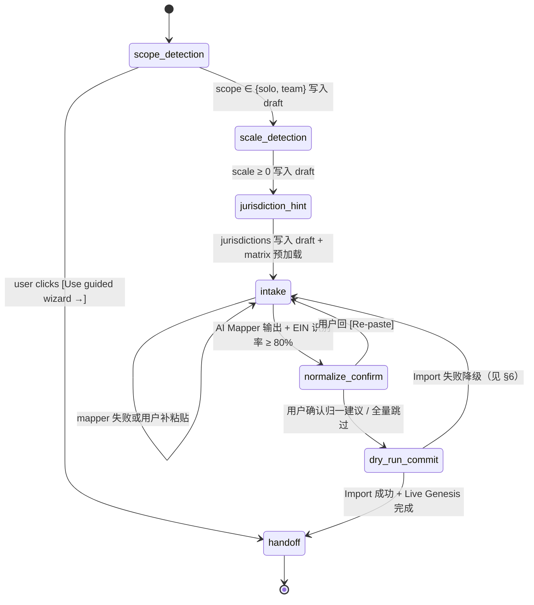

# Migration Copilot · 03 · Onboarding AI Agent 产品形态锁定

> 版本：v1.0（Demo Sprint · 2026-04-24）
> 上游：PRD Part1B §6A.11 全节（行 377–493）· Part1B §6A.1–§6A.9（复用管线）· Part1A §5.9 入口 / §6.2.1 Glass-Box 纪律 · Part2B §9.3 数据保留与调用记录 / §13.2 placeholder · `dev-file/04-AI-Architecture.md` §1–§3 / §5
> 入册位置：[`./README.md`](./README.md) §2 第 03 份
> 权威口径：本 Sprint 产出**产品形态 + 对话脚本 + 降级 + Demo 钩子**锁定文档；**Demo Sprint 不实现**，Agent 入口位以 disabled preview 卡片呈现，点击自动降级跳传统 4 步向导（[`./02-ux-4step-wizard.md`](./02-ux-4step-wizard.md)）Step 1

本文件是 PRD §6A.11 的**落地翻译**，不改写 PRD 语义；所有对话脚本**原文照录 §6A.11.2**，仅在右侧加中文注解标识 state 流转 / 复用管线 / Evidence / Audit 写入。本文件与 [`./02-ux-4step-wizard.md`](./02-ux-4step-wizard.md) 共享 `onboardingDraft` 对象契约（§4.3），后者在 Agent 真实上线前兜底整个 S2 AC 闭环。

---

## 1. 战略与定位

### 1.1 为什么必须做（对齐 PRD §6A.11.1）

1. **没人真正读 Onboarding 文档。** 传统空态页 `[+ Import] [+ Add client]` 的转化窗口只有 30 秒；CPA 走不过来就会关掉标签页。
2. **产品受众会精准 GET 到这个。** LangGenius 每天在做 AI orchestration；看到"主动发问 → 按客户回答 → 调用工具链 → 产出具体价值"的 Agent，共鸣一次爆炸。
3. **它复用你已经做过的 90% 管线**（Migration Mapper + Normalizer + Default Matrix + Live Genesis），增量成本 ≤ 2 人天。

### 1.2 为什么 P1 不 P0（对齐 PRD §6A.11.6）

- **Story S2 验收不依赖它**：`./01-mvp-and-journeys.md` §2 AC × Test × P0 映射表的 5 条 AC 全部由传统 4 步向导兑现（[`./02-ux-4step-wizard.md`](./02-ux-4step-wizard.md)）；Agent 对话路径**不进入**本 Sprint 的自动化测试基线。
- **它是集训评分的关键差异化资产**：产品受众第一次看到产品时，Agent 对话框的视觉冲击远强于传统向导，直接决定"这是 AI Agent 在正确场景的正确姿势"的 Pitch 叙事分（`../../dev-file/10-Demo-Sprint-7Day-Rhythm.md` §6 Pitch 彩排表）。
- **风险对称**：Demo Sprint 不跑真实 AI SDK 连接 Agent 路径，等价于把 KPI 起止点（`./01-mvp-and-journeys.md` §3）全部绑到 4 步向导，Agent 只承担叙事价值。

### 1.3 Demo Sprint 定位（本 Sprint 真正渲染的）

- Practice onboarding 完成后进入
  [`/migration/new?source=onboarding`](./13-onboarding-activation-route.md)，route 顶部解释
  为什么要导入客户，页面内直接承载传统 4 步向导（`./02-ux-4step-wizard.md` Step 1）。
- Agent 入口从单纯 disabled 卡片升级为 **Agent-shaped setup shell 的产品入口位**：Demo Sprint 可以只展示确定性 shell / preview 状态并自动跳传统向导；完整多轮 Agent 不在本 Sprint 承诺内。增强边界见 [`./11-agentic-enhancements.md`](./11-agentic-enhancements.md)。
- **不是 404**：preview 卡片必须能点、能回落；入口矩阵（`./01-mvp-and-journeys.md` §5）保持"首登强制 + 三处非强制"不变。
- 埋点：`onboarding.agent.preview_card.clicked`（工程 log，口径同 [`./10-conflict-resolutions.md#6-audit-action-命名与-ui-文案分层`](./10-conflict-resolutions.md#6-audit-action-命名与-ui-文案分层)），用来看 Pitch 现场有多少人对 AI 路径感兴趣 → 反哺 Phase 0 rollout 判断。

### 1.4 Phase 0 / P1 扩展路线

| 阶段                | 里程碑                                                                                     | 复用 / 增量                                                                                                                             | 需要冻结的契约                                                                 |
| ------------------- | ------------------------------------------------------------------------------------------ | --------------------------------------------------------------------------------------------------------------------------------------- | ------------------------------------------------------------------------------ |
| Demo Sprint（本轮） | 产品形态锁定 + preview 卡片 + 降级走 wizard                                                | 0 AI 调用；仅埋点                                                                                                                       | —                                                                              |
| Phase 0（4 周 MVP） | Agent 真实 AI SDK 接线（`intake` → `normalize_confirm`）；`onboardingDraft` 跨标签页持久化 | 复用 `./04-ai-prompts.md#field-mapper-v1` + `#normalizer-v1`；增量 = Agent 脚本 prompt `agent@v1`                                       | AI Execution Contract（`../../dev-file/09-Demo-Sprint-Module-Playbook.md` §6） |
| Phase 0 末          | Agent 走通完整 7 state 链路 + Live Genesis 接入                                            | 复用 [`./05-default-matrix.md`](./05-default-matrix.md) + [`./07-live-genesis.md`](./07-live-genesis.md)；增量 = 多轮记忆 session store | Obligation Domain Contract                                                     |
| P1                  | 多轮记忆（"我上次说的 42 个客户"）+ 跨 firm 切换时的 Setup History 可见性                  | 复用 §6A.11.5 Setup History                                                                                                             | Audit/Evidence Contract                                                        |

> 关键约束：Agent 可以预填 draft、调用 Mapper / Normalizer / Dry-Run，但 `commitMigration` 只能由用户在 Wizard Step 4 或 Agent 的同构 dry-run commit screen 上显式点击触发。禁止 Agent 自动导入、自动撤销、自动 Apply Pulse。

> Phase 0 扩展位：Agent 真实 AI SDK 调用接线；`onboardingDraft` 跨标签页持久化（localStorage + Worker 端 draft 同步）；多轮记忆；跨 firm 切换时的 Setup History 可见性；Agent 转化率 vs Wizard 转化率的 A/B funnel。

---

## 2. 空态首页布局

### 2.1 Agent 真实上线（P1）ASCII 线框

```text
┌────────────────────────────────────────────────────────────────────┐
│  DueDateHQ                          [Use guided wizard →]  ⌘K  ⚙   │
├────────────────────────────────────────────────────────────────────┤
│                                                                    │
│   ┌──────────────────────────────────────────────────────────────┐ │
│   │  ✦ DueDateHQ Setup Copilot               state: scope_detect │ │
│   │                                                              │ │
│   │   Hi! I'm here to get you running in under 5 minutes.        │ │
│   │   Quick question: are you solo, or do you have a team?       │ │
│   │                                                              │ │
│   │   [ solo ]   [ team ]   [ Skip ]                             │ │
│   │                                                              │ │
│   │   ──────────────────────────────────────────────────────     │ │
│   │                                                              │ │
│   │   > _                                           [Send ↵]     │ │
│   │                                                              │ │
│   │   [Go back]                       [Use guided wizard →]      │ │
│   └──────────────────────────────────────────────────────────────┘ │
│                                                                    │
│   💡 Progress pill（右上常驻）: 1/7 · Detecting scope              │
│                                                                    │
└────────────────────────────────────────────────────────────────────┘
```

- **Agent Chat 占主位**（≈ 60% 视口宽度，max-width 720px，对齐 `{spacing.8}` 外边距）；右上 `[Use guided wizard →]` 作为**常驻逃生门**（`{colors.text-secondary}` + hover `{colors.accent-text}`），任何 state 都可达。
- 用户气泡 background = `{colors.surface-elevated}` + `{rounded.md}`；Agent 气泡 background = `{colors.accent-tint}` + `{rounded.md}`，参考 `../../docs/Design/DueDateHQ-DESIGN.md` Evidence drawer Level 3 密度。
- Progress pill（state 回显）文字色 `{colors.accent-default}`，字号走 `{typography.label}`。
- 三个逃生门：每个 state 都附 `[Skip this step]` / `[Go back]` / `[Use guided wizard →]`；已收集字段通过 `onboardingDraft` 对象携带，切换到传统向导时**不丢失**。

### 2.2 Demo Sprint 渲染形态（本 Sprint 实际产出）

```text
┌────────────────────────────────────────────────────────────────────┐
│  DueDateHQ — Let's get you running                           ⌘K   │
├────────────────────────────────────────────────────────────────────┤
│                                                                    │
│   Welcome, David. Pick how you want to set things up:              │
│                                                                    │
│   ┌─────────────────────────────────┐  ┌────────────────────────┐  │
│   │  ✦ Try AI Setup Copilot         │  │  Start guided wizard → │  │
│   │  (preview · coming soon)        │  │                        │  │
│   │                                 │  │  4 steps · ~15 min     │  │
│   │  Chat your way through setup.   │  │  Paste or upload CSV.  │  │
│   │  Available next phase.          │  │                        │  │
│   │                                 │  │  [ Start →  (primary)] │  │
│   └─────────────────────────────────┘  └────────────────────────┘  │
│       ↑ disabled · {colors.surface-subtle}                         │
│                                                                    │
└────────────────────────────────────────────────────────────────────┘
```

- 左卡 `[Try AI Setup Copilot (preview)]`：`{colors.surface-subtle}` + `{colors.text-muted}` 标题 + `{rounded.md}`；**可点但不可用**；点击行为见 §11。
- 右卡 `[Start guided wizard →]`：primary 按钮 `{colors.accent-default}` + `{colors.text-primary}`；点击跳 [`./02-ux-4step-wizard.md#step-1-intake`](./02-ux-4step-wizard.md#step-1-intake)。
- **首登强制**：仍按 `./01-mvp-and-journeys.md` §5 入口矩阵第 1 行"首登强制进入空态"；但落地路径变成"首登 → 两卡选择页 → guided wizard"，Agent preview 卡不拦截，不消耗 P95 预算。

---

## 3. 对话脚本完整原文（§6A.11.2 照录 + 右侧中文注解）

> **重要约束**：本节左列每一 turn 的文字**原文来自 PRD Part1B §6A.11.2 行 390–442**，不删减、不改写、不翻译；每个 turn 的英文气泡文案在 SaaS app 工程实现时都会走 `<Trans>...</Trans>`（JSX）或 `` t`...` ``（字符串）宏（ADR 0009 · [`../../adr/0009-lingui-for-i18n.md`](../../adr/0009-lingui-for-i18n.md)），zh-CN 副本跟 `apps/app` 的 Lingui catalog 抽取（`apps/app/src/i18n/locales/zh-CN/messages.po`，见 `../../AGENTS.md`）。公开 marketing 站文案不进入 app catalog。右列是本册新加的中文注解，**不进 PRD，不进工程代码**。

### 3.1 完整脚本（原文 + 注解）

```
(空态首页，AI Agent Chat 占主位，传统 4 步向导降为右上 [Use guided wizard] 链接)    ← 布局锚点：§2.1；Demo Sprint 本身不渲染这个形态，渲染 §2.2

✦ DueDateHQ Setup Copilot
   Hi! I'm here to get you running in under 5 minutes.                                ← state 进入 = scope_detection（§4 state #1）
   Quick question: are you solo, or do you have a team?                               ← prompt_version = agent@v1 · model_tier = fast-json（`dev-file/04-AI-Architecture.md` §2 router 档位）
                                                                                        ← audit_event = onboarding.agent.turn.opened
                                                                                        ← evidence_link = source_type: `ai_migration_map`（本 turn 不涉，仅挂 turn open）
> solo                                                                                ← 用户输入。onboardingDraft.scope = 'solo'

   Nice — one-person setup is the fastest path.                                       ← state 转移：scope_detection → scale_detection（§4 #2 退出条件：scope 已知）
   Roughly how many active clients do you have?                                       ← audit_event = onboarding.agent.state.advanced（from=scope_detection, to=scale_detection）

> around 50                                                                           ← 用户输入。onboardingDraft.scale = 50（接受 "around N" 模糊量化）

   Got it. Most of them US-based?                                                     ← state 转移：scale_detection → jurisdiction_hint（§4 #3）
                                                                                        ← audit_event = onboarding.agent.state.advanced

> all in CA and NV, mostly LLCs                                                       ← 用户输入。onboardingDraft.jurisdictions = ['CA', 'NV']；onboardingDraft.entity_hint = 'LLC'

   Perfect — I've pre-loaded CA Franchise Tax + NV rules for you.                     ← 触发规则预加载：复用 §6A.5 Default Tax Types Matrix（[`./05-default-matrix.md`](./05-default-matrix.md)）LLC×CA 行 = CA Franchise min $800 + CA LLC Fee + Federal 1065/1040
                                                                                        ← evidence_link.source_type = `default_inference_by_entity_state`
                                                                                        ← audit_event = onboarding.agent.matrix.preloaded
                                                                                        ← NV 未在 Demo Sprint 3 辖区内（Federal/CA/NY），P1 上线前需扩 seed（`./05-default-matrix.md` §待扩展清单）
   Now the hardest part: your client list. Paste it here in any                      ← state 转移：jurisdiction_hint → intake（§4 #4）
   format — a TaxDome export, a messy Excel, even rows from an email.
   I'll figure out the columns.

   💡 Tip: 52-column spreadsheet? I've seen worse. Just paste.

> [user pastes 52 rows × 7 columns of messy Excel]                                    ← onboardingDraft.raw_paste = 原始 TSV（客户端 redact SSN 后，见 §5 PII）

   Reading it now...                                                                  ← 调用 AI Field Mapper（复用 §6A.2 + [`./04-ai-prompts.md#field-mapper-v1`](./04-ai-prompts.md#field-mapper-v1)）
   ✓ Found 52 clients                                                                 ← 注意：用户说 "around 50"，mapper 实测 52；以 mapper 结果为准
   ✓ Detected columns: Name, Tax ID (EIN), State, Entity Type,                       ← mapper 输出：EIN 命中率 ≥ 80% 才接受（§6A.2 后处理）
     Assignee, Notes, Last Contact
   ⚠ 3 entity types look odd ("Corp (S)", "L.L.C.", "Ptnr") —                         ← 归一建议，复用 §6A.3 Normalizer（[`./04-ai-prompts.md#normalizer-v1`](./04-ai-prompts.md#normalizer-v1)）
     I'll clean them up.                                                              ← state 转移：intake → normalize_confirm（§4 #5）
                                                                                        ← audit_event = onboarding.agent.intake.submitted
                                                                                        ← evidence_link.source_type = `ai_migration_map` + `ai_migration_normalize`
                                                                                        ← ai_output.prompt_version = agent@v1 · input_context_ref = hash(piiMap + raw_paste 前 5 行)
   Before I commit: I'll generate 247 deadlines for tax year 2026                    ← Dry-Run 预览：复用 §6A.6 Step 4（[`./02-ux-4step-wizard.md#step-4-dry-run-and-genesis`](./02-ux-4step-wizard.md#step-4-dry-run-and-genesis)）的 SQL 预检
   with an estimated $31,400 exposure this quarter. OK to proceed?                    ← state 转移：normalize_confirm → dry_run_commit（§4 #6）
                                                                                        ← audit_event = onboarding.agent.dry_run.previewed

> go                                                                                  ← 用户输入 commit 信号

   [Live Genesis 4s 动画]                                                             ← 复用 §6A.6 Step 4 Live Genesis（[`./07-live-genesis.md`](./07-live-genesis.md)）；动效时序与传统 wizard 完全一致
                                                                                        ← audit_event = onboarding.agent.import.committed（**对齐** `migration.imported` 但命名空间不同，见 §7）
                                                                                        ← 同时写 `migration.imported` 工程 audit（complicance 归属同一 batch），见 §7.3

   ✓ Done. Your Dashboard is ready — top 3 urgent items are                           ← state 转移：dry_run_commit → handoff（§4 #7）
   Acme LLC (CA Franchise, 3 days, $4,200), Bright Studio                             ← 这 3 条来自 Dashboard 的 Deadline Radar（Part1A §0.3 第 1 条铁律）
   (1120-S, 5 days, $2,800), Zen Holdings (Q1 Est., 7 days, $1,650).

   Want me to walk you through the weekly triage workflow?                            ← Handoff：二选一，不再推进 state；下一轮会话可由用户从 Dashboard 继续
   Or jump to the Dashboard?                                                          ← audit_event = onboarding.agent.handoff.offered

> [Open Dashboard] [Walk me through]                                                  ← 用户选择 = 跳转 / 或开始 Pulse / Brief 引导（本文不展开，见 Phase 0 follow-up）
```

### 3.2 每个气泡的 i18n 落地

| 气泡来源           | EN（主，`<Trans>` 或 `` t`...` ``）                                                                                    | zh-CN（副，Lingui catalog 抽取）                                             |
| ------------------ | ---------------------------------------------------------------------------------------------------------------------- | ---------------------------------------------------------------------------- |
| Turn 1 greeting    | `Hi! I'm here to get you running in under 5 minutes.`                                                                  | `嗨！我是来帮你 5 分钟内搞定 setup 的。`                                     |
| Turn 1 question    | `Quick question: are you solo, or do you have a team?`                                                                 | `先问一句：你是一个人做，还是有团队？`                                       |
| Turn 3 confirm     | `Got it. Most of them US-based?`                                                                                       | `收到。主要是美国本土客户吗？`                                               |
| Turn 5 preload     | `Perfect — I've pre-loaded CA Franchise Tax + NV rules for you.`                                                       | `好嘞——我已经帮你预载了 CA Franchise Tax 和 NV 的规则。`                     |
| Turn 5 intake hint | `Paste it here in any format — a TaxDome export, a messy Excel, even rows from an email. I'll figure out the columns.` | `直接粘贴——TaxDome 导出、乱七八糟的 Excel、邮件里复制的几行都行。我来认列。` |
| Turn 6 found       | `Found 52 clients`                                                                                                     | `找到 52 个客户`                                                             |
| Turn 6 cleanup     | `3 entity types look odd — I'll clean them up.`                                                                        | `3 条实体类型看着有点怪——我帮你清洗一下。`                                   |
| Turn 6 commit ask  | `OK to proceed?`                                                                                                       | `可以开始生成吗？`                                                           |
| Turn 7 done        | `Done. Your Dashboard is ready — top 3 urgent items are ...`                                                           | `搞定。Dashboard 已就绪——最急的 3 条是……`                                    |
| Turn 7 handoff     | `Want me to walk you through the weekly triage workflow? Or jump to the Dashboard?`                                    | `要不要我带你走一遍每周分诊流程？还是直接去 Dashboard？`                     |

> 约定：**所有** Agent 对 user 显示的文本字符串**必须**走 `<Trans />`（JSX 模板）或 `` t`...` `` 宏（工具函数字符串）；AI prompt 本身**不走** Lingui（prompt 是英文工程常量，见 [`./04-ai-prompts.md`](./04-ai-prompts.md)）。这条规则与 `migration.*` audit action 命名不走 Lingui 对称（[`./10-conflict-resolutions.md#6-audit-action-命名与-ui-文案分层`](./10-conflict-resolutions.md#6-audit-action-命名与-ui-文案分层)）。

---

## 4. State Machine（对齐 §6A.11.3）

### 4.1 mermaid 状态图



### 4.2 7 State 详述（每 state 必含 4 列）

#### State 1 · `scope_detection`

| 退出条件                                           | 复用管线              | Evidence / Audit 写入                                                                                                                                    | Skip / Back / Switch to wizard 可达                                                                         |
| -------------------------------------------------- | --------------------- | -------------------------------------------------------------------------------------------------------------------------------------------------------- | ----------------------------------------------------------------------------------------------------------- |
| `onboardingDraft.scope ∈ {'solo', 'team', 'skip'}` | 无（纯 Agent prompt） | `audit_event = onboarding.agent.state.advanced (to=scale_detection)`；`ai_output(prompt_version=agent@v1, model_tier=fast-json, input_context_ref=hash)` | Skip：`scope='skip'` 跳下一 state · Back：不可（首 state，Back 灰化）· Switch：跳 wizard Step 1，保留 draft |

#### State 2 · `scale_detection`

| 退出条件                                        | 复用管线 | Evidence / Audit 写入                                                  | Skip / Back / Switch to wizard 可达                                      |
| ----------------------------------------------- | -------- | ---------------------------------------------------------------------- | ------------------------------------------------------------------------ |
| `onboardingDraft.scale` 为数字或 `null`（skip） | 无       | `audit_event = onboarding.agent.state.advanced (to=jurisdiction_hint)` | Skip：`scale=null` · Back：回 scope_detection · Switch：跳 wizard Step 1 |

#### State 3 · `jurisdiction_hint`

| 退出条件                                                       | 复用管线                                                                                                                          | Evidence / Audit 写入                                                                                                                 | Skip / Back / Switch to wizard 可达                                                                                                            |
| -------------------------------------------------------------- | --------------------------------------------------------------------------------------------------------------------------------- | ------------------------------------------------------------------------------------------------------------------------------------- | ---------------------------------------------------------------------------------------------------------------------------------------------- |
| `onboardingDraft.jurisdictions: string[]` + 可选 `entity_hint` | **规则预加载**：复用 §6A.5 Default Matrix（[`./05-default-matrix.md`](./05-default-matrix.md)）按 `(entity_hint, state)` 两键查表 | `evidence_link.source_type = default_inference_by_entity_state` + `matrix_version`；`audit_event = onboarding.agent.matrix.preloaded` | Skip：`jurisdictions=[]`，后续 Dry-Run 回退 `federal_*` 默认 · Back：回 scale_detection · Switch：跳 wizard Step 1（draft 保留 jurisdictions） |

#### State 4 · `intake`

| 退出条件                                                                                                                                                                                                           | 复用管线                                                                                                                                                                  | Evidence / Audit 写入                                                                                         | Skip / Back / Switch to wizard 可达                                                                                                   |
| ------------------------------------------------------------------------------------------------------------------------------------------------------------------------------------------------------------------ | ------------------------------------------------------------------------------------------------------------------------------------------------------------------------- | ------------------------------------------------------------------------------------------------------------- | ------------------------------------------------------------------------------------------------------------------------------------- |
| `onboardingDraft.raw_paste` 非空 + AI Mapper 返回 JSON 且 EIN 命中率 ≥ 80%（若存在 EIN 列，对齐 §6A.2 + [`./10-conflict-resolutions.md#3-t-s2-01-双指标口径`](./10-conflict-resolutions.md#3-t-s2-01-双指标口径)） | **AI Field Mapper**：复用 §6A.2 + [`./04-ai-prompts.md#field-mapper-v1`](./04-ai-prompts.md#field-mapper-v1)；仅发字段名 + 5 行样本，不走 `{{client_N}}` 占位符（裁定 5） | `evidence_link.source_type = ai_migration_map`（每列一条）；`audit_event = onboarding.agent.intake.submitted` | Skip：直接跳 normalize_confirm 走 Default Matrix 补全 · Back：回 jurisdiction_hint · Switch：跳 wizard Step 1（draft.raw_paste 不丢） |

#### State 5 · `normalize_confirm`

| 退出条件                                                                                  | 复用管线                                                                                                                                                                                               | Evidence / Audit 写入                                                                                                                                                               | Skip / Back / Switch to wizard 可达                                                                                                                  |
| ----------------------------------------------------------------------------------------- | ------------------------------------------------------------------------------------------------------------------------------------------------------------------------------------------------------ | ----------------------------------------------------------------------------------------------------------------------------------------------------------------------------------- | ---------------------------------------------------------------------------------------------------------------------------------------------------- |
| 用户确认 Agent 给出的归一 summary（气泡里"3 entity types look odd — I'll clean them up"） | **AI Normalizer**：复用 §6A.3 + [`./04-ai-prompts.md#normalizer-v1`](./04-ai-prompts.md#normalizer-v1)；**Default Matrix** 补缺失 tax_types（复用 [`./05-default-matrix.md`](./05-default-matrix.md)） | `evidence_link.source_type = ai_migration_normalize`（每条归一决策）+ `default_inference_by_entity_state`（每条 matrix 补全）；`audit_event = onboarding.agent.normalize.confirmed` | Skip：直接 dry_run_commit（用户接受全部 normalize 建议）· Back：回 intake · Switch：跳 wizard Step 2 Mapping 或 Step 3 Normalize（按最近 turn 判断） |

#### State 6 · `dry_run_commit`

| 退出条件                                       | 复用管线                                                                                                  | Evidence / Audit 写入                                                                                                                                            | Skip / Back / Switch to wizard 可达                                                                         |
| ---------------------------------------------- | --------------------------------------------------------------------------------------------------------- | ---------------------------------------------------------------------------------------------------------------------------------------------------------------- | ----------------------------------------------------------------------------------------------------------- |
| 用户回 `go` / `yes` / 点 `[Import & Generate]` | **原子导入 + Live Genesis**：复用 §6A.7 import 事务 + [`./07-live-genesis.md`](./07-live-genesis.md) 动效 | `audit_event = onboarding.agent.import.committed` + **同时** `migration.imported`（compliance 归属同 batch，见 §7.3）；批量 `evidence_link` 每条 obligation 都挂 | Skip：不可（必须显式 commit 或 cancel）· Back：回 normalize_confirm · Switch：跳 wizard Step 4 Dry-Run 预览 |

#### State 7 · `handoff`

| 退出条件                                         | 复用管线     | Evidence / Audit 写入                                                                | Skip / Back / Switch to wizard 可达                                                                  |
| ------------------------------------------------ | ------------ | ------------------------------------------------------------------------------------ | ---------------------------------------------------------------------------------------------------- |
| 用户点 `[Open Dashboard]` 或 `[Walk me through]` | 无（跳路由） | `audit_event = onboarding.agent.handoff.offered` + `onboarding.agent.handoff.chosen` | Skip：不可（终态）· Back：灰化 · Switch：灰化（已导入，后续入口走 Clients 的 Import history drawer） |

> 三大逃生门约束：`[Skip this step]` / `[Go back]` / `[Use guided wizard →]` 在 **state 1–6** 必须全部可见（Skip 可能灰化，如 dry_run_commit）；state 7 handoff 为终态，三门全部灰化。切换到 wizard 时 **`onboardingDraft` 对象不丢**，由 [`./02-ux-4step-wizard.md`](./02-ux-4step-wizard.md) 同款对象消费（见 §4.3）。

### 4.3 `onboardingDraft` 对象契约

```ts
// 契约位：packages/contracts/src/migration/onboarding-draft.ts（Phase 0 接入）
export interface OnboardingDraft {
  scope: 'solo' | 'team' | 'skip' | null
  scale: number | null // 用户报的模糊数字
  jurisdictions: string[] // 2-letter state codes
  entity_hint: EntityType | null // LLC / S-Corp / ...（对齐 §6A.2）
  raw_paste: string | null // 客户端 redact SSN 后的 TSV
  mapper_output: MapperResult | null // AI Field Mapper JSON（§6A.2）
  normalizer_output: NormalizerResult | null // §6A.3
  matrix_applied: MatrixRow[] // Default Matrix 命中（§6A.5）
  piiMap: Record<string, string> // Agent 路径才用，见 §5
  state: OnboardingState // 当前 state
  last_turn_audit_ref: string // audit_event.id 最近 turn
}
```

**兼容性约束**：`./02-ux-4step-wizard.md` 的 `wizardDraft` 是本对象的**超集**（多 `preset_profile`、`conflicts` 两字段）；Agent 切换到 wizard 时按字段名直接赋值，不做数据迁移。

---

## 5. Placeholder 与 PII 落地（裁定 5 对齐）

### 5.1 分治原则

对齐 [`./10-conflict-resolutions.md#5-placeholder-策略`](./10-conflict-resolutions.md#5-placeholder-策略) 与 PRD Part1A §6.2.1 + Part2B §13.2。

| 场景                                                 | 是否走 `{{client_N}}` / `{{ein_N}}` / `{{email_N}}` 占位符                                        | 理由                                                                              |
| ---------------------------------------------------- | ------------------------------------------------------------------------------------------------- | --------------------------------------------------------------------------------- |
| **Agent 对话气泡**（本文）                           | **是**：客户名 / EIN / 邮箱发到 AI SDK 前**必须替换**为 `{{client_N}}` 等占位符                   | Agent 只需要语义，不需要原值识别能力                                              |
| Migration Field Mapper（§6A.2）                      | **否**：只发字段名 + 5 行原始样本                                                                 | Mapper 的工作正是"识别原始值模式"（如 EIN `^\d{2}-\d{7}$`），占位符会洗掉可识别性 |
| Migration Normalizer（§6A.3）                        | **否**：同上，归一枚举需要看原值                                                                  | `L.L.C.` / `Corp (S)` 这类模糊值必须原文进 AI SDK                                 |
| Onboarding Agent 调 Field Mapper / Normalizer 子管线 | **否**（委托给子管线）：占位符仅作用于 Agent 对话气泡层，子管线仍按 §6A.2 / §6A.3 规则发 5 行原值 | 分层护栏：Agent 气泡 ↔ Mapper/Normalizer 之间有 piiMap 边界                       |

### 5.2 piiMap 生命周期

```text
User input: "I have 42 clients, mostly Acme LLC, Bright Studio in CA/NV"
         ↓ 客户端（apps/app）正则扫描
piiMap (Worker 内存 + ai_output.input_context_ref = hash):
  {
    "{{client_1}}": "Acme LLC",
    "{{client_2}}": "Bright Studio",
    // EIN、email 同理按 {{ein_N}} / {{email_N}} 编号
  }
         ↓ redact 后发 AI SDK
Prompt to agent@v1: "I have 42 clients, mostly {{client_1}}, {{client_2}} in CA/NV"
         ↓ AI SDK 响应
Raw completion: "Got it — I've pre-loaded rules for {{client_1}} / {{client_2}}..."
         ↓ Glass-Box Guard（dev-file/04-AI-Architecture.md §3 第 4 道闸 PII 回填）
Final bubble to user: "Got it — I've pre-loaded rules for Acme LLC / Bright Studio..."
```

- **piiMap 存储位置**：Worker 内存（单 request 作用域）+ `ai_output.input_context_ref` 存 **hash**（SHA-256），**不存原文**；对齐 PRD Part2B §9.3 数据保留与调用记录 + `dev-file/04-AI-Architecture.md` §3。
- **未声明占位符 = 禁止渲染**：若 AI SDK 输出里出现未在 piiMap 声明的 `{{xxx_N}}`，Glass-Box Guard 第 4 道闸抛 `pii_mismatch`，重试 1 次失败后走 refusal（见 §6）。
- **Retention 契约**：运行时走 Vercel AI SDK Core + Cloudflare AI Gateway provider；prompt 明示 `Do not retain any data seen for training`；`ai_output` trace 只存 input hash 不存原文（Part2B §9.3 + §6A.9）。

### 5.3 对比 Mapper / Normalizer 的 PII 策略

| 维度                 | Agent 对话（本文）                                | Field Mapper（§6A.2）   | Normalizer（§6A.3）                          |
| -------------------- | ------------------------------------------------- | ----------------------- | -------------------------------------------- |
| 发到 AI SDK 的数据   | 用户对话文本（含客户名 / EIN / 邮箱被占位符替换） | 表头 + 5 行样本（原值） | 字段枚举值（原值，如 `L.L.C.` / `Corp (S)`） |
| Placeholder          | 走 `{{client_N}}` / `{{ein_N}}` / `{{email_N}}`   | 不走                    | 不走                                         |
| Retention 契约       | 必须                                              | 必须                    | 必须                                         |
| `ai_output` 记录原文 | 否（仅 input hash）                               | 否                      | 否                                           |
| 前端 SSN 正则拦截    | 是（见 §6 第 5 行）                               | 是（§6A.9）             | 是（§6A.9）                                  |

> 文档归属：Mapper / Normalizer 的占位符口径由 [`./04-ai-prompts.md`](./04-ai-prompts.md) 主述；本文只锁 Agent 路径。两边冲突时以 [`./10-conflict-resolutions.md#5-placeholder-策略`](./10-conflict-resolutions.md#5-placeholder-策略) 为准。

---

## 6. Fallback 降级表（对齐 §6A.11.4 + 扩展）

| 异常场景                                                                                             | 降级行为                                                            | 文案（EN 主 / zh-CN 副，走 `<Trans />`）                                                                                                                                                         | 状态机跳转                                      |
| ---------------------------------------------------------------------------------------------------- | ------------------------------------------------------------------- | ------------------------------------------------------------------------------------------------------------------------------------------------------------------------------------------------ | ----------------------------------------------- |
| **AI SDK 响应超时**（> 8s）                                                                          | 气泡显示降级提示 → 自动跳传统 wizard Step 1，`onboardingDraft` 保留 | EN: `[Fallback] Switching to the guided wizard...` / zh-CN: `[降级] 我们切到引导向导……`                                                                                                          | 任意 state → wizard Step 1                      |
| **对话绕圈**（用户连续问 3 次非 setup 问题）                                                         | Agent 主动投降 → 跳 wizard Step 1                                   | EN: `Let me get you to the wizard — we can chat later.` / zh-CN: `先让我带你走一遍向导吧——咱们回头再聊。`                                                                                        | 任意 state → wizard Step 1                      |
| **用户粘贴内容 AI Mapper 识别不出**（Mapper 置信度 < 0.5 或 EIN 命中率 < 80% 且存在 EIN 列）         | 回到 `intake` state，提示重贴或上传 CSV                             | EN: `Try pasting a cleaner table, or [Upload a CSV instead].` / zh-CN: `试试重新贴一份干净点的表格，或者 [直接传个 CSV]。`                                                                       | 回 `intake`（不退出 Agent 路径）                |
| **Cloudflare AI Gateway / retention policy 不可用**                                                  | **禁用 Agent 路径**，降级到 preset profile 路径（不再调 AI SDK）    | EN: `AI Copilot is temporarily unavailable. Let's use the guided wizard.` / zh-CN: `AI Copilot 暂时不可用，咱们走引导向导。`                                                                     | 任意 state → wizard Step 1                      |
| **对话中 SSN 模式被捕获**（正则 `\d{3}-\d{2}-\d{4}` 命中）                                           | Agent **主动声明**已拦截 + redact，继续原 state；**不**发到 AI SDK  | EN: `I saw a Social Security number pattern. Let me strip that before we continue — I don't need it for deadlines.` / zh-CN: `我看到了一段 SSN 样式的数字，我先把它去掉——算 deadline 用不上它。` | 保持当前 state；客户端 redact 后继续            |
| **Glass-Box Guard `pii_mismatch`**（AI SDK 输出出现未声明占位符）                                    | 重试 1 次；仍失败 → 显示固定 refusal                                | EN: `I don't have a verified source for this. [Ask a human]` / zh-CN: `我这边没有可靠出处，[请转人工]。`                                                                                         | 任意 state → 等待用户下一步（可 Back / Switch） |
| **Glass-Box Guard `no_citation` / `banned_phrase`**（Agent 路径不强制 citation，但黑名单短语必须拦） | 同上，走 refusal 模板                                               | 同上                                                                                                                                                                                             | 同上                                            |
| **onboardingDraft 丢失**（跨标签页 / 浏览器崩溃）                                                    | Demo Sprint 不支持持久化，直接回空态首页（§2.2）                    | EN: `Your setup session reset. Let's start again.` / zh-CN: `Setup 会话丢了，咱们重新来。`                                                                                                       | 回空态首页                                      |

> 降级优先级：**静默降级 > 用户可见提示 > 阻塞**。PRD §6A.11.4 三条 + 本表扩展的 5 条共 8 条 fallback，覆盖 AI SDK / 网络 / PII / 状态丢失四类故障。所有降级**必须**写 `audit_event = onboarding.agent.fallback.triggered`（带 `reason` 字段）+ `ai_output.verify_status = 'refused'`（对齐 `dev-file/04-AI-Architecture.md` §3）。

---

## 7. Glass-Box 一致性（对齐 §6A.11.5 + PRD Part1A §6.2.1 + Part2A §8.1）

### 7.1 Evidence Link 枚举（每 state 写什么）

| State                             | 写入 `evidence_link.source_type`                               | 说明                                                                          |
| --------------------------------- | -------------------------------------------------------------- | ----------------------------------------------------------------------------- |
| scope_detection / scale_detection | —                                                              | 无 evidence 产出，仅 audit_event                                              |
| jurisdiction_hint                 | `default_inference_by_entity_state`                            | Matrix 预加载，每条命中行一条 evidence，带 `matrix_version = v1.0`            |
| intake                            | `ai_migration_map`                                             | 每个识别出的列一条，带 `confidence`、`model`、`raw_value`、`normalized_value` |
| normalize_confirm                 | `ai_migration_normalize` + `default_inference_by_entity_state` | 归一 + Matrix 补缺失 tax_types，每条决策一条                                  |
| dry_run_commit                    | 同上（批量挂到每条 obligation）+ `migration_batch_id`          | 原子导入时每条 obligation 都挂完整 evidence 链                                |
| handoff                           | —                                                              | 无                                                                            |

> 枚举值来自 PRD Part2A §8.1 `EvidenceLink.source_type` 定义：`rule | pulse | human_note | ai_migration_normalize | ai_migration_map | default_inference_by_entity_state | pulse_apply | pulse_revert | penalty_override`。

### 7.2 Audit Event 命名空间

Agent 路径**专属** audit action，全部以 `onboarding.agent.*` 前缀（工程 log 英文，**不走 Lingui**，对齐 [`./10-conflict-resolutions.md#6-audit-action-命名与-ui-文案分层`](./10-conflict-resolutions.md#6-audit-action-命名与-ui-文案分层)）：

```
onboarding.agent.preview_card.clicked           ← Demo Sprint 唯一会发生的
onboarding.agent.turn.opened                    ← 每个气泡开口都记（P1）
onboarding.agent.state.advanced                 ← from / to 两个字段
onboarding.agent.matrix.preloaded               ← jurisdiction_hint 专用
onboarding.agent.intake.submitted
onboarding.agent.normalize.confirmed
onboarding.agent.dry_run.previewed
onboarding.agent.import.committed
onboarding.agent.handoff.offered
onboarding.agent.handoff.chosen                 ← 带 target: dashboard | walkthrough
onboarding.agent.fallback.triggered             ← 带 reason: timeout | loop | parse_fail | gateway_down | pii | guard_refuse
```

### 7.3 Agent 路径与 4 步向导的 Audit 分层（关键）

- Agent 路径的**业务 audit** 走 `onboarding.agent.*`（本表），**合规 audit** 仍复用 `migration.*`（Part2B §13.2.1）。
- 具体到 `dry_run_commit` 成功时，**同一事务**内写两条 audit：
  - `onboarding.agent.import.committed`（业务：追踪 Agent 转化率）
  - `migration.imported`（合规：归属同一 `migration_batch_id`，享受 24h Revert + 7d Single Undo）
- 两套 audit **分开**的唯一理由：**便于 Pitch 分析转化率差异**（"Agent 路径 commit rate vs Wizard 路径 commit rate"）；若合并成一条，funnel 无法区分入口。
- PostHog 事件名与 audit action **同源同名**（[`./10-conflict-resolutions.md#6-audit-action-命名与-ui-文案分层`](./10-conflict-resolutions.md#6-audit-action-命名与-ui-文案分层)）：Demo Sprint 只发 `onboarding.agent.preview_card.clicked` 这一个；P1 起全系列 emit。

### 7.4 `ai_output` 表写入字段

每次 Agent 调 AI SDK（Phase 0 起）都在 `ai_output` 记录：

```json
{
  "prompt_version": "agent@v1",
  "model_tier": "fast-json",
  "runtime": "ai-sdk-core",
  "gateway": "cloudflare-ai-gateway",
  "input_context_ref": "sha256:xxxxxxx",
  "piiMap_hash": "sha256:yyyyyyy",
  "verify_status": "verified | refused | pending_review",
  "guard_flags": ["no_citation_skip", "pii_mismatch", ...],
  "state": "scope_detection | ... | handoff",
  "turn_index": 1
}
```

### 7.5 Settings · Setup History（对齐 §6A.11.5）

`/setup-history` 页展示：

- 每次 onboarding 会话的**完整对话记录**（回填后的气泡，**不是** redact 后的 AI SDK 输入）
- 每个气泡 hover → Evidence Drawer Level 3（`../../docs/Design/DueDateHQ-DESIGN.md` 无障碍章节规范）展示 `prompt_version` / `model` / `confidence` / `guard_flags`
- 与 Clients 的 Import history drawer **互相引用**：batch detail 可跳 `setup-history` 看"这个 batch 是通过 Agent 对话还是 Wizard 创建的"；历史 `/imports` deep link 只重定向打开 drawer

---

## 8. Demo 钩子（对齐 §6A.11.7）

### 8.1 现场 Demo 脚本（Pitch 用）

1. **现场观众报一个数字 "42"** → 演示者在 Agent 聊天里打 `I have 42 clients`。
   - 注：Demo Sprint 本 Sprint **不会**真的跑通这步（Agent 入口是 preview 卡片）；本 Sprint Demo 用的是 §2.2 的 wizard 路径，Agent 脚本停留在"PPT 截图叙事"层。
   - P1 真实上线后：Agent 走 `scope_detection → scale_detection`。
2. **现场观众报一个州 "Texas"** → 演示者输入 `mostly in TX`。
   - P1：`jurisdiction_hint` 触发 Default Matrix 查表（TX 在 [`./05-default-matrix.md`](./05-default-matrix.md) 待扩展清单，**本 Sprint 3 辖区不含 TX**，需在 Demo 彩排表显式标注"演示用 CA/NY 替代"，见 `../../dev-file/10-Demo-Sprint-7Day-Rhythm.md` §6）。
3. **演示者粘贴预置 42 行 TX Excel**（fixture 位于 [`./06-fixtures/README.md`](./06-fixtures/README.md) → `messy-excel-agent-demo.csv`）。
   - P1：Agent 调 Field Mapper + Normalizer，4–6 秒内识别完。
4. **Agent 实时回应 + Live Genesis 4 秒**（[`./07-live-genesis.md`](./07-live-genesis.md)）→ Dashboard Top 3 风险。
   - 这是**纯叙事层面的 jaw-drop moment**（PRD §6A.11.7 原句）。

### 8.2 彩排清单（Demo Sprint 彩排用）

| 风险项                                        | 彩排动作                                                                                          | 回退方案                  |
| --------------------------------------------- | ------------------------------------------------------------------------------------------------- | ------------------------- |
| Agent 预置回复不触发                          | 换成 §2.2 wizard 截图叙事                                                                         | 直接走 4 步向导 live demo |
| 网络异常导致 AI SDK 超时                      | 走 fallback 第 1 行：`[Fallback] Switching to the guided wizard...`                               | 观众看不见差异            |
| Cloudflare AI Gateway 不可用                  | 走 fallback 第 4 行：`AI Copilot is temporarily unavailable`                                      | 展示 preset profile 路径  |
| 非 CA/NY 州不在 Default Matrix v1.0 demo seed | Pitch 口播"Rules 已覆盖 FED + 50 states + DC，Default Matrix 自动推断仍需 review"；现场用 CA 演示 | 无                        |
| 观众报超出范围的数字（"5000 clients"）        | Agent 继续正常响应（Mapper 5 行样本策略下规模无关）                                               | 无                        |
| 观众试图跳过 preview 卡                       | 卡片点击自动降级（§11）                                                                           | 无                        |

> Demo Sprint 本 Sprint **不做** Agent 真实 live demo；彩排清单的价值是"**万一** Phase 0 早期赶工接通 Agent，现场出问题时有 PRM（Pre-Recorded Mitigation）可切"。

---

## 9. 对比：Agent 路径 vs 传统 4 步向导

| 维度                        | Agent 路径（本文）                                                                                                        | 4 步 Wizard（[`./02-ux-4step-wizard.md`](./02-ux-4step-wizard.md)） | 备注                                           |
| --------------------------- | ------------------------------------------------------------------------------------------------------------------------- | ------------------------------------------------------------------- | ---------------------------------------------- |
| 首屏视觉                    | 聊天框 60% 占比 + 右上 wizard 链接（§2.1）                                                                                | 完整向导 Step 1（Intake）                                           | Demo Sprint **都走 wizard**（§2.2 两卡选择页） |
| 转化目标                    | Pitch 叙事 + 差异化转化率（"会聊"的用户）                                                                                 | S2-AC5 兑现（P95 ≤ 30 min · 30 客户）                               | Agent 真实上线后 A/B                           |
| AI 调用次数 / 会话          | 5–7 次（每 state 一次 + mapper + normalizer）                                                                             | 2 次（mapper + normalizer）                                         | Agent 成本是 Wizard 的 3×，但仅首登            |
| PII 策略                    | `{{client_N}}` 占位符 + piiMap 回填（§5）                                                                                 | 仅发字段名 + 5 行样本，不走占位符（裁定 5）                         | 两档分治                                       |
| 专属 audit action           | `onboarding.agent.*`（§7.2）                                                                                              | `migration.*`（Part2B §13.2.1）                                     | 两套 audit 分开，便于 funnel 对比              |
| 合规 audit（import 成功时） | 同时写 `migration.imported`                                                                                               | `migration.imported`                                                | 归属同 batch，共享 24h Revert                  |
| 复用的下游管线              | Field Mapper + Normalizer + Default Matrix + Live Genesis + Atomic Import（§6A.2 / §6A.3 / §6A.5 / §6A.6 Step 4 / §6A.7） | 同左                                                                | "90% 复用"的核心论点（§1.1 第 3 条）           |
| Demo Sprint 可见性          | preview disabled 卡 + Toast + 自动降级（§11）                                                                             | 完整 live demo                                                      | Agent 实现延迟到 Phase 0                       |
| Phase 0 上线难度            | 需要冻结 AI Execution Contract + 写 `agent@v1` prompt（[`./04-ai-prompts.md`](./04-ai-prompts.md) 留 placeholder）        | 已就位                                                              | Agent 是 Wizard 的渐进增强                     |

---

## 10. 组件规格速查

本节明确声明 Agent 路径引入的**组件增量**，全部**回灌到** [`./09-design-system-deltas.md`](./09-design-system-deltas.md)。

### 10.1 Chat Bubble

| 子元素                  | Token                       | 说明                       |
| ----------------------- | --------------------------- | -------------------------- |
| User bubble background  | `{colors.surface-elevated}` | 参照 evidence-chip         |
| User bubble text        | `{colors.text-primary}`     | `{typography.body}`        |
| Agent bubble background | `{colors.accent-tint}`      | `#F1F1FD` · Level 3 参考   |
| Agent bubble text       | `{colors.text-primary}`     | `{typography.body}`        |
| Bubble radius           | `{rounded.md}`              | 6px · 对齐 pulse-banner    |
| Bubble padding          | `{spacing.3}`               | 12px                       |
| Bubble gap              | `{spacing.2}`               | 8px 气泡之间               |
| 长消息 max-width        | `min(720px, 60ch)`          | 对齐 `apps/app` 文章体宽度 |

### 10.2 `[Use guided wizard →]` 右上常驻链接

| 状态              | Token                                            |
| ----------------- | ------------------------------------------------ |
| Default           | `{colors.text-secondary}` + `{typography.label}` |
| Hover             | `{colors.accent-text}`                           |
| Focus-visible     | 2px outline `{colors.accent-default}`            |
| 位置              | top-right 固定，`{spacing.4}` 内边距             |
| keyboard shortcut | `g + w`（非 Demo Sprint；P1 起）                 |

### 10.3 Progress Pill（state 回显）

| 状态       | Token                                              |
| ---------- | -------------------------------------------------- |
| 文字色     | `{colors.accent-default}`                          |
| Background | `{colors.accent-tint}`                             |
| 字号       | `{typography.label}`                               |
| 形状       | `{rounded.sm}` + `{spacing.1}` vertical padding    |
| 文案模板   | `N/7 · <state 名>`（EN 主 zh-CN 副走 `<Trans />`） |

### 10.4 Preview Disabled Card（§2.2）

| 子元素           | Token                                          |
| ---------------- | ---------------------------------------------- |
| Background       | `{colors.surface-subtle}`                      |
| Border           | 1px `{colors.border-default}`                  |
| Title color      | `{colors.text-muted}`                          |
| Title typography | `{typography.title}`                           |
| Body typography  | `{typography.body}` + `{colors.text-muted}`    |
| Radius           | `{rounded.md}`                                 |
| Cursor           | `pointer`（可点，触发 Toast + 跳转）           |
| Aria label       | `Try AI Setup Copilot (preview · coming soon)` |

### 10.5 Escape Hatch Chips（`[Skip]` / `[Back]` / 用于 state 1–6）

| 状态       | Token                                            |
| ---------- | ------------------------------------------------ |
| Background | `{colors.surface-elevated}`                      |
| Border     | 1px `{colors.border-default}`                    |
| Text       | `{colors.text-secondary}`                        |
| Radius     | `{rounded.sm}`                                   |
| Disabled   | `{colors.text-disabled}` + `cursor: not-allowed` |

> 上述 5 组规格在 [`./09-design-system-deltas.md`](./09-design-system-deltas.md) 增量清单中对应"Onboarding Agent"一节；Demo Sprint 只真实渲染 10.4（preview card），其余仅作 P1 接入契约预留。

---

## 11. Demo Sprint 降级路径（本 Sprint 真正要渲染的）

### 11.1 两卡选择页（§2.2 已画线框）

- `[Try AI Setup Copilot (preview)]` disabled 卡（DESIGN token 见 §10.4）
- `[Start guided wizard →]` primary 按钮（`{colors.accent-default}`，对齐 button-primary 组件）

### 11.2 点击 disabled 卡的降级序列

```text
user click preview card
  ↓
toast.show({
  variant: 'info',
  duration: 3000,
  message: t`AI Setup Copilot is on the roadmap. For now, we'll use the guided wizard.`,
})
  ↓
emit(audit_event = 'onboarding.agent.preview_card.clicked', { source: 'empty-state' })
  ↓
emit(posthog = 'onboarding.agent.preview_card.clicked')
  ↓
navigate('/migration/new?source=empty')  ← 入口矩阵第 1 行（./01-mvp-and-journeys.md §5）
  ↓
render wizard Step 1 Intake
```

- Toast 文案 EN / zh-CN 走 Lingui `<Trans />`（[`../../adr/0009-lingui-for-i18n.md`](../../adr/0009-lingui-for-i18n.md)）：
  - EN（主）：`AI Setup Copilot is on the roadmap. For now, we'll use the guided wizard.`
  - zh-CN（副）：`AI Setup Copilot 已排进路线图。眼下先走引导向导。`

### 11.3 埋点契约

| 事件名                                  | 字段                                 | 触发时机                     | Demo Sprint 必做                                           |
| --------------------------------------- | ------------------------------------ | ---------------------------- | ---------------------------------------------------------- |
| `onboarding.agent.preview_card.clicked` | `{ source: 'empty-state' }`          | 点击 preview 卡              | 是                                                         |
| `migration.wizard.step1.opened`         | `{ source: 'empty-agent-fallback' }` | Toast 后导航到 wizard Step 1 | 是（改 source 值为 `empty-agent-fallback` 以区分正常首登） |

> `source` 字段用来在 Pitch funnel 里区分：**多少用户是想走 Agent 但被降级到 Wizard 的**。这条数据是 Phase 0 rollout 决策的关键输入。

### 11.4 不做项清单（Demo Sprint 显式 NOT DO）

- Agent 真实 AI SDK 调用（任何 state 都不发真实 AI SDK 请求）
- `agent@v1` prompt 定稿（留 placeholder 在 [`./04-ai-prompts.md`](./04-ai-prompts.md) Phase 0 接入位）
- `onboardingDraft` 持久化（localStorage / Worker session store 都不做）
- `/setup-history` 页面渲染（留空）
- Chat UI 组件实装（只渲染 preview 卡 + Toast）
- Escape hatch chips（§10.5）实装
- `onboarding.agent.*` 其余 10 个 audit action 的 emit（仅 `.preview_card.clicked` emit）

---

## 12. 近最终 Agent 形态增强引用

近最终 Agent 形态不再理解为“开放聊天”，而是 **Agent-shaped setup + deterministic wizard commit**。完整增强设计见 [`./11-agentic-enhancements.md`](./11-agentic-enhancements.md)，本文件只保留 Onboarding Agent 的对话与 state machine 规格。

本文件与 11 的关系：

- 本文件定义 Agent 的 conversational UX、state machine、fallback、PII 分治。
- 11 定义围绕 PRD 用户画像的增强点、架构边界、allowed tools、coverage transparency、first-week operating loop、Agent Orchestration Envelope。
- 两者冲突时：危险写入边界、allowed tools、coverage 状态以 11 为准；对话脚本文案以本文件为准。

---

## 13. 变更记录

| 版本 | 日期       | 作者       | 摘要                                                                                                                                                                                                                                                                                                                         |
| ---- | ---------- | ---------- | ---------------------------------------------------------------------------------------------------------------------------------------------------------------------------------------------------------------------------------------------------------------------------------------------------------------------------- |
| v1.0 | 2026-04-24 | Subagent C | 初稿：战略与定位 · Demo Sprint 两卡形态 · §6A.11.2 脚本原文照录 + 右侧 state 注解 · 7 state 四列表 · `onboardingDraft` 契约 · Placeholder 分治 · 8 条 fallback · Glass-Box `onboarding.agent.*` + `migration.*` 双写 · Demo 钩子 · Agent vs Wizard 对比 · 组件 token 规格 · 降级埋点 `onboarding.agent.preview_card.clicked` |
| v1.1 | 2026-04-24 | Codex      | 接入 Agent-shaped setup 增强口径：Agent 可引导与预填，但所有危险写入仍回 Wizard / dry-run commit screen 显式确认                                                                                                                                                                                                             |
