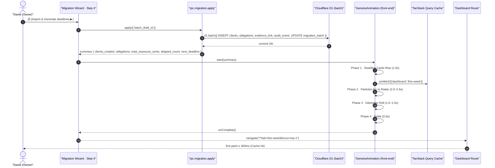

# Migration Copilot · Live Genesis 动效规格

> 版本：v1.0（Demo Sprint · 2026-04-24）
> 上游：PRD Part1B §6A.6 Step 4（行 260–296）· Part2A §7.5.6 Live Genesis（行 270–360）· Part2B §15.3.2 · `DESIGN.md` hero-metric / accent-default / spacing 系 token · `Design/DueDateHQ-DESIGN.md` §7.3（OVERDUE 闪烁同原则）· `dev-file/02` §4.3 Migration 原子导入
> 入册位置：[`./README.md`](./README.md) §2 第 07 份
> 阅读对象：Design / Frontend Engineer / Demo Presenter

本文件把 Live Genesis 动画的时序、粒子参数、Odometer 规格、降级策略、失败态处理、组件位点与 token 映射写死，作为 `./02-ux-4step-wizard.md` Step 4 尾声的像素级实现契约。

---

## 1. 定位与 AC 绑定

**一句话定位**：Live Genesis 是 S2-AC5 向导闭环的最后 4–6 秒，也是 Demo Day Pitch 段 30–90s 的 jaw-drop moment（PRD Part2B §15.3.2 行 675–717）——用户点下 `Import & Generate deadlines ▶` 到 Dashboard 首屏渲染出 Deadline Radar 截止日风险之间的那段"入场秀"。

- **AC 绑定**：
  - S2-AC5（[`./01-mvp-and-journeys.md` §2 AC × Test × P0 映射表](./01-mvp-and-journeys.md#2-ac--test--p0-三维映射表)）：P95 ≤ 30 min、Import 成功 → Dashboard 首屏显示美元风险
  - Activation Time-to-First-Value（[`./01-mvp-and-journeys.md` §3 KPI 埋点表](./01-mvp-and-journeys.md#3-kpi-埋点表) 第 1 行）：`signup.completed → dashboard.penalty_radar.first_rendered`，动画结束即 Dashboard 首帧
- **驱动方式裁定**：动画由前端驱动，不等后端事件推送。后端 `rpc.migration.apply` 成功返回 summary（counts + 截止日风险总额）后，前端立刻开始播动画；后端异步副作用（evidence_link、audit_event、email_outbox 入库）与动画并行。对齐 `dev-file/02` §4.3 Migration 原子导入流程图最后一行"前端 Live Genesis 动画 + 顶栏 $ 滚动（纯前端驱动）"。
- **AC5 时间边界**：Live Genesis **不计入** P95 ≤ 30 min 的判定点（终点事件是 `migration.imported`，见 [`./10-conflict-resolutions.md#4-kpi-起点与终点口径`](./10-conflict-resolutions.md#4-kpi-起点与终点口径)），但动画总时长 ≤ 6s，不得拖垮 Time-to-First-Value。

---

## 2. 事件序列与时间预算

### 2.1 端到端时序（前端视角）



### 2.2 Phase 时间预算表（总 4.5–6s）

| Phase | 名称                   | 预算（ms） | 关键行为                                                                                                                                                           |
| ----- | ---------------------- | ---------- | ------------------------------------------------------------------------------------------------------------------------------------------------------------------ |
| 1     | Deadline Cards Rise    | 1000       | 舞台中央 10–30 张 obligation 卡片从 y+40px fade-in；卡片内文走 `{typography.body}`；背景 `{colors.surface-canvas}`；padding `{spacing.4}`                          |
| 2     | Particles Arc to Radar | 2000–2500  | 每张卡片的 90-day legacy penalty estimate `$` 金额粒子化，沿贝塞尔曲线飞向顶栏 Deadline Radar 位；命中瞬间 Radar 位短促脉冲 `{colors.severity-critical}` 200ms     |
| 3     | Odometer Roll          | 1000–1500  | 顶栏 `$0 → total_exposure_cents`（90-day legacy penalty estimate），`{typography.hero-metric}` + tabular-nums；linear-interpolate + `cubic-bezier(0.4, 0, 0.2, 1)` |
| 4     | Settle & Navigate      | 500        | 卡片 fade-out；Radar 数字 hold `{colors.text-primary}`；触发 `onComplete` → `navigate("/?tab=this-week&focus=top-1")`                                              |

- Phase 1 启动同时 TanStack Query 预热 Dashboard / Obligations 的数据（Cache warm-up）；目标：动画结束跳 Dashboard 时首帧命中 cache，Dashboard first paint ≤ 300ms。
- Phase 3 的 `target` = `summary.total_exposure_cents`（后端 `rpc.migration.apply` 返回，单位 cents），口径是 90-day legacy penalty estimate，不展示 accrued penalty。
- 总时长硬上限 6000ms，若 Phase 2 因粒子数超限（> 50）延长，则 Phase 4 压到 300ms 以保 6s 封顶。

### 2.3 埋点事件

| 事件名                                   | 触发点                             | 负载                                                                                             |
| ---------------------------------------- | ---------------------------------- | ------------------------------------------------------------------------------------------------ |
| `migration.genesis.started`              | Phase 1 起点                       | `{ batch_id, total_exposure_cents, mode }`                                                       |
| `migration.genesis.played`               | Phase 4 `onComplete()`             | `{ batch_id, mode: 'full' \| 'reduced', duration_ms }`                                           |
| `migration.genesis.downgraded`           | 帧率低于 30fps 触发运行时降级      | `{ batch_id, reason: 'fps' \| 'browser-motion-pref' }`                                           |
| `dashboard.penalty_radar.first_rendered` | Dashboard 路由首次把 hero 数字打出 | 由 Dashboard 模块 emit（[`./01-mvp-and-journeys.md` §3](./01-mvp-and-journeys.md#3-kpi-埋点表)） |

> 约定：`migration.genesis.*` 是 PostHog 事件名，遵循 [`./10-conflict-resolutions.md#6-audit-action-命名与-ui-文案分层`](./10-conflict-resolutions.md#6-audit-action-命名与-ui-文案分层) 工程 log 口径，不进 Lingui catalog。

---

## 3. 粒子参数

### 3.1 渲染契约

- **载体**：单一 `<canvas>` 元素，`position: absolute`，覆盖 wizard 舞台；`z-index: 50`；`pointer-events: none`。**禁止用 DOM / div 粒子**（Safari 合成层数量 > 30 时会降帧）。
- **帧循环**：`requestAnimationFrame` + `performance.now()`；不引入 `react-spring` / `framer-motion` 物理引擎（纯时间线求值）。
- **同屏上限**：最多 30 颗活动粒子。
- **DPI**：canvas 依 `devicePixelRatio` 缩放（最高 2x），避免 Retina 发虚。

### 3.2 粒子抽样策略

| 场景                            | 行为                                                                                      |
| ------------------------------- | ----------------------------------------------------------------------------------------- |
| obligations 数 ≤ 50             | 从每张 obligation 卡派 1 颗粒子，共 N 颗                                                  |
| obligations 数 > 50             | 随机抽样 50 颗，其余金额聚合为 `+{remaining} more` 气泡从舞台中央直接跳入 Radar（无弧线） |
| obligations 数 < 10（小 batch） | 可降为 1 颗卡 1 粒子，但保最少 5 颗粒子（视觉密度）                                       |

### 3.3 粒子形态

- 尺寸：6px × 6px（逻辑像素）
- 形状：圆形（`arc(0, 0, 3, 0, 2π)`）
- 颜色：`{colors.accent-default}` 实心 + 10% alpha glow（`shadowColor` 同色，`shadowBlur: 8`）
- 命中 Radar 瞬间的 flash：填充切到 `{colors.severity-critical}`，200ms 内再淡回原色随后消失

### 3.4 运动曲线

- 起点 `startPos`：对应 obligation 卡片金额字段的屏幕坐标（`getBoundingClientRect` 取样一次，Phase 1 末）
- 终点 `radarPos`：顶栏 Deadline Radar hero 数字的中心坐标
- 4 点三次贝塞尔：`[startPos, startPos + (0, -200), radarPos + (0, -100), radarPos]`
- 时间曲线：`cubic-bezier(0.4, 0, 0.2, 1)`，总 1200–1800ms
- 错峰出发：每颗粒子 stagger 60ms，避免同步到达拥塞

### 3.5 性能目标

- 基准机型：MacBook Air M1（Safari 17）/ iPhone 15（Safari 17）
- 目标帧率：60fps；最低 45fps
- 兜底：`performance.now()` 连续 5 帧差值 > 33ms（≈ 30fps）→ 自动触发运行时降级（切 reduced 分支，详见 §5）

---

## 4. Odometer 规格

### 4.1 组件 API

```
<GenesisOdometer
  targetCents={summary.total_exposure_cents}
  durationMs={1200}
  locale={firmLocale}        // 'en-US' | 'zh-CN'
  onSettle={...}
/>
```

### 4.2 Token 映射表

| 字段                  | 规格                                         | token                                  |
| --------------------- | -------------------------------------------- | -------------------------------------- |
| 字号 / 行高 / 字距    | 56px / 1 / -0.02em（Geist Mono 700）         | `{typography.hero-metric}`             |
| 字体特性              | `font-variant-numeric: tabular-nums`（强制） | `{typography.hero-metric.fontFeature}` |
| 主文字色              | navy                                         | `{colors.text-primary}`                |
| 舞台背景              | 纯白画布（与 Wizard modal 背景同）           | `{colors.surface-canvas}`              |
| Radar 命中脉冲色      | 200ms 短暂 critical red flash                | `{colors.severity-critical}`           |
| Odometer 容器 padding | 垂直 `{spacing.3}` / 水平 `{spacing.5}`      | `{spacing.3}` / `{spacing.5}`          |
| 舞台与顶栏间距        | `{spacing.12}`（避免粒子终点与卡片区挤压）   | `{spacing.12}`                         |

### 4.3 滚动行为

- 货币符 `$` 与千分位分隔符 `,` **固定不滚动**（仅数字字符逐位 tween）
- 每位数字独立 linear-interpolate，起点 `0`，终点为 `targetCents` 除以 100 后格式化后的位值；不做"老虎机千位 stagger"（PRD Part2A §7.5.6.2 行 271 是 P1 的增量增减场景；Genesis 是 0→final 单次爬升，保持朴素）
- 缓动：`cubic-bezier(0.4, 0, 0.2, 1)`（Material "standard"）
- Settle 末态：文字 `{colors.text-primary}`，无 shake / 无 halo（Genesis 本身是"入场"而非"减分"，绿 halo 留给 §7.5.6.3 Score Pop）

### 4.4 可达性

- 容器 `role="status"` + `aria-live="polite"`
- Phase 4 结束时 `aria-label` 广播英文 `"{formattedAmount} at risk this quarter"`（zh-CN 广播 `"本季度 {formattedAmount} 截止日风险"`）
- 遵 [`./01-mvp-and-journeys.md` §7.4 屏幕阅读器](./01-mvp-and-journeys.md#74-屏幕阅读器)：状态变化用 `polite` 不用 `assertive`
- 数字格式化走 `Intl.NumberFormat(INTL_LOCALE[locale], { style: 'currency', currency: 'USD', maximumFractionDigits: 0 })`，`INTL_LOCALE` 来自共享 locale contract（`packages/i18n`），对齐 `0009-lingui-for-i18n.md`

---

## 5. `prefers-reduced-motion: reduce` 降级

### 5.1 触发条件

1. 浏览器 CSS media `prefers-reduced-motion: reduce`
2. 运行时帧率探测：连续 5 帧 > 33ms → 自动切降级路径（无需用户重启）
3. Demo Day 安全开关：URL 参数 `?reducedMotion=1` 手动强制（给现场演示降级 fallback 留 hook）

### 5.2 降级行为

| 环节      | Full 模式                                   | Reduced 模式                                   |
| --------- | ------------------------------------------- | ---------------------------------------------- |
| 粒子      | 30 颗 canvas 粒子 + 弧线                    | **关闭**（canvas 不渲染）                      |
| 卡片 rise | y+40 fade-in，stagger 60ms                  | 直接展示卡片静态列表 200ms fade-in             |
| Odometer  | 1.2s 线性滚动                               | **一次性显示 final 值**，200ms fade-in         |
| 导航      | Phase 4 末 `navigate`                       | 卡片 fade-in 完成后 400ms 立刻 `navigate`      |
| 总时长    | 4.5–6s                                      | ≤ 800ms                                        |
| 埋点      | `migration.genesis.played { mode: 'full' }` | `migration.genesis.played { mode: 'reduced' }` |

### 5.3 同原则对齐

对齐 `docs/Design/DueDateHQ-DESIGN.md` §7.3 OVERDUE 闪烁动画原则：**任何时长 > 300ms 的周期性 / 循环性装饰动画都必须尊重 `prefers-reduced-motion`**。Genesis 的粒子虽是单次播放而非循环，但时长与视觉冲击较大，强制同原则处理。

---

## 6. 错误 / 失败态

### 6.1 apply 部分失败

`rpc.migration.apply` 返回的 summary 带 `partial_failure: boolean`（行级失败写入 `migration_error`，批次仍 `status=applied`，对齐 PRD Part1B §6A.7"单行失败不阻塞整批"）。

- 动画 Phase 1 启动前检查 `summary.partial_failure`
  - `false`：正常 4 Phase
  - `true`：Phase 1–2 正常播（视觉已有内容产生）→ **跳过 Phase 3/4** → 不播 Odometer 滚动 → 弹红色 Toast 并跳 Dashboard

```
Toast（红色，常驻 12s 可手动关闭）
  Some rows couldn't be imported. Review errors in Clients import history.
  [Review errors] [Dismiss]
```

- `[Review errors]` → `/clients?importHistory=open` 并打开 batch detail / errors（对齐 PRD Part1B §6A.7）
- 跳转仍走 `navigate("/?tab=this-week&focus=top-1")`，保持主叙事

### 6.2 apply 整体失败

- 前端根本拿不到 summary，动画从未启动
- 由 Wizard Step 4 层处理：按钮回弹、展示错误 Banner、允许重试（不在本文件范围，见 `./02-ux-4step-wizard.md`）

### 6.3 运行时帧率降级

- 触发 §5.1 第 2 条
- 无 Toast 打扰；静默切 reduced 路径
- 埋点 `migration.genesis.downgraded { reason: 'fps' }` 用于后续优化分析

### 6.4 浏览器 Tab 非活动态

- 若用户在动画播放中切到其他 Tab（`document.visibilityState !== 'visible'`）：
  - 冻结 `requestAnimationFrame`（浏览器默认行为）
  - Tab 回到活动时从当前时间戳继续，不重播
  - 若总时长超过 10s 硬上限 → 强制 `onComplete()` 直接跳 Dashboard

---

## 7. 组件位点与 DOM 布局

### 7.1 ASCII 示意

```
+------------------------------------- wizard modal (role="dialog", aria-modal="true") ------------------------------+
|                                                                                                                   |
|   +---------------------- deadline-cards-stage (relative, padding {spacing.12}) -----------------------+           |
|   |                                                                                                   |           |
|   |   [Acme LLC · CA · $4,200]   [Bright · 1120-S · $2,800]   [Zen · Q1 Est · $1,650]   ...            |           |
|   |                                                                                                   |           |
|   |   (GenesisCanvas: position absolute, inset 0, z-index 50, pointer-events none)                    |           |
|   +-------------------------------------------------------------------------------------------------- +           |
|                                                                                                                   |
|   [← Back]                                                   [Import & Generate deadlines ▶] (pressed)             |
+-------------------------------------------------------------------------------------------------------------------+
                    ↑ particles arc upward into
+-- Page shell top bar (Deadline Radar, z-index 40) -----------------------------------------------+
|   Deadline Radar                                                                                 |
|   $0 → $19,200 at risk this week    ▲ up $3,100 vs last                                         |
+-------------------------------------------------------------------------------------------------+
```

### 7.2 层级约定

| 层             | z-index | 描述                                         |
| -------------- | ------- | -------------------------------------------- |
| 页面 shell     | 0       | Sidebar + 主区域                             |
| 顶栏 Radar     | 40      | Deadline Radar 固定顶部                      |
| Wizard modal   | 60      | `role="dialog"`，focus trap（§7.3）          |
| Deadline stage | 相对    | modal 内部舞台                               |
| GenesisCanvas  | 50      | modal 内部，覆盖 stage 但不遮挡 modal 外顶栏 |

注：粒子从 modal 内部 canvas 起飞 → 穿过 modal 上沿 → 抵达顶栏（页面 shell 层）。为此 **canvas 必须挂在 modal 外层容器**（`document.body` 级 portal），否则 modal 的 `overflow: hidden` 会裁切粒子路径。实现上建议用 `createPortal` 挂一个顶层 `<div id="genesis-root">` 容器，layout 期间根据 `radarPos` / `startPos` 取样一次即可。

### 7.3 Focus Trap 交接

- Phase 1 启动时 Wizard Step 4 的按钮 disabled
- Phase 4 `onComplete()` 之后 Wizard modal 卸载 → 焦点由 Dashboard 路由的 `tab=this-week` 首个 obligation 行接管
- 降级路径同接管逻辑，无额外处理

---

## 8. Token 映射总览

| 元素                  | 属性             | token                                            |
| --------------------- | ---------------- | ------------------------------------------------ |
| Stage 背景            | backgroundColor  | `{colors.surface-canvas}`                        |
| Deadline 卡片背景     | backgroundColor  | `{colors.surface-elevated}`                      |
| Deadline 卡片边框     | border           | `{colors.border-default}`                        |
| Deadline 卡片圆角     | borderRadius     | `{rounded.md}`                                   |
| Deadline 卡片正文     | typography       | `{typography.body}`                              |
| Deadline 卡片金额     | typography       | `{typography.numeric}`                           |
| Deadline 卡片内边距   | padding          | `{spacing.4}`                                    |
| 舞台上下 padding      | padding          | `{spacing.12}`（顶 / 底对称留粒子弧线空间）      |
| 卡片列表间距          | gap              | `{spacing.5}`                                    |
| 粒子主色              | fill             | `{colors.accent-default}`                        |
| 粒子命中 flash        | fill             | `{colors.severity-critical}`                     |
| 粒子发光              | shadowColor      | `{colors.accent-default}` + alpha 10%            |
| Odometer 数字         | color            | `{colors.text-primary}`                          |
| Odometer 字体         | typography       | `{typography.hero-metric}`                       |
| Odometer 容器         | backgroundColor  | `{colors.surface-canvas}`（同 hero-metric 组件） |
| Odometer 容器圆角     | borderRadius     | `{rounded.lg}`（与顶栏 hero 保持一致）           |
| Radar 命中脉冲        | boxShadow / ring | `{colors.severity-critical}` + 200ms             |
| 焦点环（按钮 / 卡片） | outline          | `{colors.accent-default}`（`:focus-visible`）    |

> 硬规则：本文件一律用 token 名引用；禁止把 `#155aef` / `#DC2626` 等 hex 直接写入本文件与实现代码（对齐 `DESIGN.md` 的 semantic utility 要求）。

---

## 9. 与 Obligations / Dashboard 的交接

### 9.1 跳转目标 URL

```
/?tab=this-week&focus=top-1
```

- `tab=this-week` → Dashboard 默认 Pulse + This Week tab
- `focus=top-1` → 第 1 条 obligation 行自动获得键盘焦点（`aria-selected="true"`），对齐 PRD Part1B §6A.6 Step 4"Top of `This Week` tab 选中第 1 条"
- `/` 是 Dashboard 的 canonical app root；`/dashboard` 仅作为历史兼容入口重定向到 `/`。

### 9.2 Cache 预热

- Phase 1 起（~1000ms 前）开始：`queryClient.prefetchQuery({ queryKey: ['dashboard','this-week'], queryFn: ... })`
- 同时预热 `['dashboard','penalty-radar']` 与 `['obligations','list', { filter: 'this-week' }]`
- Dashboard 路由挂载时：`staleTime` 设 30s，首帧必命中 cache

### 9.3 Dashboard first paint 契约

- 动画 `onComplete` → `navigate` → Dashboard LCP ≤ 300ms
- 若 cache 未命中（极端网络 / RPC 慢）→ Dashboard 骨架屏（hero 数字 `—`）在 200ms 内出现，填充真值时触发 `dashboard.penalty_radar.first_rendered`
- Time-to-First-Value 终点事件仍由 Dashboard 模块 emit（[`./01-mvp-and-journeys.md` §3](./01-mvp-and-journeys.md#3-kpi-埋点表)）

---

## 10. Phase 0 扩展位

Demo Sprint 本轮只做上述最小闭环；以下 hook 在 Phase 0 MVP（4 周全量）阶段逐项补齐，不在本 Sprint 展开：

- **Deadline Radar 分层动画**：Critical / High / Upcoming 三层分别对应 3 组不同目的位，粒子按 severity 分色爬升（`{colors.severity-critical}` / `{colors.severity-high}` / `{colors.severity-medium}`），Odometer 分 3 个子金额 stagger 到位
- **Pulse Apply 连动 Genesis 余震**：Pulse Batch Apply 成功后在 Obligations 播弱化版 Genesis（粒子 ≤ 10 颗 + 2s），与 PRD Part2A §7.5.6.3 "Mark Filed" halo pulse 区分
- **Confetti 彩蛋**：若 apply 后 `total_exposure_cents = 0` → 触发 Zero Week 彩蛋（对齐 PRD Part2A §7.5.6.4）
- **Firm 历史对比**：Odometer settle 后在 Radar 右侧加 sparkline 展示"首次 Firm 纪录"注脚
- **Demo Day 可观测性**：在 Phase 3 末埋一条 `migration.genesis.target_value` 事件，便于现场 Demo 后回放验算

---

## 11. 变更记录

| 版本 | 日期       | 作者       | 摘要                                                                                                                                   |
| ---- | ---------- | ---------- | -------------------------------------------------------------------------------------------------------------------------------------- |
| v1.0 | 2026-04-24 | Subagent E | 初稿：定位 & AC · 时序与 Phase 预算 · 粒子参数 · Odometer 规格 · reduced-motion 降级 · 失败态 · DOM 位点 · token 映射 · Dashboard 交接 |
