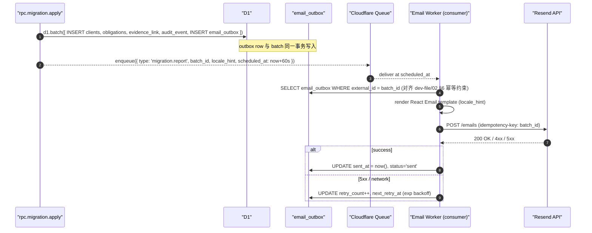

# Migration Copilot · Migration Report 邮件模板

> 版本：v1.0（Demo Sprint · 2026-04-24）
> 上游：PRD Part1B §6A.8 Migration Report（行 333–357，英文原文）· Part2B §15 Demo Pitch 叙事 · `adr/0009-lingui-for-i18n.md`（Worker 薄字典约束）· `dev-file/02` §4.3 Migration 原子导入 + outbox 消费模型
> 入册位置：[`./README.md`](./README.md) §2 第 08 份
> 阅读对象：Design / Frontend / Backend / Compliance

本文件把 Import 完成后 60 秒内发给导入者与 Owner 的战报邮件的 Subject / Body / HTML 模板、locale 策略、Revert 链接签名、发送管线、可达性与合规写死。Demo Sprint 场景下该邮件是 Offline / Future-proof 的兑现凭证——Live Genesis 是"现场感动"，Migration Report 邮件是"回到邮箱仍然在"。

---

## 1. 定位

**一句话定位**：Import 完成后 60 秒内给 Owner 发一封战报邮件；内容 = 批次计数 + Top 5 at-risk + Skipped rows + Revert 链接；**一个 batch 一封邮件，幂等不重发**。

- **AC 绑定**：S2-AC5"导入后立即生成全年日历"叙事中的 offline 验证（[`./01-mvp-and-journeys.md` §2](./01-mvp-and-journeys.md#2-ac--test--p0-三维映射表)）——即使用户关闭浏览器，邮件也能完成"30 分钟完成 30 客户"的闭环交付
- **发送时机**：后端写入 `migration.imported` audit event 后 **+60s**，由 Queue consumer 从 `email_outbox` 取出推送 Resend。前端播 Live Genesis 动画期间邮件已入 `email_outbox`（对齐 `dev-file/02` §4.3 原子导入事务内 INSERT `email_outbox`）
- **收件人**：Demo Sprint 只发 Owner 单人；Phase 0 起发送给导入者 + Owner（如导入者就是 Owner 则去重）。邮件里的 Revert intent link 仍需登录，并只允许 Owner / Manager 执行。

---

## 2. Subject + Body 结构

### 2.1 Subject

```
DueDateHQ import complete — {client_count} clients, ${total_exposure_usd} at risk
```

- 数字字段全部走 `Intl.NumberFormat(INTL_LOCALE[locale], ...)` 格式化；`INTL_LOCALE` 来自共享 locale contract（`packages/i18n`，见 `adr/0009-lingui-for-i18n.md`），Worker 的 `src/i18n/messages.ts` 薄字典在插值前调用同一格式化函数
- 货币符 `$` 在 `en-US` / `zh-CN` 两版 subject 中**保留固定**（SaaS 主流做法；Demo Sprint 不做 `¥` 换算）
- Subject 不含 emoji（邮件客户端兼容 + 避免 Gmail spam）

### 2.2 Body 结构（plain text + HTML 双版本）

| 段落          | 必/选 | 内容                                                                                         |
| ------------- | ----- | -------------------------------------------------------------------------------------------- |
| Summary block | 必    | `✓ N clients created / ✓ M obligations generated / ⚠ X rows skipped / 🔔 Next deadline: ...` |
| Top 5 at-risk | 必    | 表格 3 列：client name / exposure $ / days（≤ 5 行；若 batch 不足 5 条有多少列多少）         |
| Skipped rows  | 条件  | `X > 0` 时展示；前 10 行 inline；超过 10 行给 `[See all {X} →]` 链接                         |
| Revert 链接   | 必    | `https://app.duedatehq.com/migration/{batch_id}/revert`；签名 token，24h 过期                |
| 页脚          | 必    | `You can undo this import for the next 24 hours.` + Unsub + Firm name                        |

---

## 3. 完整模板

### 3.1 Plain-text · en-US（PRD Part1B §6A.8 原文照录 + 微调）

```
Subject: DueDateHQ import complete — 30 clients, $19,200 at risk

Summary
  ✓ 30 clients created
  ✓ 152 obligations generated for tax year 2026
  ⚠ 3 rows skipped (see below)
  🔔 Next deadline: Acme LLC — CA Franchise Tax in 3 days

Top 5 at-risk this quarter
  1. Acme LLC                   $4,200    3 days
  2. Bright Studio S-Corp       $2,800    5 days
  3. Zen Holdings               $1,650    8 days
  4. Delta Group LLC            $1,400   12 days
  5. Harbor Foods               $1,200   15 days

Skipped rows (3)
  Row 17: state="—", could not be normalized
  Row 23: entity_type="Trust", marked as needs_review
  Row 29: duplicate of existing Acme LLC, marked as skip

You can undo this import for the next 24 hours.
  https://app.duedatehq.com/migration/batch_xx/revert

—
Sent by DueDateHQ on behalf of {firm_name}.
Unsubscribe: https://app.duedatehq.com/notifications?unsub={token}
```

> 说明：PRD §6A.8 原文的 Top-5 表格只写到第 3 行省略号；本模板把 5 行补齐以对应"Top 5 at-risk"标题。Next deadline 行来自 `summary.next_deadline` 字段（后端 `rpc.migration.apply` 返回）。

### 3.2 Plain-text · zh-CN

```
Subject: DueDateHQ 导入完成 —— 30 个客户，本季度 $19,200 截止日风险

批次概览
  ✓ 已创建 30 个客户
  ✓ 已生成 152 条 2026 纳税年度义务
  ⚠ 跳过 3 行（详见下方）
  🔔 下一个截止日：Acme LLC —— CA 特许经营税 · 还剩 3 天

本季度 Top 5 高风险客户
  1. Acme LLC                   $4,200    3 天
  2. Bright Studio S-Corp       $2,800    5 天
  3. Zen Holdings               $1,650    8 天
  4. Delta Group LLC            $1,400   12 天
  5. Harbor Foods               $1,200   15 天

跳过的行（3）
  第 17 行：州字段为 "—"，无法规范化
  第 23 行：实体类型 "Trust"，已标记为待复核
  第 29 行：与已有 Acme LLC 重复，已标记为跳过

你可以在 24 小时内撤销本次导入。
  https://app.duedatehq.com/migration/batch_xx/revert

——
由 DueDateHQ 代表 {firm_name} 事务所发送。
取消订阅：https://app.duedatehq.com/notifications?unsub={token}
```

> 翻译策略：
>
> - "Firm" → "事务所"（对齐 PRD §3.6.1.0 命名约定，管理类语境）
> - "Practice" 保留给客户面叙事，本邮件不出现
> - "obligations" → "义务"（对齐 `Design/DueDateHQ-DESIGN.md` 术语表）
> - 货币符保留 `$`，日期按 zh-CN `Intl.DateTimeFormat` 自然排版

### 3.3 HTML · en-US（Outlook / Gmail 兼容 · 纯 table 布局）

```html
<!doctype html>
<html lang="en">
  <head>
    <meta charset="utf-8" />
    <meta name="viewport" content="width=device-width, initial-scale=1" />
    <title>DueDateHQ import complete</title>
  </head>
  <body
    style="margin:0;padding:0;background:#FAFAFA;font-family:Inter,Helvetica,Arial,sans-serif;color:#0A2540;"
  >
    <!-- Outer wrapper · {colors.surface-panel} #FAFAFA -->
    <table
      role="presentation"
      width="100%"
      cellpadding="0"
      cellspacing="0"
      border="0"
      style="background:#FAFAFA;"
    >
      <tr>
        <td align="center" style="padding:24px 12px;">
          <!-- Card · 640px max · {colors.surface-elevated} #FFFFFF + {colors.border-default} #E5E7EB -->
          <table
            role="presentation"
            width="640"
            cellpadding="0"
            cellspacing="0"
            border="0"
            style="max-width:640px;background:#FFFFFF;border:1px solid #E5E7EB;border-radius:12px;"
          >
            <!-- Header -->
            <tr>
              <td style="padding:24px 32px 8px 32px;">
                <p
                  style="margin:0;font-size:11px;font-weight:500;letter-spacing:0.08em;text-transform:uppercase;color:#475569;"
                >
                  DUEDATEHQ · IMPORT REPORT
                </p>
                <h1
                  style="margin:8px 0 0 0;font-size:20px;font-weight:600;line-height:1.3;color:#0A2540;"
                >
                  Import complete — 30 clients, $19,200 at risk
                </h1>
              </td>
            </tr>

            <!-- Summary block -->
            <tr>
              <td style="padding:16px 32px;">
                <table
                  role="presentation"
                  width="100%"
                  cellpadding="0"
                  cellspacing="0"
                  border="0"
                  style="font-family:'Geist Mono','JetBrains Mono',Menlo,monospace;font-size:13px;color:#0A2540;"
                >
                  <tr>
                    <td style="padding:4px 0;">✓&nbsp;&nbsp;30 clients created</td>
                  </tr>
                  <tr>
                    <td style="padding:4px 0;">
                      ✓&nbsp;&nbsp;152 obligations generated for tax year 2026
                    </td>
                  </tr>
                  <tr>
                    <td style="padding:4px 0;color:#CA8A04;">
                      ⚠&nbsp;&nbsp;3 rows skipped (see below)
                    </td>
                  </tr>
                  <tr>
                    <td style="padding:4px 0;color:#0A2540;">
                      🔔&nbsp;&nbsp;Next deadline: Acme LLC — CA Franchise Tax in 3 days
                    </td>
                  </tr>
                </table>
              </td>
            </tr>

            <!-- Top 5 at-risk -->
            <tr>
              <td style="padding:16px 32px 8px 32px;">
                <p
                  style="margin:0 0 8px 0;font-size:11px;font-weight:500;letter-spacing:0.08em;text-transform:uppercase;color:#475569;"
                >
                  TOP 5 AT-RISK THIS QUARTER
                </p>
                <table
                  role="presentation"
                  width="100%"
                  cellpadding="0"
                  cellspacing="0"
                  border="0"
                  style="border-collapse:collapse;font-size:13px;color:#0A2540;"
                >
                  <thead>
                    <tr>
                      <th
                        align="left"
                        style="padding:8px 0;border-bottom:1px solid #E5E7EB;font-weight:500;color:#475569;"
                      >
                        Client
                      </th>
                      <th
                        align="right"
                        style="padding:8px 0;border-bottom:1px solid #E5E7EB;font-weight:500;color:#475569;font-family:'Geist Mono',Menlo,monospace;"
                      >
                        Exposure
                      </th>
                      <th
                        align="right"
                        style="padding:8px 0;border-bottom:1px solid #E5E7EB;font-weight:500;color:#475569;font-family:'Geist Mono',Menlo,monospace;"
                      >
                        Days
                      </th>
                    </tr>
                  </thead>
                  <tbody>
                    <tr>
                      <td style="padding:8px 0;border-bottom:1px solid #F1F5F9;">Acme LLC</td>
                      <td
                        align="right"
                        style="padding:8px 0;border-bottom:1px solid #F1F5F9;font-family:'Geist Mono',Menlo,monospace;color:#DC2626;"
                      >
                        $4,200
                      </td>
                      <td
                        align="right"
                        style="padding:8px 0;border-bottom:1px solid #F1F5F9;font-family:'Geist Mono',Menlo,monospace;color:#DC2626;"
                      >
                        3
                      </td>
                    </tr>
                    <tr>
                      <td style="padding:8px 0;border-bottom:1px solid #F1F5F9;">
                        Bright Studio S-Corp
                      </td>
                      <td
                        align="right"
                        style="padding:8px 0;border-bottom:1px solid #F1F5F9;font-family:'Geist Mono',Menlo,monospace;"
                      >
                        $2,800
                      </td>
                      <td
                        align="right"
                        style="padding:8px 0;border-bottom:1px solid #F1F5F9;font-family:'Geist Mono',Menlo,monospace;"
                      >
                        5
                      </td>
                    </tr>
                    <tr>
                      <td style="padding:8px 0;border-bottom:1px solid #F1F5F9;">Zen Holdings</td>
                      <td
                        align="right"
                        style="padding:8px 0;border-bottom:1px solid #F1F5F9;font-family:'Geist Mono',Menlo,monospace;"
                      >
                        $1,650
                      </td>
                      <td
                        align="right"
                        style="padding:8px 0;border-bottom:1px solid #F1F5F9;font-family:'Geist Mono',Menlo,monospace;"
                      >
                        8
                      </td>
                    </tr>
                    <tr>
                      <td style="padding:8px 0;border-bottom:1px solid #F1F5F9;">
                        Delta Group LLC
                      </td>
                      <td
                        align="right"
                        style="padding:8px 0;border-bottom:1px solid #F1F5F9;font-family:'Geist Mono',Menlo,monospace;"
                      >
                        $1,400
                      </td>
                      <td
                        align="right"
                        style="padding:8px 0;border-bottom:1px solid #F1F5F9;font-family:'Geist Mono',Menlo,monospace;"
                      >
                        12
                      </td>
                    </tr>
                    <tr>
                      <td style="padding:8px 0;">Harbor Foods</td>
                      <td
                        align="right"
                        style="padding:8px 0;font-family:'Geist Mono',Menlo,monospace;"
                      >
                        $1,200
                      </td>
                      <td
                        align="right"
                        style="padding:8px 0;font-family:'Geist Mono',Menlo,monospace;"
                      >
                        15
                      </td>
                    </tr>
                  </tbody>
                </table>
              </td>
            </tr>

            <!-- Skipped rows (conditional) -->
            <tr>
              <td style="padding:16px 32px;">
                <p
                  style="margin:0 0 8px 0;font-size:11px;font-weight:500;letter-spacing:0.08em;text-transform:uppercase;color:#CA8A04;"
                >
                  SKIPPED ROWS (3)
                </p>
                <table
                  role="presentation"
                  width="100%"
                  cellpadding="0"
                  cellspacing="0"
                  border="0"
                  style="background:#FEFCE8;border:1px solid #FDE68A;border-radius:6px;font-family:'Geist Mono',Menlo,monospace;font-size:12px;color:#0A2540;"
                >
                  <tr>
                    <td style="padding:6px 12px;">Row 17: state="—", could not be normalized</td>
                  </tr>
                  <tr>
                    <td style="padding:6px 12px;">
                      Row 23: entity_type="Trust", marked as needs_review
                    </td>
                  </tr>
                  <tr>
                    <td style="padding:6px 12px;">
                      Row 29: duplicate of existing Acme LLC, marked as skip
                    </td>
                  </tr>
                </table>
              </td>
            </tr>

            <!-- Revert CTA -->
            <tr>
              <td style="padding:24px 32px;">
                <table role="presentation" cellpadding="0" cellspacing="0" border="0">
                  <tr>
                    <td style="background:#5B5BD6;border-radius:4px;">
                      <a
                        href="https://app.duedatehq.com/migration/batch_xx/revert?token={revert_token}"
                        style="display:inline-block;padding:10px 18px;font-size:13px;font-weight:500;color:#FFFFFF;text-decoration:none;"
                        >Undo this import</a
                      >
                    </td>
                  </tr>
                </table>
                <p style="margin:12px 0 0 0;font-size:12px;color:#475569;">
                  You can undo this import for the next 24 hours.
                </p>
              </td>
            </tr>

            <!-- Footer -->
            <tr>
              <td style="padding:16px 32px 24px 32px;border-top:1px solid #E5E7EB;">
                <p style="margin:0;font-size:11px;line-height:1.5;color:#94A3B8;">
                  Sent by DueDateHQ on behalf of {firm_name}.<br />
                  <a
                    href="https://app.duedatehq.com/notifications?unsub={unsub_token}"
                    style="color:#475569;text-decoration:underline;"
                    >Unsubscribe</a
                  >
                  &nbsp;·&nbsp;
                  <a
                    href="https://app.duedatehq.com/migration/batch_xx"
                    style="color:#475569;text-decoration:underline;"
                    >View batch details</a
                  >
                </p>
              </td>
            </tr>
          </table>
        </td>
      </tr>
    </table>
  </body>
</html>
```

> HTML 版颜色映射说明（不是硬编码的装饰色，是 token 回填）：
>
> - `#0A2540` = `{colors.text-primary}`；`#475569` = `{colors.text-secondary}`；`#94A3B8` = `{colors.text-muted}`
> - `#FFFFFF` = `{colors.surface-elevated}`；`#FAFAFA` = `{colors.surface-panel}`
> - `#E5E7EB` = `{colors.border-default}`；`#F1F5F9` = `{colors.border-subtle}`
> - `#5B5BD6` = `{colors.accent-default}`（Revert CTA 主色）
> - `#DC2626` = `{colors.severity-critical}`（Top-1 Acme LLC 高亮）
> - `#CA8A04` / `#FEFCE8` / `#FDE68A` = `{colors.severity-medium}` / `-tint` / `-border`（Skipped rows 警示框）
>
> 邮件客户端不支持 CSS 变量，所以必须硬回填 hex；但本文件与工程实现必须用 token 名引用，编译期由 `apps/server/src/i18n/messages.ts` 旁边的邮件模板渲染器完成 token → hex 的单向展开（建议走 `react-email` + `@duedatehq/tokens` 映射模块）。禁止把 raw hex 散落在 TypeScript 源码里。

### 3.4 HTML · zh-CN

结构与 §3.3 一致；文案替换为 §3.2 plain-text 内容；`<html lang="zh-CN">`；字体栈追加 `PingFang SC`、`Microsoft YaHei` 作为 fallback：

```
font-family:Inter,"PingFang SC","Microsoft YaHei",Helvetica,Arial,sans-serif;
```

Mono 字体栈同 en-US（Geist Mono / JetBrains Mono / Menlo）。Demo Sprint 只 stub 出 zh-CN HTML shell 框架，**完整 zh-CN HTML 首版可与 en-US HTML 共用一个 React Email 组件，传入 locale 切换 messages** —— 模板结构是 locale-agnostic 的，文案插值走 Worker 薄字典。

---

## 4. Locale 策略（对齐 ADR 0009）

### 4.1 硬性约束

- Worker 运行时**不加载 Lingui runtime**（bundle 预算 + 冷启动）；邮件文案走 Worker 薄字典 `apps/server/src/i18n/messages.ts`
- SaaS app 的 `.po` catalog 与 marketing catalog **不复用**；三套字符串同源不同仓，共享的只有 locale contract（对齐 ADR 0009）
- 若翻译漂移 → Worker 编译期 `MessageKey` 穷尽性类型错误（对齐 ADR 0009 §好处 最后一条）

### 4.2 Message Key 设计

在 `apps/server/src/i18n/messages.ts` 新增 Migration Report 相关 key（下列 key 名是契约位，允许工程阶段微调但**必须在本文件同步更新**）：

```
email.migration_report.subject
email.migration_report.heading
email.migration_report.summary.clients_created           // '{n} clients created'
email.migration_report.summary.obligations_generated     // '{n} obligations generated for tax year {year}'
email.migration_report.summary.rows_skipped              // '{n} rows skipped (see below)'
email.migration_report.summary.next_deadline             // 'Next deadline: {client} — {rule} in {days} days'
email.migration_report.top5.title                        // 'Top 5 at-risk this quarter'
email.migration_report.top5.col.client
email.migration_report.top5.col.exposure
email.migration_report.top5.col.days
email.migration_report.skipped.title                     // 'Skipped rows ({n})'
email.migration_report.revert.cta                        // 'Undo this import'
email.migration_report.revert.window                     // 'You can undo this import for the next 24 hours.'
email.migration_report.footer.sent_by                    // 'Sent by DueDateHQ on behalf of {firm_name}.'
email.migration_report.footer.unsubscribe                // 'Unsubscribe'
email.migration_report.footer.view_batch                 // 'View batch details'
```

- 变量插值走 `interpolate(template, vars)`（ADR 0009 §架构 Worker 部分已有）
- 数字 / 货币在插值前由 `Intl.NumberFormat` 预格式化，**不**进模板；对齐 SPA 侧 `formatCents` 的 locale-aware 行为
- Body 大段 plain-text 用一个 key `email.migration_report.body` 也可接受（PRD 任务卡建议），但**推荐拆细**便于 A/B 与局部改文案；两套方案二选一，工程阶段由 Subagent F/G 定稿

### 4.3 Locale 选择逻辑

```
firm.locale ?? user.locale ?? 'en-US'
```

- Demo Sprint 硬编 `en-US`；`zh-CN` key 在 §3.2 / §3.4 预留但邮件发送端**不启用**（对齐 [`./01-mvp-and-journeys.md` §1 Demo Sprint 范围](./01-mvp-and-journeys.md#1-demo-sprint-mvp-范围一览) 单账号单 locale 假设）
- Phase 0 起：从 Firm Profile 读 `locale`（等同 Owner 用户的 locale，避免一个 firm 多个 locale 带来的收件人与内容错位）
- Worker 侧 `resolveLocale(headers)`（ADR 0009 §SPA 的 `attachLocaleHeader` → `x-locale` header）对邮件发送不直接适用，因为邮件是 **async / out-of-request**；正确链路是：
  - Wizard 提交 apply 请求时带 `x-locale` header
  - `rpc.migration.apply` middleware 读到后连同 `firm_id` / `batch_id` 写入 `email_outbox.locale_hint` 字段
  - Queue consumer 从 outbox 行取 locale，再渲染模板 → 不依赖 AsyncLocalStorage

---

## 5. Revert 链接签名

### 5.1 Token 结构

```
token = base64url(HMAC-SHA256(secret, `${batch_id}.${expires_at_unix}`)) + '.' + base64url(expires_at_unix)
```

- `secret`：`env.MIGRATION_REVERT_SECRET`（wrangler secret，**不入 git**）
- `expires_at_unix`：`import_timestamp + 24h`（对齐 PRD Part1B §6A.7 Revert 双档 · 24h 窗口）
- Token 形式：`{signature}.{expires_at_unix}`，URL-safe，约 70 字符

### 5.2 Endpoint

```
GET /api/migration/{batch_id}/revert?token=...
```

- 后端 middleware：
  1. 解码 token，校验 HMAC
  2. 校验 `now() < expires_at_unix`
  3. 校验 `batch_id` 存在且 `status=applied` 且 `revert_expires_at > now()`
  4. 校验用户已登录；否则 302 → `/login?redirect=/api/migration/{batch_id}/revert?token=...`
  5. 校验用户是 batch 对应 firm 的 Owner 或 Manager（对齐 [`./10-conflict-resolutions.md#1-revert-24h-全量撤销权限`](./10-conflict-resolutions.md#1-revert-24h-全量撤销权限)）
- 通过 → 302 → `/migration/{batch_id}`
  - 前端 mount 时读 query `?from=email` → 直接展开 `[Undo all]` 确认 Modal（仍然需要二次点击确认，邮件 token 不做 one-click destructive）
- 不通过 → 邮件落地页（静态）`/migration/revert/expired` 告知"链接已过期或不适用"

### 5.3 Token 一次性

- 每 `batch_id` 仅签发一枚 token，存 `migration_batch.revert_token_hash`（hash 后存，防日志泄漏）
- Token 被成功 revert 使用后立即置空（revert 是单向不可逆操作；即使失败也重签发一次新 token，旧 token 失效）
- 不做 replay attack 复杂防护（Demo Sprint 范围内 token 24h 到期 + 单次使用已足够）；Phase 0 可加 `migration_revert_attempts` 审计表

### 5.4 Auth Middleware 双层校验

- **邮件 token** 是"谁收到邮件就能打开链接"的弱凭证；**不等于授权执行 revert**
- 真正执行 revert 仍走 `rpc.migration.revert({ batch_id })`，middleware 校验 session + Owner / Manager role（对齐 ADR 0009 错误码合约 `FORBIDDEN` / `UNAUTHORIZED`）
- 即：token 仅放行 `/api/migration/{batch_id}/revert` 到 `/migration/{batch_id}` 的**跳转 + prefill 意图**，不跳过登录

---

## 6. 发送管线

### 6.1 链路



### 6.2 幂等性

- `email_outbox.external_id` 唯一约束为 `batch_id`（对齐 `dev-file/02` §6"邮件 outbox 幂等"）
- Resend `Idempotency-Key: migration.report.{batch_id}` 头确保即使 Queue 重投也不重发
- 重试策略：3 次（1min / 5min / 30min backoff）

### 6.3 60s 延迟依据

- 给 Live Genesis 动画 + 用户首次看 Dashboard 留时间窗口
- 若用户在 60s 内点了 `[Undo all]` toast → `migration.reverted` 事件发 → Queue consumer 消费前检查 `email_outbox.should_skip`（Wizard 回写）→ 跳过发送，写 `status='skipped_reverted'`
- 若 60s 内网络异常 / Queue 延迟 > 5min → 邮件仍会发（窗口放宽优先于精确）

### 6.4 失败降级

- 3 次 retry 全失败 → `email_outbox.status='failed'`
- Owner 下次登录 SPA 时，Dashboard 顶部显示非阻塞 Toast：

```
Your import report couldn't be emailed.
[Download report] [Dismiss]
```

- `[Download report]` → 后端生成同内容 HTML/PDF 走浏览器下载（对齐 §8 扩展位；Demo Sprint 本轮**仅设计就位**，实现延后）
- 埋点 `migration.report.email_failed { batch_id, attempts }`

---

## 7. 可达性与合规

### 7.1 邮件可达性

- `<html lang>` 必须设（en / zh-CN）
- `role="presentation"` 声明所有布局 table，避免屏幕阅读器把排版当数据表朗读
- 数据表（Top 5、Skipped rows）**不**加 `role="presentation"`；保留 `<thead>` / `<th>` 让 VoiceOver 正确朗读"Client, Exposure, Days"表头
- 所有链接 **不**依赖颜色区分：`text-decoration: underline` 显式保留
- 无装饰图片；所有内容是纯文本（Unicode 勾叉铃铛已是语义字符）；如 Phase 0 加 logo，必须带 `alt` 文案

### 7.2 合规（CAN-SPAM / GDPR）

- **Unsubscribe one-click**：footer 明示退订链接 + `List-Unsubscribe` header：

```
List-Unsubscribe: <mailto:unsubscribe@duedatehq.com?subject=unsub-{token}>,
                  <https://app.duedatehq.com/notifications?unsub={token}>
List-Unsubscribe-Post: List-Unsubscribe=One-Click
```

- **发件人真实地址**：`reports@duedatehq.com`（Resend 管理域，SPF/DKIM/DMARC 托管）
- **Firm name** 出现在 footer 的 "on behalf of" 句式中，满足"identify the sender clearly"
- **物理地址**：Demo Sprint 占位 `DueDateHQ, 2261 Market Street, San Francisco, CA 94114`（上线前由 Legal / Compliance 更新）

### 7.3 PII 最小化

- **必要 PII**：客户姓名（业务必要；PRD Part1B §6A.9 未禁止）
- **禁止出现**：EIN、邮箱、电话、SSN、完整税额、完整地址（Demo Sprint + Phase 0 一致）
- **允许**：金额（截止日风险）、天数、实体类型、州代码
- **理由**：邮件是"信道外"载体，截图 / 转发风险高于 SPA；EIN 出现在邮件等同于泄漏（对齐 PRD Part1B §6A.9 + ADR 0011 Migration 安全护栏）

### 7.4 SPF / DKIM / DMARC

- 全部走 Resend 托管（对齐 `apps/server` 已有邮件配置；Migration Report 复用 transactional domain）
- DMARC policy：`p=reject`（Phase 0 确认后上线；Demo Sprint 可降至 `p=none` 观察）

---

## 8. Phase 0 扩展位

Demo Sprint 本轮不展开，但以下 hook 在 Phase 0 MVP（4 周全量）阶段逐项补齐：

- **失败 in-app 补推**：§6.4 `[Download report]` 真实实现；生成 HTML / PDF（对齐 PRD P2 Audit-Ready Package 的副产物）
- **Revert 链接 token 防 replay**：加 `migration_revert_attempts` 审计表 + rate limit
- **邮件版本号 / A/B test**：Subject / CTA copy 的多变体；`email.migration_report.subject.v2` key + PostHog 对照组
- **多 firm 账号收件聚合**：Owner 管理多个 firm 时，按 firm 拆不同邮件（Demo Sprint 单 firm 不触发）
- **Team RBAC 扩展**：Phase 1 开闸后 Manager 可 cc 接收；Preparer / Coordinator 不发；对齐 [`./01-mvp-and-journeys.md` §6.2](./01-mvp-and-journeys.md#62-phase-0-权限矩阵预告对齐-prd-part1a-363)
- **zh-CN 启用**：Firm Profile locale 切换后邮件自动走 zh-CN 模板（§3.2 / §3.4）
- **React Email 组件化 + Visual Editor 预览**：对齐仓库 skill `react-email/SKILL.md` 的 visual editor 工作流，支持市场 / 法务非工程师微调文案

---

## 9. 变更记录

| 版本 | 日期       | 作者       | 摘要                                                                                                                                                                   |
| ---- | ---------- | ---------- | ---------------------------------------------------------------------------------------------------------------------------------------------------------------------- |
| v1.0 | 2026-04-24 | Subagent E | 初稿：定位 · Subject/Body 结构 · en-US/zh-CN 双 plain-text + en-US HTML 完整模板 · Locale 策略（ADR 0009）· Revert 链接签名 · 发送管线 · 可达性与合规 · Phase 0 扩展位 |
