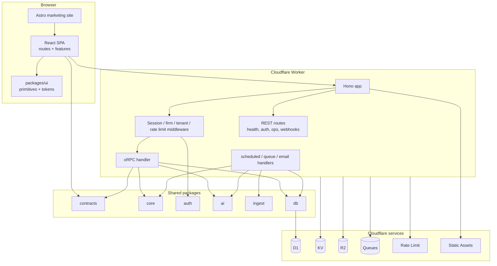
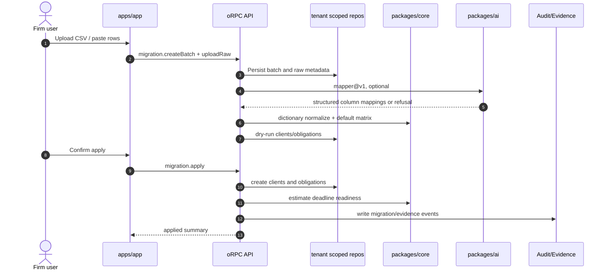
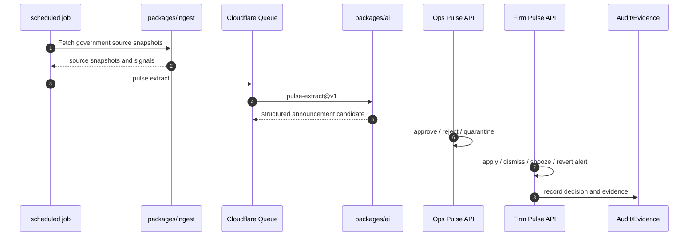
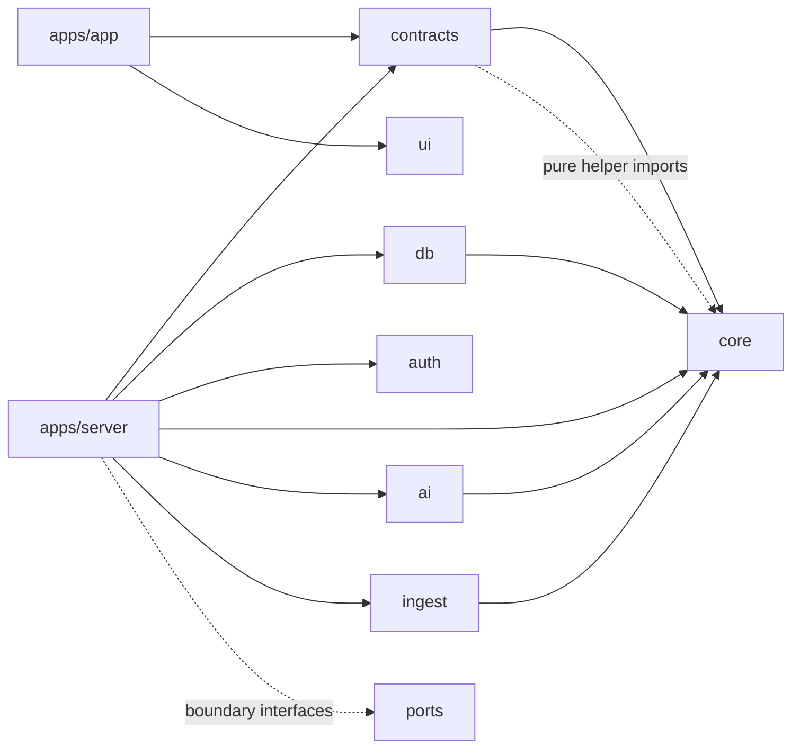
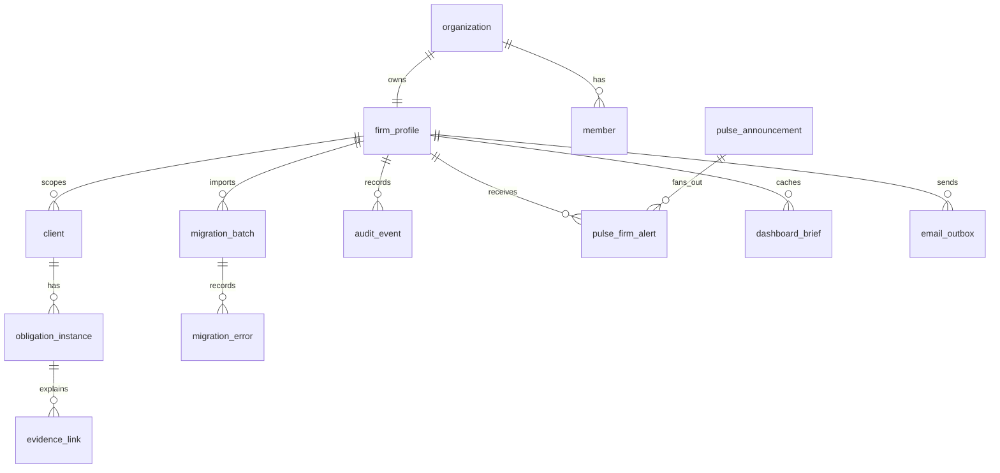

# DueDateHQ 项目总览

## 项目定位

DueDateHQ 是一个面向美国会计事务所的税务截止日、罚金风险和合规证据操作台。项目的主线不是“提醒工具”，而是把客户、义务、截止日变更、罚金影响、审计证据和政府来源更新串成一条可追踪的工作流。

当前代码体现出四个核心产品面：

- **Migration Copilot**：从 CSV/TSV/粘贴表格导入客户和义务，结合 AI mapper、字典归一化、默认矩阵和 dry-run，把旧系统数据迁入租户空间。
- **Obligations / Dashboard / Workload**：把义务状态、罚金风险、负责人、证据和团队负载变成日常操作台。
- **Pulse**：从 IRS、州税务机构、FEMA 等来源抓取更新，生成 owner/manager 可处理的 firm alert，并能应用到客户义务。
- **Audit / Evidence**：所有重要操作都写入 audit event，证据链通过 evidence link 和 evidence package 导出支撑合规解释。

## 项目结构

```text
.
├── apps
│   ├── app              # Vite React SPA，主产品前端
│   ├── server           # Cloudflare Worker API
│   └── marketing        # Astro 静态营销站
├── packages
│   ├── ai               # AI Gateway、提示词、guard、trace
│   ├── auth             # Better Auth 配置和权限模型
│   ├── contracts        # Zod/oRPC 合约
│   ├── core             # 纯领域逻辑
│   ├── db               # Drizzle schema + tenant-scoped repos
│   ├── i18n             # 共享 locale helper
│   ├── ingest           # Pulse source adapters
│   ├── ports            # 纯接口边界
│   ├── ui               # UI primitives 与设计 token
│   └── typescript-config
└── docs                 # 产品、设计、架构和本文档
```

## 功能全景

| 能力域       | 用户价值                                          | 当前实现入口                                                                            |
| ------------ | ------------------------------------------------- | --------------------------------------------------------------------------------------- |
| 身份与事务所 | 支持组织、成员、角色、active practice 切换        | `apps/server/src/auth.ts`, `packages/auth`, `apps/app/src/routes/practice*`, `members*` |
| 客户与义务   | 管理客户、税务义务、截止日、状态、负责人          | `procedures/clients`, `procedures/obligations`, `packages/db/src/repo`                  |
| 迁移导入     | 降低从旧表格迁移的人工成本，保留证据              | `features/migration`, `procedures/migration`, `packages/core/csv-parser`                |
| 罚金风险     | 用确定性规则估算暴露金额并分解原因                | `packages/core/penalty`, `obligations`, `dashboard`                                     |
| Pulse 变更   | 追踪政府来源变化，并可安全应用到义务              | `packages/ingest`, `procedures/pulse`, `jobs/pulse-*`                                   |
| 审计证据     | 解释谁在什么时候为何做了什么                      | `packages/db/schema/audit`, `procedures/audit`, `EvidenceDrawer`                        |
| 通知提醒     | 邮件 outbox、站内通知、deadline reminder          | `procedures/notifications`, `jobs/email`, `jobs/deadline-reminders`                     |
| AI 协助      | Mapper、归一化、dashboard brief、Pulse extraction | `packages/ai`, `jobs/dashboard-brief`, `procedures/migration`                           |
| 营销转化     | 介绍产品、价格、州覆盖、规则库                    | `apps/marketing`                                                                        |

## 创新点

### 1. 以证据链为核心的 AI 工作流

AI 不直接成为不可解释的写入者。迁移、Pulse、dashboard brief 等 AI 结果都通过结构化 schema、guard、trace 和 audit/evidence 进入系统。关键字段保留来源、置信度、拒绝原因或 fallback 证据，便于会计场景中的审计解释。

### 2. Deterministic-first 的税务域模型

罚金估算、默认矩阵、日期展开、规则预览等核心逻辑放在 `packages/core`，不依赖 DB、HTTP、React 或 Worker runtime。这让核心规则可测试、可复用，并降低“线上环境行为与本地推演不一致”的风险。

### 3. Tenant-scoped repository 防线

server middleware 从 Better Auth session 的 active organization 推导 `firmId`，再注入 `scoped(db, firmId)`。大部分业务过程只能拿到租户化 repo，而不是裸数据库连接。数据隔离不是靠每个 procedure 自觉补 `where firm_id = ?`，而是由仓储边界默认强制。

### 4. Edge-native 部署形态

API、队列、定时任务、邮件 webhook、D1、KV、R2、Rate Limit 都围绕 Cloudflare Worker 组织。静态 SPA 由 Worker assets 承载，营销站独立以 Astro 静态资源部署。

### 5. 合约驱动的前后端接口

`packages/contracts` 使用 Zod 和 oRPC 定义输入输出，server 实现 contract，React 侧通过 oRPC client 和 TanStack Query 生成 query/mutation options。这样减少手写 fetch 层、重复 schema 和隐式字段漂移。

## 系统架构



## 业务主流程





## 模块依赖原则



关键约束：

- `packages/core` 保持无基础设施依赖。
- `packages/contracts` 只放 contract/schema，不放 server runtime 逻辑。
- `packages/db` 封装 D1/Drizzle 和 repo；业务 procedure 不应散落原始 SQL。
- `apps/app/src/lib` 只放 app runtime/integration helper；业务 UI 放 feature vertical。
- `packages/ui` 不依赖路由、auth、RPC 或业务语义。
- `packages/ai` 不导入 DB；AI 调用结果由 server 层负责持久化。

## 数据模型总览



## 当前实现状态

| 区域             | 状态             | 说明                                                                                                         |
| ---------------- | ---------------- | ------------------------------------------------------------------------------------------------------------ |
| 前端主工作台     | 已实现           | Dashboard、Obligations、Migration、Pulse、Audit、Rules、Members、Billing 等路由存在                          |
| Server API       | 已实现           | Hono + oRPC + REST + queue/scheduled/email handlers                                                          |
| 数据模型         | 已实现并持续扩展 | Drizzle schema 覆盖 auth、firm、client、obligation、migration、pulse、audit、notifications                   |
| AI 能力          | 部分实现         | mapper、normalizer、brief、pulse extract 已有；router/retriever/budget 仍是占位                              |
| Pulse ingest     | 部分实现         | adapter/fetcher 框架完整，source 覆盖多州和 IRS；抽取成功后直接进入 Rules > Pulse Changes review 流程        |
| Marketing        | 已实现           | 双语 Astro 站点和 SEO/structured data                                                                        |
| Billing          | 已实现并持续扩展 | Billing route、checkout/success/cancel、subscription cache、plan entitlement 和 provider portal flow 已接入  |
| Priority scoring | 已实现           | `packages/core/src/priority` 已实现 Smart Priority scoring、factor decomposition、ranking 与 profile preview |

## 运行与验证

常用命令：

```bash
pnpm dev
pnpm check
pnpm test
pnpm build
pnpm ready
pnpm db:migrate:local
pnpm db:seed:demo
```

文档相关变更通常不需要运行完整 `pnpm ready`，但如果文档伴随 contract、schema、procedure 或 UI 变更，应至少运行对应 package 的测试，并在 PR 中说明验证范围。

## 后续演进关注点

- 建立 rules/source registry、marketing state coverage 与 README 之间的自动一致性检查，避免 candidate registry 被误读为 verified public coverage。
- 给外部集成、公开 API、Web Push/native 和合规认证类规划补充明确状态标签，确保用户文档与产品实现同步。
- 明确 AI router/retriever/budget 的生产化边界，避免 prompt 和模型选择继续散落。
- Pulse ingest 需要持续补 source-specific parser 测试，降低政府页面变更造成的静默失效。
- Billing 当前处于活跃变更，应补齐合同、权限、审计和前端状态之间的文档同步。
- 数据库 migration、schema 文档和 `docs/dev-file/03-Data-Model.md` 需要随 Drizzle schema 变更同步维护。
