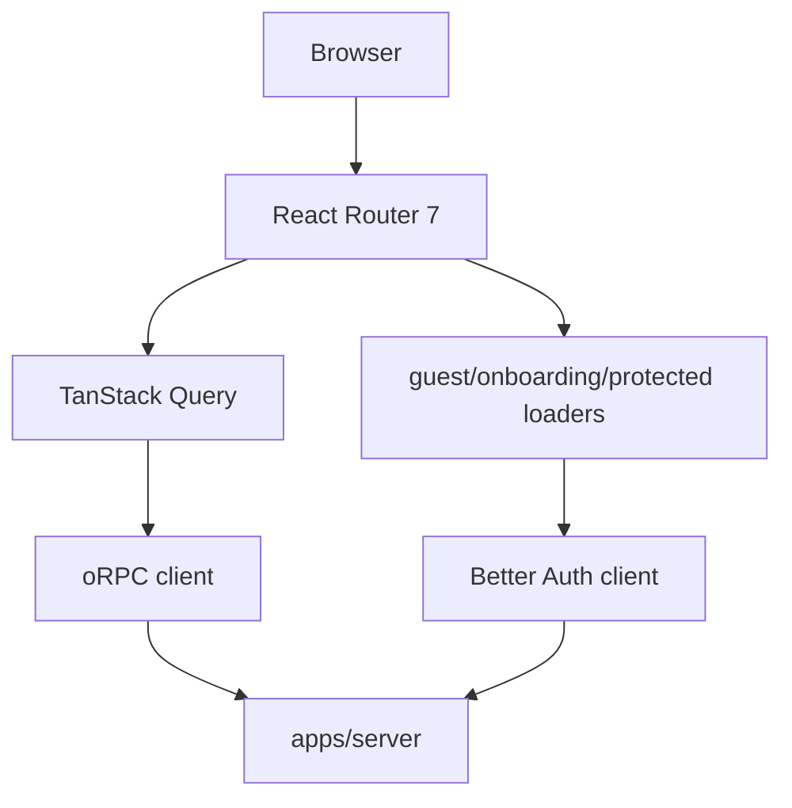
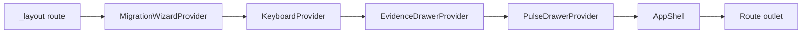
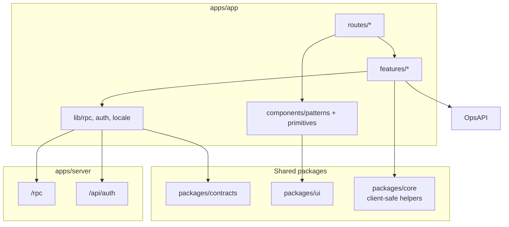

# apps/app 模块文档：产品单页应用

## 功能定位

`apps/app` 是 DueDateHQ 的主产品前端，基于 Vite、React 19、React Router 7、TanStack Query、oRPC client、Better Auth client 和 `@duedatehq/ui` 构建。它承载事务所用户的日常操作：登录、onboarding、dashboard、Obligations（`/obligations`）、导入、Pulse、Opportunities、审计、规则预览、成员、事务所设置和计费。

前端的核心职责不是保存业务事实，而是把 server 合约暴露的状态组织成高效、可审计、可键盘操作的工作台。

## 关键路径

| 路径                                             | 职责                                                                       |
| ------------------------------------------------ | -------------------------------------------------------------------------- |
| `apps/app/src/main.tsx`                          | React root、QueryClient、i18n、tooltip、router、toaster                    |
| `apps/app/src/router.tsx`                        | 路由表、loader gating、locale handoff、404                                 |
| `apps/app/src/lib/rpc.ts`                        | oRPC client、locale header、credentials                                    |
| `apps/app/src/lib/auth.ts`                       | Better Auth client、One Tap helper、organization/stripe plugins            |
| `apps/app/src/routes/_layout.tsx`                | 登录后应用框架、practice/session 数据加载                                  |
| `apps/app/src/components/patterns/app-shell.tsx` | Sidebar、header、mobile shell、pending indicator                           |
| `apps/app/src/features/migration`                | Migration Copilot 四步向导                                                 |
| `apps/app/src/features/pulse`                    | Pulse alert 列表、详情 drawer、source context、apply/dismiss/snooze/revert |
| `apps/app/src/features/evidence`                 | Evidence drawer 和审计时间线                                               |
| `apps/app/src/features/opportunities`            | 轻量未来业务提示页面和 Client detail 小卡片                                |
| `apps/app/src/routes/obligations.tsx`            | Obligations 表格、过滤、状态更新、罚金输入                                 |
| `apps/app/src/routes/rules.tsx`                  | Rules Console                                                              |

## 主要功能

### 登录、onboarding 与 practice identity/switching

- 使用 Better Auth client 调用 `/api/auth`。
- `/login` 先通过 `/api/auth-capabilities` 读取公开的 Google Client ID，再触发 Google One Tap；Google OAuth 按钮是主入口，Microsoft OAuth 在配置后显示，Email OTP 位于 split `or` 分隔线下方作为工作邮箱 fallback。
- React Router loaders 区分 guest、onboarding 和 protected route。
- 登录后根据 active organization 加载 practice context。
- 支持成员、事务所设置、active practice 切换和 owner-only 管理动作。

### Dashboard

- 展示 Pulse banner、顶部风险 metrics 和唯一的 Dashboard triage queue。
- Dashboard 不再渲染独立 AI weekly brief；分诊解释下沉到 Triage queue 行内的 Smart Priority
  drivers、Focus rank 和 Next check。
- `PulseAlertsBanner` 把可处理的政府更新带入首页。

### Obligations

- 使用 TanStack Table 和 infinite query。
- URL query 由 `nuqs` 管理，支持
  `q/status/assignee/owner/due/dueWithin/exposure/evidence/asOf/sort/row/drawer/id/tab`。
- 支持义务状态更新、客户罚金输入更新、证据 drawer、键盘选择，以及五 tab 的义务详情
  drawer（Readiness / Extension / Risk / Evidence / Audit）。
- Readiness tab 会复用已发送 request 或最新 AI checklist evidence；如果两者都不存在，打开
  drawer 时自动生成一次默认 checklist。
- `/readiness/:token` 是公开客户 portal route，脱离受保护 app shell，只展示客户安全字段并提交
  readiness response。
- coordinator 角色在 practice 设置禁止时隐藏 deadline readiness。

### Migration Copilot

四步导入流程：

1. Intake：解析 CSV/TSV/粘贴表格。
2. Mapping：AI mapper 或 preset/manual mapping。
3. Normalize：AI normalizer、字典 fallback、默认矩阵。
4. Preview & apply：dry-run、错误列表、apply、revert。

前端只负责用户决策和中间态展示，真正的 batch 状态、AI 调用、commit plan、audit/evidence 写入都在 server。

Clients 使用 `/clients?client=<id>` 的同页详情态管理客户事实，不新增 `/clients/:id` route，
也不再用右侧侧栏承载完整档案。列表列和 State/Jurisdiction 筛选按任一 active filing profile
匹配；详情页顶部展示客户身份、readiness 和 Pulse impact，主体展示 work plan、filing
jurisdictions、risk summary、contact chain、轻量未来业务提示、activity log、notes 和删除入口。`Filing
jurisdictions` 保存时调用 `clients.replaceFilingProfiles`，让 server 统一维护 profile
archive、primary mirror、exposure 重算和缓存刷新。

### Opportunities

- `/opportunities` 面向 partner 提供轻量未来业务提示，用来发现哪些客户可能值得 service、
  scope 或 relationship conversation。
- V1 只从现有 client facts 和 obligations 派生 deterministic cues：advisory conversation、
  scope review、retention check-in。
- 该页面不是税务建议、不是避税策略生成器、不是 pricing benchmark，也不持久化 opportunity
  lifecycle；主操作只回到 Client detail。
- Client detail 右侧 rail 展示最多三条当前客户的 future business cues。

Migration Step 2 支持 `Filing states` 目标；Step 3 的 matrix counts 会把逗号/分号/竖线分隔的
多州输入拆开统计，使一行多州列表和一行一州重复客户都能进入同一 preview/apply 路径。

### Pulse

- `/rules?tab=pulse` 面向事务所用户，承载 owner/manager 对 Pulse 影响客户的 review/apply/dismiss/snooze。
- Pulse Changes 列表使用 impact-first 过滤：needs action、needs review、no matches、closed；
  status/source 过滤作为二级排查工具。
- Pulse detail drawer 展示来源状态、置信度、source context、parsed scope、影响客户、suggested
  actions、安全 checklist 和操作按钮。
- apply/revert/reactivate 会触发 server 端锁或状态流、数据更新、罚金重算、audit/evidence 和
  dashboard queue；undo 后 alert 回到 `matched`，历史 `reverted` alert 可重新激活再 apply。

### Audit 与 Evidence

- Audit 页面支持事件列表、证据包请求、下载 URL 创建。
- Evidence drawer 可从义务上下文打开，展示证据链和相关 audit timeline。
- 这是产品的核心差异化界面：用户能解释每个截止日和罚金数字从何而来。

### Rules Console

- 规则工作台，展示 Rule Library coverage map、pending review queue、source list、Pulse Changes、Temporary Rules 和 obligation preview。
- 用于解释系统支持哪些 jurisdiction、source 和 obligation rule，并在 Coverage pending queue 中完成单条或批量规则审核。

### 通知、成员、计费和设置

- Notifications：未读数、mark read、mark all read、preferences 和 `href` 深链跳转；Pulse 到达通知只负责把用户带到 Rules > Pulse Changes 决策工作台，不在通知中心承载 apply/dismiss/revert。
- Members：owner-only invite、cancel/resend、role update、suspend/reactivate/remove。
- Firm：名称、时区、coordinator dollar visibility、soft delete。
- Billing：plan、checkout、success/cancel 和 audit pay intent。

## 创新点

- **操作台优先**：首页不是静态报表，而是把风险、Pulse、任务、下一步检查和证据入口放到同一个工作语境。
- **URL 可复现工作状态**：Obligations 和 Rules Console 用 URL query 保存筛选、排序和选中行，便于团队共享上下文。
- **全局证据 drawer**：证据不是单独页面，而是嵌入在 dashboard/Obligations/pulse 等工作流里，降低解释成本。
- **键盘工作流**：命令面板、快捷键导航、帮助层和表格选择服务于高频后台操作。
- **无 React `useEffect` 约束下的架构**：依赖 route loader、TanStack Query、render-time keyed reset、external store 和受控状态完成常见副作用场景。

## 技术实现

### 路由与数据加载

- `router.tsx` 定义全部页面和 loader。
- `main.tsx` 创建全局 `QueryClient`，默认 `staleTime` 60 秒，关闭 window focus refetch。
- `lib/rpc.ts` 统一设置 `/rpc` base path、locale header 和 cookie credentials。
- `lib/auth.ts` 统一 Better Auth plugins、Google One Tap callback 和 locale-aware fetch。

### 应用 Shell

应用 shell 负责：

- desktop sidebar 和 mobile sheet。
- 顶部路由标题、计划/计费入口、个人通知铃铛。
- pending navigation indicator。
- provider 层级，确保全局 drawer 和 keyboard shell 能跨 route 工作。

### 数据状态模式

| 场景              | 实现方式                                           |
| ----------------- | -------------------------------------------------- |
| Server state      | TanStack Query + oRPC queryOptions/mutationOptions |
| URL state         | `nuqs` parsers                                     |
| Global UI state   | Provider + context，必要时 useSyncExternalStore    |
| Auth/session      | Better Auth client + route loader + Google One Tap |
| Theme             | `@duedatehq/ui/theme` shared store                 |
| Optimistic update | 针对成员、通知、Obligations 状态等局部 query cache |

## 架构图

## 权限与安全

- 前端会根据 session、firm membership、role 做 UX gating，但所有权限仍由 server enforcement 决定。
- coordinator dollar visibility 属于 server 返回数据前的脱敏逻辑，前端只负责展示结果。
- 路由 loader 只做导航体验，不作为安全边界。

## 测试与验证

- 单元和组件测试应与实现文件 colocate。
- 浏览器级工作流变化应增加 Playwright e2e 覆盖。
- UI 改动应检查 desktop/mobile 布局、按钮文字溢出、drawer/sheet 可访问性和键盘路径。

## 后续演进关注点

- Migration Wizard 可继续拆出更细的 feature model，减少 route/provider 对 mutation 细节的了解。
- Obligations 的 filter schema 可以从 contracts 派生更多类型，降低 URL state 和 server filter 漂移。
- Pulse drawer 可补更强的来源 diff 可视化，帮助用户比较变更前后截止日。
- Billing 相关页面需要随当前 billing contract/procedure 完成度持续同步。
