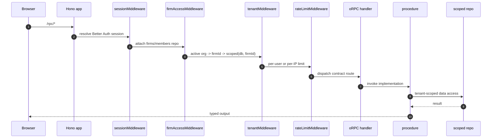
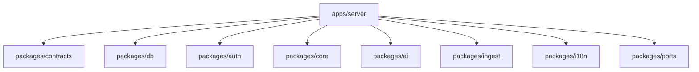
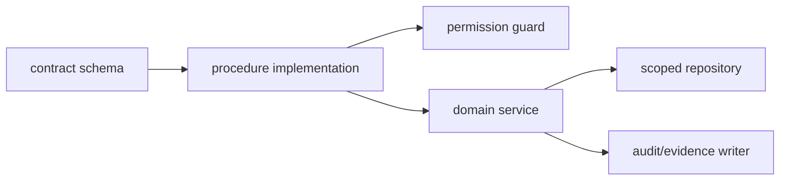
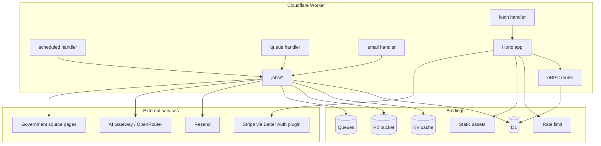

# apps/server 模块文档：Cloudflare Worker API

## 功能定位

`apps/server` 是 DueDateHQ 的后端运行时，部署在 Cloudflare Worker。它同时承担 HTTP API、oRPC handler、Better Auth 接入、队列消费者、定时任务、邮件入口、Pulse ops API、dashboard brief job 和静态 SPA assets 托管。

server 模块的核心职责是把共享包中的合约、领域逻辑、数据库仓储、AI 能力和外部平台绑定成一个可部署的边缘应用。

## 关键路径

| 路径                         | 职责                                                                            |
| ---------------------------- | ------------------------------------------------------------------------------- |
| `apps/server/src/index.ts`   | Worker entry，导出 fetch/scheduled/queue/email handlers                         |
| `apps/server/src/app.ts`     | Hono app 组装、middleware、route 注册                                           |
| `apps/server/src/rpc.ts`     | oRPC handler 与错误日志                                                         |
| `apps/server/src/procedures` | contract implementation，业务 API                                               |
| `apps/server/src/middleware` | request id、locale、session、firm access、tenant、rate limit                    |
| `apps/server/src/jobs`       | dashboard brief、Pulse ingest/extract、email、audit package、deadline reminders |
| `apps/server/src/auth.ts`    | Worker runtime 下的 Better Auth wiring                                          |
| `apps/server/src/routes`     | health、ops、audit REST、notifications、webhook                                 |

## 主要功能

### HTTP 应用入口

`createApp()` 组装 Hono app：

- `/api/health` public health check。
- `/api/auth/*` Better Auth。
- `/api/auth-capabilities` public provider metadata for SPA login bootstrap。
- `/api/e2e/*` e2e bootstrap。
- `/api/webhook/resend` 邮件 webhook。
- `/api/notifications` 邮件交互入口。
- `/api/audit/*` session、firm、tenant、rate-limit 后的 audit REST。
- `/rpc/*` session、firm、tenant、rate-limit 后的 oRPC API。
- `/api/v1/*` reserved。

### oRPC 业务 API

Root router 覆盖：

- `firms`
- `members`
- `clients`
- `obligations`
- `dashboard`
- `obligations`
- `workload`
- `pulse`
- `migration`
- `rules`
- `notifications`
- `audit`
- `evidence`
- `billing`

每个 procedure 通过 `requireSession`、`requireTenant` 和 permission helper 明确访问上下文。

### 租户上下文

`tenantMiddleware` 从 Better Auth session 的 `activeOrganizationId` 推导 firm：

1. 校验 active organization。
2. 校验当前 user 在组织中的 active membership。
3. 懒创建 `firm_profile`。
4. 注入 `tenantContext` 和 `scoped(db, firmId)`。
5. 跳过 `/rpc/firms/`，避免创建/切换 firm 的循环依赖。

### 队列与定时任务

- `scheduled`：按 cron fan-out dashboard brief、Pulse ingest、deadline reminders、email flush。
- `queue`：处理 `dashboard.brief.refresh`、`pulse.extract`、`email.flush`、`audit.package.generate`。
- `email`：GovDelivery 或邮件入口。

### Migration service

`procedures/migration/_service.ts` 是最复杂的业务服务之一：

- 创建 batch，保证一个 firm 同时只有一个 active draft。
- 接收 raw input，解析 tabular data。
- AI mapper 与 fallback preset/manual mapping。
- AI/dictionary normalizer。
- default matrix 推导 tax types。
- dry-run 生成 commit plan。
- apply 写入 client/obligation/evidence/audit。
- revert 和 single undo。

多州导入由 commit plan 负责归并：

- 支持一行内的 filing state 列表，以及同一客户多行一州的导入形态。
- 合并 key 优先 EIN，其次 normalized name + email。
- 每个客户创建 active `client_filing_profile` rows；`client.state/county` 只写 primary mirror。
- 州级 tax types 按 profile 推断或归属，联邦 obligations 在同一客户/年度/期间下去重。
- apply/revert/single undo 在同一 batch 里处理 clients、filing profiles、obligations、evidence、
  external references 和 audit。

### Pulse service

Pulse API 负责 firm alert 生命周期：

- list alerts/history/source health/detail。
- apply/dismiss/snooze/revert。
- apply/revert 使用 KV lock 防止重复并发操作。
- 修改 obligation 后重算 exposure，写 audit/evidence，并 enqueue dashboard brief。

Pulse matching reads obligation `jurisdiction` and filing profile counties. Archived filing profiles
do not participate in new matches, but previously-created obligations remain auditable rows and can
be marked `not_applicable` manually.

### Dashboard brief job

后台 brief 刷新机制：

- KV debounce，避免重复刷新。
- 手动刷新 daily limit。
- snapshot hash 去重。
- AI `brief@v1` 输出校验。
- 写入 `dashboard_brief` 和 `ai_output`。
- 失败时标记 reason，避免 UI 长期 pending。

## 创新点

- **同一个 Worker 运行 API、jobs 和 webhook**：减少部署单元，同时用 Hono route 和 Worker handler 明确边界。
- **权限失败也可审计**：permission helper 在可用上下文下写 `auth.denied` audit event。
- **租户 repo 注入**：procedure 默认面向 `scoped` repo 工作，降低跨租户查询风险。
- **AI 输出必须结构化和可拒绝**：server 把 AI refusal 当作业务状态处理，不假设模型永远可用。
- **Pulse apply/revert 有显式锁和证据**：政府来源变更不直接黑盒写入客户义务。

## 技术实现

### 请求链路



### Server 模块依赖



### Procedure 分层



典型规则：

- input/output shape 来自 `packages/contracts`。
- request context 来自 middleware。
- role/permission 在 procedure 或 service 入口显式检查。
- repo 负责租户过滤和 DB 操作。
- audit/evidence 在状态改变处写入。

## 架构图



## 权限模型

server 权限基于 Better Auth role 和自定义 permission：

| 角色        | 大致能力                                     |
| ----------- | -------------------------------------------- |
| owner       | 全量业务、成员、计费、审计、组织管理         |
| manager     | 客户、义务、migration、Pulse、审计和计费读写 |
| preparer    | 客户/义务/迁移/Pulse 业务操作，较少管理权限  |
| coordinator | 只读或有限操作，可能隐藏 deadline readiness  |

权限 helper 的重点是：

- 对 mutation 做 permission check。
- 对 plan-gated 功能返回明确错误。
- 对拒绝行为尽可能写 audit event。

## 运行与部署

常用命令：

```bash
pnpm --filter @duedatehq/server dev
pnpm --filter @duedatehq/server build
pnpm --filter @duedatehq/server test
pnpm db:migrate:local
pnpm db:seed:demo
pnpm deploy
```

## 后续演进关注点

- 把 billing 当前开发中的 audit procedure 与最终 Stripe subscription 状态机梳理成完整文档。
- 给 queue message 类型补更强的 contract/schema，减少 handler 分支中隐式 payload。
- Pulse ingest 和 Pulse apply 的错误映射可继续统一到 contracts error code。
- `procedures/migration/_service.ts` 体量较大，后续可在保持事务语义清晰的前提下按 mapper/normalizer/commit/revert 拆分。
