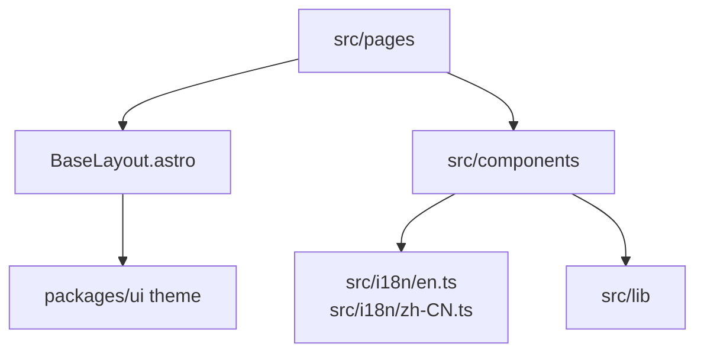
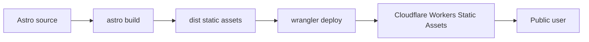
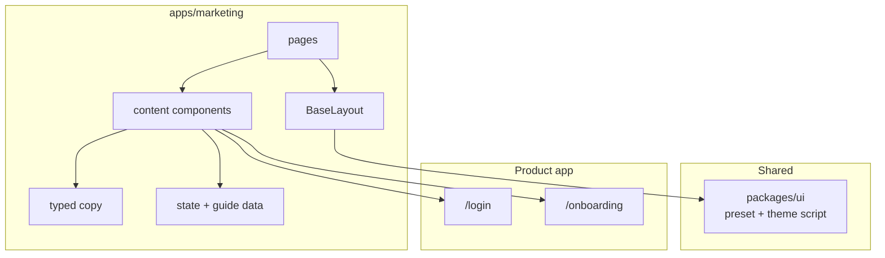

# apps/marketing 模块文档：Astro 营销站

## 功能定位

`apps/marketing` 是 DueDateHQ 的公开营销站，基于 Astro 静态构建，部署为 Cloudflare Workers Static Assets。它负责产品叙事、价格页、规则库说明、州覆盖页面、指南内容、公开信任页、SEO metadata、结构化数据和中英文落地页。

营销站和主产品 SPA 分离部署，避免营销内容影响应用 bundle，也让公开页面可以更容易做静态优化。

## 关键路径

| 路径                                          | 职责                                                            |
| --------------------------------------------- | --------------------------------------------------------------- |
| `apps/marketing/astro.config.mjs`             | Astro 配置、站点 URL、sitemap、i18n、Tailwind                   |
| `apps/marketing/wrangler.toml`                | Cloudflare Worker static assets 部署配置                        |
| `apps/marketing/src/layouts/BaseLayout.astro` | HTML shell、canonical/hreflang、OG/Twitter、theme init、JSON-LD |
| `apps/marketing/src/pages`                    | 首页、价格、规则、州覆盖、指南、信任页和中文版本                |
| `apps/marketing/src/components`               | TopNav、Hero、SLA strip、workflow、security、footer 等          |
| `apps/marketing/src/i18n`                     | typed copy dictionary                                           |
| `apps/marketing/src/lib`                      | CTA URL、SEO helpers、content metadata、state/guide/trust data  |

## 主要功能

- 英文和中文首页。
- Pricing 页面。
- Rules 页面，回答“申报规则如何变成带来源、已复核的事务所工作”。
- State coverage 总览和单州页面，回答“哪些州级更新会进入 Pulse 复核并影响客户截止日工作”。
- Guides 内容页，回答“本周先处理哪个客户截止日”和“截止日变更前应具备什么证据”。
- Trust 页面：`/about`、`/security`、`/privacy`、`/terms`、`/status`，提供公开信任面和联系入口。
- SEO：canonical、alternate hreflang、sitemap、OG/Twitter metadata。
- JSON-LD structured data，包括 WebPage、BreadcrumbList、FAQPage、Product/Offer 和 guide Article。
- CTA 连接到 app 域名，并通过 query 进行 locale handoff。

## 创新点

- **营销站完全静态化**：更适合 SEO、缓存和低运维成本。
- **typed copy contract**：文案字典不是松散 JSON，而是 TypeScript 类型约束，减少双语页面字段缺失。
- **与 app 解耦但共享品牌资产**：使用 `@duedatehq/ui` 的 theme script 和基础样式，但不引入 React runtime。
- **本地化 CTA handoff**：中文页面进入应用时带 locale 参数，减少首次进入 app 的语言切换成本。

## 技术实现

### 页面结构

### SEO 与多语言

`BaseLayout.astro` 统一处理：

- `<html lang>`。
- canonical URL。
- alternate hreflang。
- Open Graph metadata。
- Twitter card metadata。
- JSON-LD。
- no-flash theme script。

Astro config 中配置 `locales: ['en', 'zh-CN']`，中文页面通过 `/zh-CN` 路径组织。

### 部署

## 架构图

## 内容模型

| 内容类型       | 实现方式                           | 说明                                     |
| -------------- | ---------------------------------- | ---------------------------------------- |
| Landing copy   | `src/i18n` typed dictionaries      | 英中分别维护                             |
| State coverage | static data + dynamic Astro routes | 围绕 Pulse、客户适用性和证据复核         |
| Guides         | guide data + dynamic pages         | 围绕分诊优先级和审计证据                 |
| Trust pages    | trust page data + dynamic pages    | 围绕 about/security/privacy/terms/status |
| CTA            | helper 生成                        | app URL 来自 public env                  |

## 后续演进关注点

- 如果引入交互式 pricing calculator，应保持 island 体积可控，避免把整个站点变成 React 应用。
- 州覆盖页面应与 `packages/core/rules` 的 jurisdiction coverage 建立更自动的同步机制。
- 指南和州覆盖页的 visible review date、官方来源链接与 JSON-LD `dateModified` 必须保持一致。
- 需要定期核对 `PUBLIC_APP_URL` 与实际 app 域名。
- SEO 内容扩展前应先核对当前 app 和产品文档，只写已存在或明确规划的产品能力，并在规则、州覆盖、迁移、对比内容中保留“不提供税务建议、不自动替用户判断”的边界。
