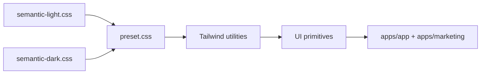
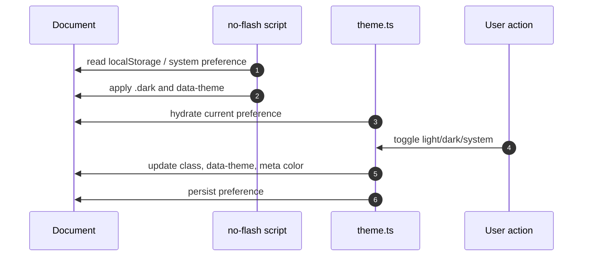
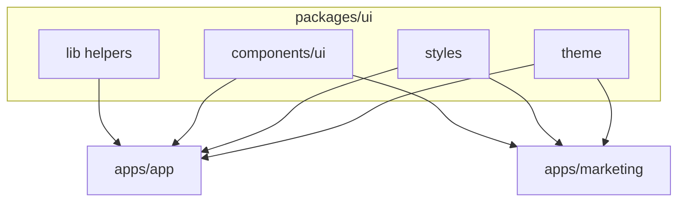

# packages/ui 模块文档：UI primitives 与设计系统

## 功能定位

`packages/ui` 提供 DueDateHQ 的基础 UI primitives、语义化设计 token、主题管理、Tailwind v4 preset 和少量跨应用组件。它服务于 `apps/app` 和 `apps/marketing`，但不承载业务语义、路由逻辑、认证状态或 RPC 调用。

这个包的边界非常重要：它是设计语言和交互 primitive，不是业务组件库。

## 关键路径

| 路径                                        | 职责                                                   |
| ------------------------------------------- | ------------------------------------------------------ |
| `packages/ui/src/components/ui`             | Button、Sheet、Tooltip、Toaster、Sidebar 等 primitives |
| `packages/ui/src/theme/theme.ts`            | shared theme preference store 和 DOM application       |
| `packages/ui/src/theme/no-flash-script.ts`  | 首屏主题防闪烁脚本                                     |
| `packages/ui/src/styles/preset.css`         | Tailwind v4 token preset                               |
| `packages/ui/src/styles/semantic-light.css` | light theme semantic tokens                            |
| `packages/ui/src/styles/semantic-dark.css`  | dark theme semantic tokens                             |
| `packages/ui/src/lib/utils.ts`              | `cn` 等通用 helper                                     |
| `packages/ui/src/lib/overlay.ts`            | overlay/surface class helper                           |
| `packages/ui/src/lib/placement.ts`          | placement parser/helper                                |

## 主要功能

- Base UI based primitives：button、dialog/sheet、tooltip、toast、sidebar 等。
- Tailwind v4 语义 token preset。
- light/dark/system 主题偏好。
- inline no-flash script，供 app 和 marketing layout 使用。
- hand-rolled sidebar primitives，满足 DueDateHQ 产品 shell 的 expanded / icons-only rail 布局。
- 统一 class merge helper。

## 创新点

- **业务无关的品牌系统**：视觉一致性与业务模块解耦，营销站和应用共享同一套 token。
- **主题状态跨应用一致**：theme preference storage key、DOM attribute、color-scheme、theme-color meta 由同一实现管理。
- **首屏防闪烁**：marketing 和 app 都可以内联 no-flash script，在 CSS/JS 完整加载前应用正确主题。
- **primitives 优先**：包内不放 DueDateHQ 的客户、义务、Pulse 等业务组件，避免共享层被业务耦合污染。

## 技术实现

### 设计 token 流

### 主题应用流程

### Component pattern

- `button.tsx` 使用 Base UI Button 和 `class-variance-authority` 组织 variant/size。
- 组件 class 使用 semantic token，不直接硬编码产品场景。
- Sidebar 组件暴露 provider、trigger、content、menu 等 primitive，由 app shell 组合具体导航。

## 架构图

## 使用约束

- 不依赖 `@duedatehq/contracts`、auth client、router 或 feature code。
- 不放业务 copy。
- 不把 app 特定布局封装成通用组件，除非营销站也需要同等 primitive。
- 对复杂浮层、drawer、table 操作，先确认是否属于 product pattern，而不是基础 primitive。

## 测试与验证

- UI primitive 变更应通过 app 页面人工检查 light/dark、desktop/mobile、keyboard focus。
- 主题脚本变更应验证首次加载不会出现 light/dark 闪烁。
- Token 变更需要检查 marketing 和 app 两端。

## 后续演进关注点

- 可补充 Storybook 或轻量 visual catalog，帮助 token 和 primitive 审核。
- Sidebar primitive 已服务 app shell，后续如果营销站不用，应避免继续加入 app 专属能力。
- 表单、table、empty state 等更高层模式需要谨慎判断是否进入 `packages/ui`。
