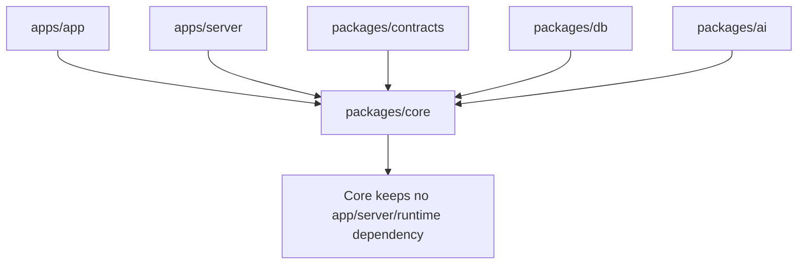
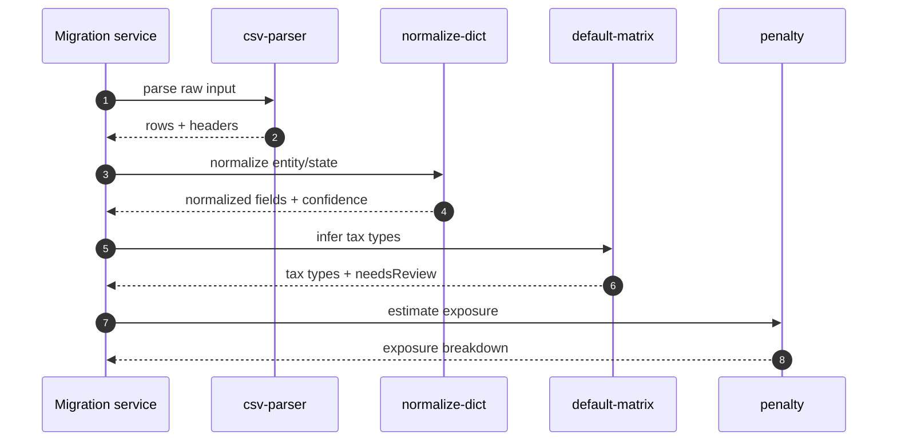
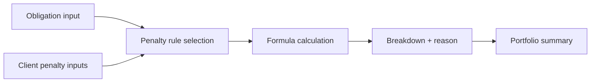
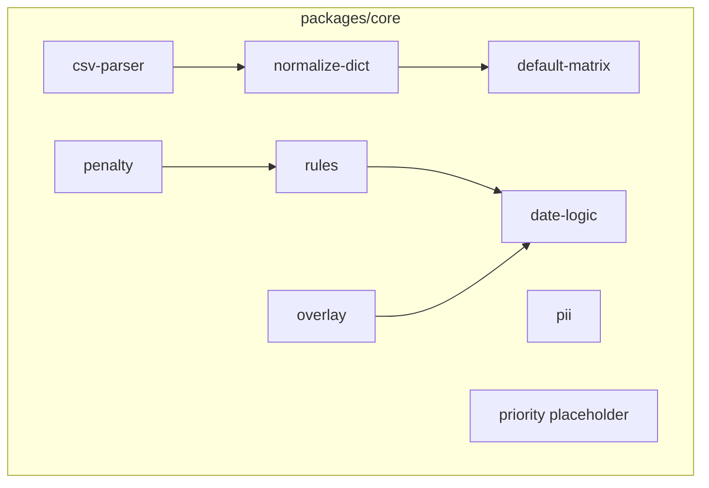

# packages/core 模块文档：纯领域逻辑

## 功能定位

`packages/core` 是 DueDateHQ 的基础领域逻辑包。它不依赖数据库、HTTP、React、Worker runtime 或第三方服务，主要提供税务义务规则、日期计算、罚金风险估算、默认矩阵、导入解析、PII 检测和归一化字典。

这个包承担“确定性业务逻辑”的角色：只要输入一致，输出就应一致，便于测试、复用和审计解释。

## 关键路径

| 路径                               | 职责                                                  |
| ---------------------------------- | ----------------------------------------------------- |
| `packages/core/src/penalty`        | 罚金暴露估算与汇总                                    |
| `packages/core/src/rules`          | 规则来源、obligation rules、coverage、preview         |
| `packages/core/src/date-logic`     | due date logic 展开                                   |
| `packages/core/src/default-matrix` | entity/state 到 tax type 的默认推导                   |
| `packages/core/src/overlay`        | due date overlay 应用                                 |
| `packages/core/src/csv-parser`     | CSV/TSV/paste parser                                  |
| `packages/core/src/normalize-dict` | entity/state 字典归一化                               |
| `packages/core/src/pii`            | PII/SSN 检测                                          |
| `packages/core/src/priority`       | Smart Priority scoring、factor decomposition、ranking |
| `packages/core/src/practice-name`  | 事务所名称 helper                                     |

## 主要功能

### 罚金暴露估算

`estimatePenaltyExposure` 输入义务、客户罚金参数和 as-of date，输出：

- `status`: `ready`、`needs_input`、`unsupported`。
- exposure cents。
- formula version。
- breakdown。
- reason 和 explanation。

当前规则 seed 覆盖 federal 1065/1120S owner-month、1120/estimated、CA、NY、FL、TX、WA 等模板场景；同时登记 50 州 + DC 官方税务与 UI/劳工来源，并为各州主税种生成 review-only templates。Server runtime 只把当前 practice 的 active rules 送入 production preview/generation，`packages/core` 仍保持纯函数与静态 seed 边界。Dashboard 只使用到期、证据、准备状态和 accrued penalty 信号汇总 top obligations。

### 规则库与规则预览

`rules` 模块维护 `FED + 50 states + DC` jurisdictions、source registry 和 obligation rules。它支持：

- list rule sources。
- list obligation rules。
- get rule coverage。
- preview obligations from rules。

Rules Console 和 server procedure 基于这些纯函数构建只读规则工作台。

### 日期逻辑

`date-logic` 支持多种 due date 展开方式：

- fixed date。
- period table。
- source-defined calendar。
- nth day after tax year end/begin。
- next business day。
- holiday handling。

### 默认矩阵

`default-matrix` 根据 entity type 和 filing profile state 推导初始 tax types。多州客户会对每个
active filing profile 单独推断州级 tax types；federal overlay 只在生成阶段去重为一组联邦义务。
Demo Sprint 中 CA/NY 有显式 cell，其他州结合 federal overlay、confidence 和 needsReview 提示。

### 导入解析

`csv-parser` 提供纯 TS tabular parser：

- CSV。
- TSV。
- 粘贴表格。
- quoted records。
- multiline quoted values。
- row cap。
- 明确拒绝 xlsx。

### 归一化与 PII

- `normalize-dict` 把常见 entity/state 文本归一化到系统枚举。
- `pii` 检测 SSN 等敏感字段，供 AI redaction 使用。

## 创新点

- **核心规则脱离基础设施**：server、app 和测试都能复用同一套纯函数。
- **可解释罚金公式**：输出包括 version、breakdown、reason，不只是一个数字。
- **导入 pipeline 可 fallback**：AI mapper 失败时仍可通过字典和默认矩阵给出可审阅结果。
- **规则库与 UI 解耦**：Rules Console 读取的是纯规则模型，而不是数据库中的临时页面数据。

## 技术实现

### 依赖边界

`packages/core/src/index.ts` intentionally 不做大 barrel 导出，调用方从具体模块导入，减少隐式公共 API 扩张。

### Migration 中的 core 参与点

### 罚金估算架构

## 架构图

## 当前限制

- Smart Priority scoring 已落地；后续重点是继续让 Dashboard / Obligations / Workload 的解释口径保持一致。
- 罚金规则覆盖是 MVP 范围，不是完整税法引擎。
- default matrix 对部分州/实体的 confidence 低，需要人工 review。
- xlsx 解析在核心 parser 中明确不支持，浏览器侧如需 Excel 需要单独适配。

## 测试与验证

- 核心逻辑应优先用 Vitest 单元测试覆盖。
- 税务公式、日期逻辑和 parser 应使用 table-driven tests。
- 新增规则必须验证：
  - 输入枚举。
  - timezone/date edge cases。
  - explanation 文案。
  - audit/evidence 中需要引用的 source 信息。

## 后续演进关注点

- 实现 priority scoring 并输出可解释 factor decomposition。
- 把 rules coverage 与 marketing state coverage 建立更自动的同步检查。
- 为 penalty rule 增加 source citation mapping，让 UI 能从估算直接跳到规则来源。
- 扩展 default matrix 时保持 confidence 和 needsReview 语义稳定。
