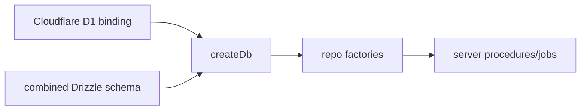
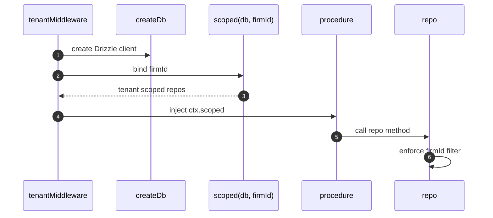
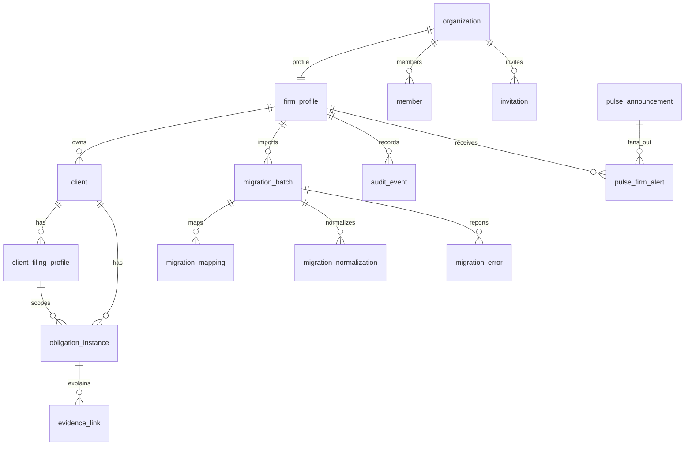
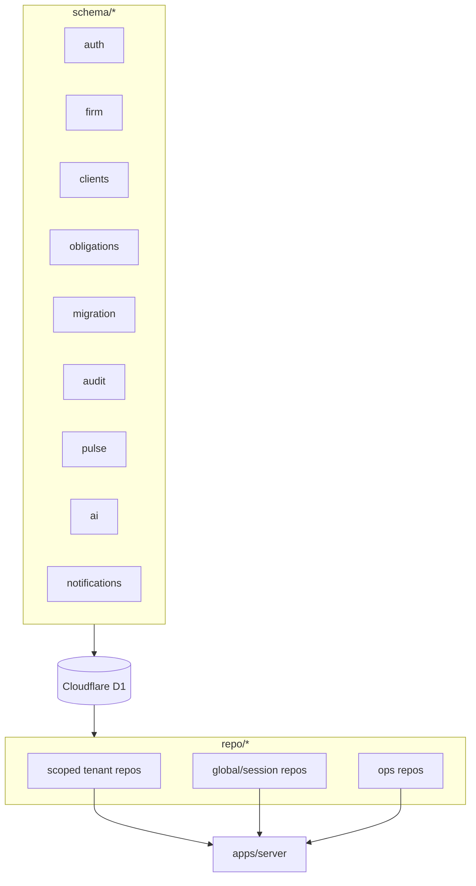

# packages/db 模块文档：Drizzle、D1 与租户仓储

## 功能定位

`packages/db` 是 DueDateHQ 的数据模型和数据访问层，基于 Drizzle ORM 和 Cloudflare D1。它定义 schema、创建数据库 client，并通过 tenant-scoped repositories 为 server procedures 提供安全的数据访问边界。

这个包的核心价值是把数据库表结构、租户隔离和常用查询封装到一处，避免业务层散落原始 SQL 和重复 firm filter。

## 关键路径

| 路径                                             | 职责                                                   |
| ------------------------------------------------ | ------------------------------------------------------ |
| `packages/db/src/client.ts`                      | Drizzle D1 client 和 schema 聚合                       |
| `packages/db/src/scoped.ts`                      | `scoped(db, firmId)` 租户仓储工厂                      |
| `packages/db/src/schema`                         | Drizzle schema                                         |
| `packages/db/src/repo`                           | repo implementations                                   |
| `packages/db/src/repo/firms.ts`                  | firm/session/active organization data access           |
| `packages/db/src/repo/members.ts`                | membership/invitation/seat usage                       |
| `packages/db/src/repo/client-filing-profiles.ts` | 客户多州 filing profile CRUD、archive 和 legacy mirror |
| `packages/db/src/repo/pulse.ts`                  | firm pulse alert 和 ops source state                   |
| `packages/db/src/repo/audit.ts`                  | append-only audit 和 evidence package                  |

## 主要数据域

### Auth 与 firm

- `user`
- `session`
- `account`
- `verification`
- `organization`
- `member`
- `invitation`
- `subscription`
- `firm_profile`

`firm_profile` 与 Better Auth organization 一对一，承载 plan、seat limit、timezone、status、billing id 和 coordinator dollar visibility。

### Client 与 obligation

- `client`
- `client_filing_profile`
- `obligation_instance`

`client_filing_profile` 是客户真实报税辖区事实来源：一个客户可以有多个 active filing state
profile，同州只允许一个 active profile，最多一个 primary profile。`client.state/county` 只做
primary profile 的兼容镜像。

义务记录包含 base/current due date、status、tax type、tax year、jurisdiction、
`client_filing_profile_id`、罚金暴露字段、迁移 batch 和删除时间。Obligations、Dashboard、
Calendar、Readiness、Pulse 和 deadline readiness 读 obligation jurisdiction，而不是直接读
legacy client state。

### Migration

- `migration_batch`
- `migration_mapping`
- `migration_normalization`
- `migration_error`

支持导入 batch 生命周期、mapping、normalization、错误列表、apply/revert。

### Audit 与 evidence

- `audit_event`
- `evidence_link`
- `audit_evidence_package`

审计表是 append-only 语义；evidence package 支持异步生成和下载。

### Pulse

- `pulse_announcement`
- `pulse_source_snapshot`
- `pulse_source_state`
- `pulse_source_signal`
- `pulse_firm_alert`
- `pulse_application`

覆盖 source ingestion、firm review fan-out、apply/revert 记录。

### AI、dashboard、notifications、overlay

- `ai_output`
- `llm_log`
- `dashboard_brief`
- `email_outbox`
- `in_app_notification`（deadline / overdue / pulse_alert / audit package / system）
- `reminder`
- `notification_preference`
- `client_email_suppression`
- `exception_rule`
- `obligation_exception_application`

## 创新点

- **tenant-scoped repo 是默认入口**：业务层获得的是 firm-bound repo，而不是自由查询能力。
- **audit append-only**：审计事件只写入和查询，不提供更新/删除 repo。
- **migration batch 有状态机痕迹**：draft、mapping、reviewing、applied、reverted、failed 支持导入流程恢复和撤销。
- **Pulse source 与 firm alert 分离**：政府来源事实和某个事务所的处理状态分开建模。
- **AI trace 与业务结果分离**：AI 输出、成本、prompt version、hash 和业务写入相互可追踪但不混为一表。

## 技术实现

### DB client

### 租户仓储

### 核心实体关系

## Repo 能力概览

| Repo             | 能力                                                                                                                              |
| ---------------- | --------------------------------------------------------------------------------------------------------------------------------- |
| `clients`        | create/createBatch/find/list/updateJurisdiction/updatePenaltyInputs/softDelete/deleteByBatch                                      |
| `filingProfiles` | createBatch/listByClient/listByClients/replaceForClient/deleteByBatch；所有方法 tenant-scoped，并维护 primary mirror              |
| `obligations`    | createBatch/list/updateDueDate/updateExposure/updateStatus/deleteByBatch；create 前校验 client/profile 同 firm，并写 jurisdiction |
| `migration`      | batch lifecycle、mapping、normalization、errors、commit/revert；commit/revert 同步处理 filing profiles                            |
| `audit`          | write/writeBatch/list/create package/mark package state                                                                           |
| `evidence`       | write/writeBatch/listByObligation                                                                                                 |
| `dashboard`      | load snapshot、brief cache、pending/ready/failed state                                                                            |
| `pulse`          | alert lifecycle、history、source health、apply/dismiss/snooze/revert                                                              |
| `notifications`  | in-app notification、email outbox、preferences、suppression；Pulse alert 到达写入个人通知，但业务生命周期仍归 `pulse` repo        |
| `firms`          | organization/firm profile/current firm/switch/update/soft delete                                                                  |
| `members`        | list/invite/update role/status/seat usage                                                                                         |

## 架构图

## 数据安全与隔离

- Tenant-scoped repo 默认带 `firmId`。
- Active firm 来自 Better Auth session，不来自客户端任意传参。
- Soft delete 用于 firm/client/obligation 等用户业务数据。
- Audit event 不提供更新删除能力。
- 角色权限在 server procedure 层执行，repo 层主要负责数据边界。

## 后续演进关注点

- 随 schema 增长，应保持 repo 方法面向 use case，而不是泄漏通用 query builder。
- D1 migration 文档需要随 Drizzle schema 变更同步。
- Pulse source tables 和 firm alert tables 的生命周期清理策略需要明确。
- Evidence package 下载 URL 和 R2 object 生命周期需要在部署文档中进一步落地。
