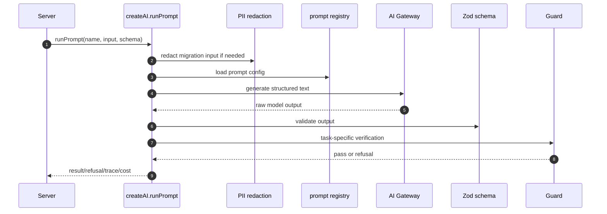
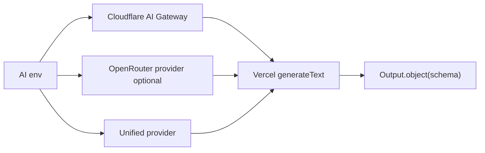
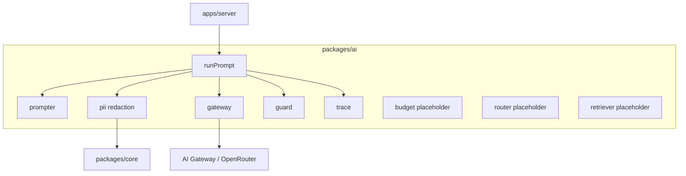

# packages/ai 模块文档：AI Gateway、提示词与 Guard

## 功能定位

`packages/ai` 封装 DueDateHQ 的 AI 调用层。它负责 prompt registry、PII redaction、Cloudflare AI Gateway/OpenRouter 调用、结构化输出校验、guard、拒绝原因、成本/trace 信息和特定任务 helper。

AI 包不导入数据库，也不负责最终业务写入。server 调用 AI 后，将结果、refusal、trace 和业务事件写入 DB/audit。

## 关键路径

| 路径                           | 职责                                                    |
| ------------------------------ | ------------------------------------------------------- |
| `packages/ai/src/index.ts`     | `createAI`、`runPrompt`、`extractPulse`                 |
| `packages/ai/src/gateway.ts`   | AI Gateway/OpenRouter provider 和 Vercel `generateText` |
| `packages/ai/src/prompter.ts`  | inline prompt registry                                  |
| `packages/ai/src/guard.ts`     | mapper 和 pulse output guard                            |
| `packages/ai/src/pii.ts`       | migration input redaction                               |
| `packages/ai/src/trace.ts`     | trace shape                                             |
| `packages/ai/src/budget.ts`    | 生产环境按 firm/plan/task 的隐藏 fair-use 计数          |
| `packages/ai/src/retriever.ts` | retrieval 占位                                          |
| `packages/ai/src/router.ts`    | plan tier 与 prompt task 的模型路由                     |

## 主要功能

### Prompt 任务

当前 prompt registry 支持：

- `mapper@v1`：迁移导入列映射。
- `normalizer-entity@v1`：实体类型归一化。
- `normalizer-tax-types@v1`：税种归一化。
- `brief@v1`：dashboard brief。
- `pulse-extract@v1`：政府来源更新抽取。

### 结构化输出

AI 调用使用 Zod schema 约束输出。模型输出必须通过 runtime validation，不能把自由文本直接写入业务表。

### PII redaction

Migration input 在进入 AI 前会检测并移除 SSN 类字段，降低把敏感信息发送到模型 provider 的风险。

### Guard

Guard 是 AI 输出后的业务安全层：

- `verifyMapperEinHitRate`：如果 mapper 把 EIN 映射到命中率不足的列，拒绝结果。
- `verifyPulseSourceExcerpt`：确保 `sourceExcerpt` 确实存在于原始 source text 中。

### Refusal 与 fallback

AI 可能返回：

- `AI_UNAVAILABLE`
- `GUARD_REJECTED`
- `SCHEMA_INVALID`
- `AI_GATEWAY_ERROR`

server 侧必须把这些状态当作正常业务分支处理，例如 migration fallback 到 preset/dictionary/default matrix。

## 创新点

- **AI 不直接写 DB**：AI 包只返回结构化结果和 trace，持久化由 server 统一处理。
- **PII redaction 在调用前执行**：迁移表格中的 SSN 风险先被处理，再进入 prompt。
- **输出 guard 与 schema 分离**：schema 保证形状，guard 保证领域可信度。
- **prompt inline 以适配 Worker bundle**：虽然有 markdown prompt 文件，当前实现使用 inline registry，减少 Worker bundle/runtime 文件读取风险。

## 技术实现

### AI 调用流程

### Provider 选择

### Trace 输出

Trace 记录：

- prompt name/version。
- model。
- input hash。
- refusal reason。
- token/cost 估计。
- guard 信息。
- citations 或 source excerpt。

server 可以把 trace 写入 `ai_output` 或 `llm_log`，并通过 audit/evidence 连接业务动作。

## 架构图

## 使用场景

| 场景                     | Prompt                    | Server 调用点                      |
| ------------------------ | ------------------------- | ---------------------------------- |
| Migration column mapping | `mapper@v1`               | `procedures/migration/_service.ts` |
| Entity normalization     | `normalizer-entity@v1`    | migration normalization            |
| Tax type normalization   | `normalizer-tax-types@v1` | migration normalization            |
| Dashboard brief          | `brief@v1`                | `jobs/dashboard-brief.ts`          |
| Pulse extraction         | `pulse-extract@v1`        | Pulse extract queue job            |

## 当前限制

- `retriever.ts` 仍是占位。
- Prompt registry inline，修改 prompt 需要重新构建部署。
- AI 输出的可信度依赖 schema 和少量 guard，仍需要 server 业务校验。
- Dashboard brief 防税务建议的校验在 server job 层完成，不在 AI 包内完全解决。

## 会员 AI 分层

| Plan       | 行为                                                                         |
| ---------- | ---------------------------------------------------------------------------- |
| Solo       | 轻量功能面和较低生产 fair-use；首次成功导入前 fast-json 走 onboarding 模型。 |
| Pro        | 完整 practice AI 功能；fast-json 走 paid preview 模型。                      |
| Team       | 与 Pro 相同 AI 功能；fast-json 同 Pro，差异来自席位和运营能力。              |
| Enterprise | 定制 coverage、BYOK/provider 选项和审计级控制；默认 fast-json 同 Pro。       |

Prompt 的 `model_tier` 选择 `AI_GATEWAY_MODEL_FAST_JSON`、
`AI_GATEWAY_MODEL_QUALITY_JSON` 或 `AI_GATEWAY_MODEL_REASONING`。其中 `fast-json`
额外按 plan 覆盖：Solo 在 migration onboarding 未完成时使用
`AI_GATEWAY_MODEL_FAST_JSON_SOLO_ONBOARDING`，首次成功导入 clients 后使用
`AI_GATEWAY_MODEL_FAST_JSON_SOLO`；Pro / Team / Enterprise 使用
`AI_GATEWAY_MODEL_FAST_JSON_PAID`。未配置 override 时回退到
`AI_GATEWAY_MODEL_FAST_JSON`。Plan 同时继续控制功能可用性和生产 fair-use 额度；本地
`ENV=development` 与测试 `ENV=staging` 跳过 fair-use KV 计数，便于验证真实 AI workflow。

## 后续演进关注点

- 继续扩展 production budget policy，按 firm/feature/date 控制 AI 成本。
- 实现 model routing，把 prompt 任务和 provider/model 选择解耦。
- 实现 retriever 后，需要明确 citation、source cache 和 evidence link 的关系。
- 为每个 prompt 增加 fixture tests，覆盖 schema invalid、guard reject、provider failure。
