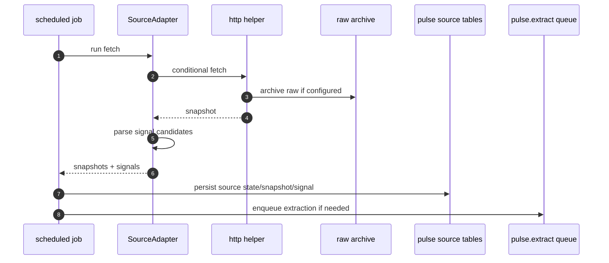
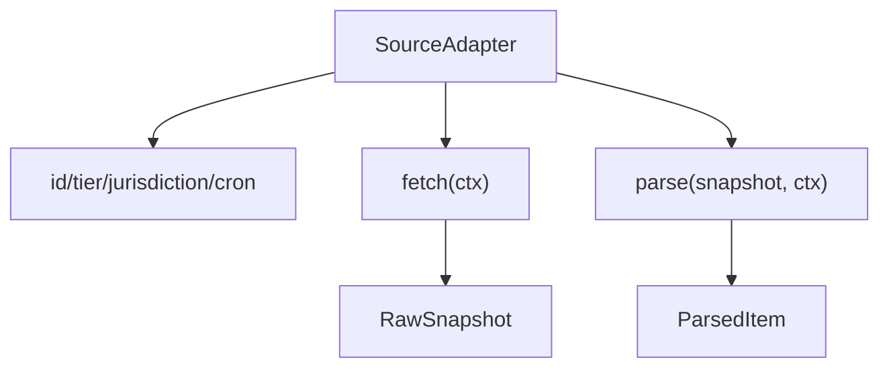
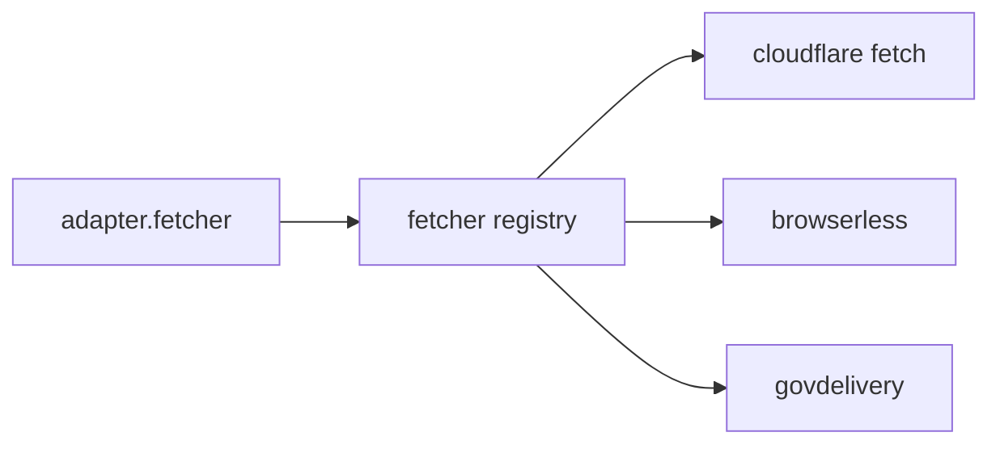
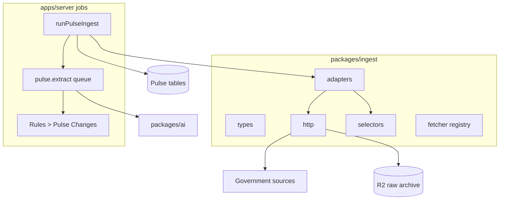

# packages/ingest 模块文档：Pulse 来源抓取与解析

## 功能定位

`packages/ingest` 是 Pulse 的来源接入层。它定义 source adapter interface、HTTP fetch helper、robots/conditional fetch、HTML/RSS selector 工具和一组政府来源 adapters。server 的 scheduled job 使用它抓取 IRS、州税务机构、FEMA 等来源，生成 snapshot 和 signal，再进入 AI extraction 和 firm alert fan-out。

该模块不负责最终业务应用，不写 tenant obligation。它只把外部来源转换成可追踪的来源快照和候选信号。
新闻索引页、RSS 目录和数据集首页只允许作为 acquisition channel；写入 Pulse snapshot /
signal 的 `officialSourceUrl` 必须指向具体公告、bulletin、declaration detail 或同等粒度的
官方来源。

## 关键路径

| 路径                                    | 职责                                                        |
| --------------------------------------- | ----------------------------------------------------------- |
| `packages/ingest/src/types.ts`          | SourceAdapter、IngestCtx、snapshot/signal 类型              |
| `packages/ingest/src/adapters/index.ts` | live Pulse adapters 注册                                    |
| `packages/ingest/src/http.ts`           | headers、rate limit、robots、conditional fetch、archive raw |
| `packages/ingest/src/selectors.ts`      | HTML stripping、link extraction、selector helper            |
| `packages/ingest/src/fetcher.ts`        | fetcher registry，cloudflare/browserless/govdelivery        |

## 主要功能

### Source adapter

每个 adapter 描述：

- source id。
- tier: T1/T2/T3。
- jurisdiction。
- cron interval。
- fetcher 类型。
- 是否可创建 Pulse。
- `fetch(ctx)`。
- `parse(snapshot, ctx)`。

### 来源覆盖

当前 adapters 覆盖：

- IRS disaster/newsroom/guidance。
- TX Comptroller 官方 News Releases HTML 列表链接（source id 暂保留 `tx.cpa.rss` 以兼容已有状态）。
- CA FTB newsroom/tax news/CDTFA。
- NY DTF press。
- FL DOR tips。
- WA DOR news/whats new。
- MA DOR press。
- FEMA declarations，T2 且默认不直接创建 Pulse。
- Rules registry 中带 `practice_rule_review` 的来源只有在 `acquisitionMethod='html_watch'`
  时才会通过 generic rule-source adapter 接入自动抓取；`manual_review`、`pdf_watch`、
  `email_subscription`、`api_watch` 需要专用 adapter 或人工流程。
- fixture adapter。

### Fetch helper

`http.ts` 处理：

- 默认 user agent。
- rate limit 常量。
- robots.txt check cache。
- ETag/Last-Modified conditional request。
- retry。
- raw archive 到 R2。
- stable external id。
- content hash。
- text excerpt。

### Selector helper

`selectors.ts` 提供轻量 HTML/RSS 解析工具：

- extract links。
- strip HTML。
- pick selector。

## 创新点

- **来源事实与 firm alert 解耦**：ingest 只产出 source-level snapshot/signal，事务所处理状态在 server/db 的 Pulse 模型里。
- **tier 化来源策略**：T1/T2/T3 可表达来源可信度、抓取频率和是否可直接创建 Pulse。
- **conditional fetch 降低成本与噪音**：ETag/Last-Modified 和 hash 减少重复解析。
- **raw archive 优先**：原始来源内容可归档到 R2，为后续审计和 AI extraction 复盘提供依据。

## 技术实现

### Ingest 流程

### Adapter 结构

### Fetcher 选择

Browserless 配置由 server Worker 注入：

- `PULSE_BROWSERLESS_URL`: Browserless `/content` endpoint，例如
  `https://production-sfo.browserless.io/content`。
- `PULSE_BROWSERLESS_TOKEN`: Browserless API token。本地可放入 `apps/server/.dev.vars`，线上必须用
  `wrangler secret put PULSE_BROWSERLESS_TOKEN`。
- `PULSE_BROWSERLESS_SOURCE_IDS`: 逗号分隔 source id override。无需改 adapter 代码即可把被
  Cloudflare egress 拦截的来源切到 Browserless。

`fl.dor.tips`、`wa.dor.news`、`wa.dor.whats_new` 当前 adapter 默认声明为 Browserless-backed；
只要配置了 `PULSE_BROWSERLESS_URL`，这些来源会绕过 Worker 原生 fetch。

## 架构图

## 数据流与审计关系

1. Adapter 获取政府来源页面。
2. 保存 source snapshot 和 source state。
3. parse 生成 source snapshot item。
4. queue 调用 AI 抽取 structured Pulse candidate。
5. 抽取成功后 fan-out 到 firm alert。
6. firm owner/manager review 后 apply/dismiss/snooze。
7. firm 用户 apply/revert 时写 audit/evidence。

`packages/ingest` 只覆盖第 1 到第 3 步，后续步骤由 server/jobs/procedures 负责。

## 当前限制

- HTML/RSS 解析工具偏轻量，对复杂政府页面可能需要 source-specific parser。
- Browserless/GovDelivery fetcher 需要部署环境配置支持；CA/WA/MA 等 WAF 风险源会优先使用
  Browserless，未配置时会退回 Cloudflare fetch 并通过 ingest metrics/source diagnostics 暴露给 ops。
- 来源页面结构变化可能导致解析退化，需要 fixture tests 和监控。
- FEMA 等 T2 来源默认不能直接创建 Pulse，需要人工或下游逻辑确认。

## 后续演进关注点

- 为每个 live adapter 增加 fixture snapshot 和 parse 测试。
- 记录 robots/cache 命中和 conditional fetch 指标。
- 将 T1/T2/T3 watcher failure 统一保留为 ops 专用 stale/quarantined 诊断，不进入 Rules >
  Pulse Changes。成功解析出的官方内容变化仍通过 Pulse review 流程处理。
- 对同一公告跨来源重复出现的情况建立 dedupe 策略。
